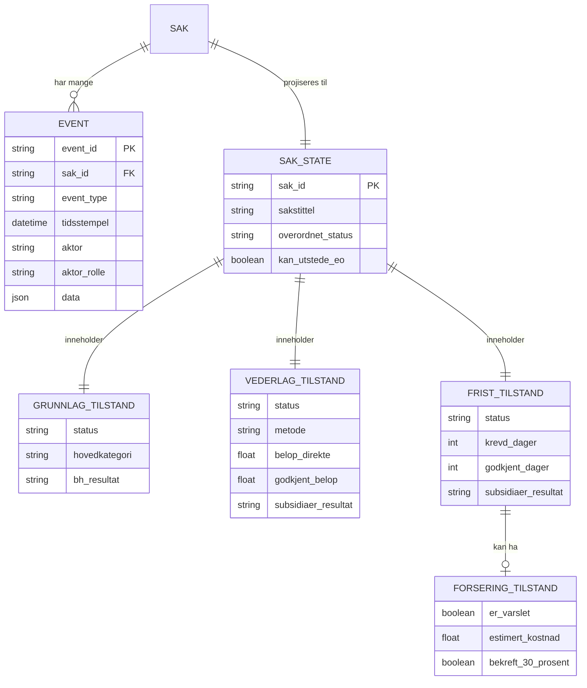
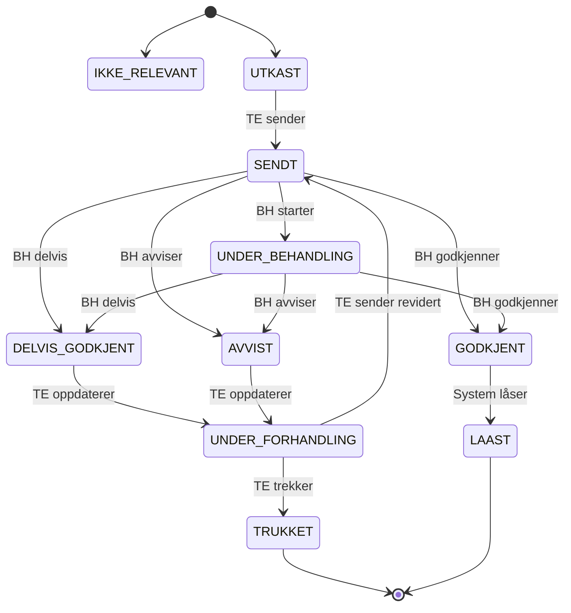
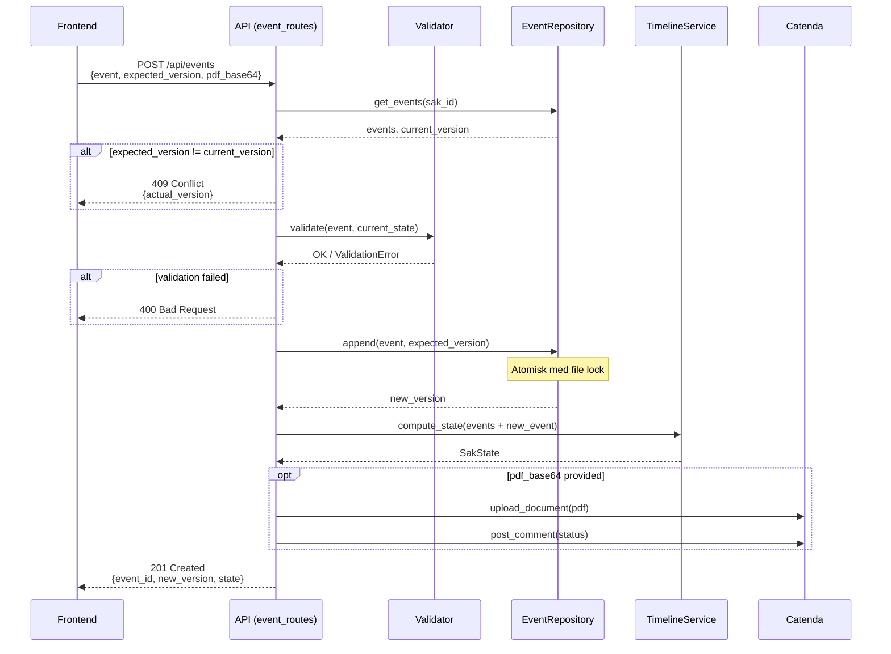
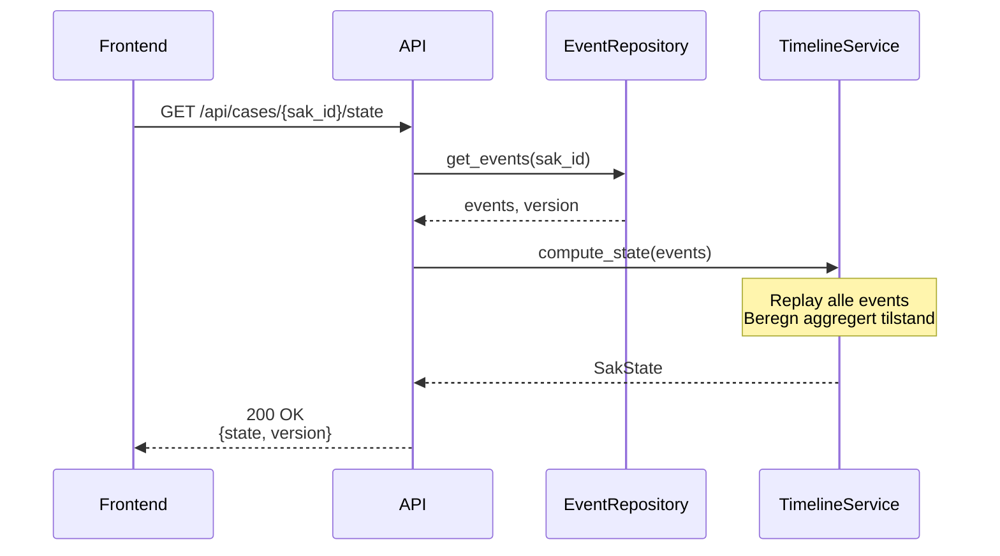

# Arkitektur og Datamodell

**Dokumentasjon av systemarkitektur, event sourcing og datastrukturer**

*Sist oppdatert: 2025-12-10*

---

## Innhold

1. [Innledning](#1-innledning)
2. [Systemarkitektur - Oversikt](#2-systemarkitektur---oversikt)
3. [Event Sourcing - Deep Dive](#3-event-sourcing---deep-dive)
4. [Datamodeller](#4-datamodeller)
5. [Dataflyt](#5-dataflyt)
6. [Dataverse-vurdering (Produksjon)](#6-dataverse-vurdering-produksjon)

---

## 1. Innledning

### Formål

Dette dokumentet gir en detaljert oversikt over:
- **Datastrukturer og datamodeller** - Event-typer, state-modeller, enums
- **Event Sourcing-arkitekturen** - Hvordan systemet lagrer og prosesserer hendelser
- **Dataverse-tilpasning** - Foreslått tabellstruktur for produksjon

For generell prosjektoversikt, teknologistack og oppsett, se [README.md](../README.md).

### Begreper

| Begrep | Forklaring |
|--------|------------|
| **Event Sourcing** | Arkitekturmønster der alle endringer lagres som uforanderlige hendelser |
| **CQRS** | Command Query Responsibility Segregation - separasjon av lese- og skriveoperasjoner |
| **Spor** | Uavhengig behandlingslinje: Grunnlag, Vederlag eller Frist |
| **Port-modell** | NS 8407-basert vurderingsstruktur med sekvensielle "porter" |
| **Subsidiært standpunkt** | BH tar prinsipal stilling men angir også hva resultatet ville vært hvis prinsipalt ikke får medhold |
| **Projeksjon** | Beregning av nåværende tilstand fra event-loggen |

---

## 2. Systemarkitektur - Oversikt

### Høynivå arkitektur

```
┌─────────────────────────────────────────────────────────────────────────┐
│                              FRONTEND                                    │
│                     React 19 + TypeScript + Vite                        │
│                   Oslo kommune designsystem (Punkt)                     │
└─────────────────────────────────┬───────────────────────────────────────┘
                                  │ HTTP/REST
                                  ▼
┌─────────────────────────────────────────────────────────────────────────┐
│                              BACKEND                                     │
│                     Flask 3 + Python + Pydantic v2                      │
├─────────────────────────────────────────────────────────────────────────┤
│                                                                         │
│   ┌─────────────────────┐              ┌─────────────────────┐         │
│   │    WRITE SIDE       │              │     READ SIDE       │         │
│   │  POST /api/events   │              │  GET /api/.../state │         │
│   │                     │              │                     │         │
│   │  • Validering       │              │  • Hent events      │         │
│   │  • Forretningsregler│              │  • Projiser state   │         │
│   │  • Persist event    │              │  • Returner view    │         │
│   └──────────┬──────────┘              └──────────▲──────────┘         │
│              │                                    │                     │
│              │         ┌──────────────────────────┘                     │
│              │         │                                                │
│              ▼         │                                                │
│   ┌─────────────────────────────────────────────────────────┐          │
│   │              TimelineService (Projector)                 │          │
│   │                                                         │          │
│   │   compute_state(events) → SakState                      │          │
│   │   • Replay alle events i rekkefølge                     │          │
│   │   • Beregn aggregert tilstand per spor                  │          │
│   │   • Returner read-only view                             │          │
│   └─────────────────────────────────────────────────────────┘          │
│                                                                         │
└─────────────────────────────────────────────────────────────────────────┘
                    │                               │
                    ▼                               ▼
        ┌───────────────────────┐       ┌───────────────────────┐
        │     EVENT STORE       │       │       CATENDA         │
        │  (JSON / Dataverse)   │       │   Prosjekthotell      │
        │                       │       │   Topics, Docs        │
        │  • Append-only log    │       └───────────────────────┘
        │  • Optimistisk låsing │
        │  • Versjonering       │
        └───────────────────────┘
```

### Lagdelt backend-arkitektur

```
Routes (HTTP-lag)
       │
       ▼
Services (Forretningslogikk)
       │
       ▼
Repositories (Data Access)
       │
       ▼
Storage (JSON-filer / Dataverse)
```

For detaljert backend-struktur, se [backend/STRUCTURE.md](../backend/STRUCTURE.md).

---

## 3. Event Sourcing - Deep Dive

### Konsept

Event Sourcing er et arkitekturmønster der **alle endringer i systemet lagres som uforanderlige hendelser** (events). I stedet for å lagre bare "nåværende tilstand" (som i tradisjonelle databaser), lagrer vi *historikken* av alt som har skjedd.

```
Tradisjonell database:           Event Sourcing:
┌──────────────────────┐         ┌──────────────────────┐
│ sak_id: KOE-001      │         │ Event 1: sak_opprettet        │
│ status: GODKJENT     │         │ Event 2: grunnlag_opprettet   │
│ belop: 150000        │         │ Event 3: vederlag_krav_sendt  │
│ godkjent_belop: 120000│        │ Event 4: respons_grunnlag     │
└──────────────────────┘         │ Event 5: respons_vederlag     │
                                 └──────────────────────┘
      ↑                                    ↑
  Kun sluttresultat              Komplett historikk
```

### Hvorfor Event Sourcing?

| Fordel | Beskrivelse |
|--------|-------------|
| **Komplett historikk** | Alle handlinger er logget - hvem gjorde hva, når |
| **Audit trail** | Tilfredsstiller krav til sporbarhet i offentlig sektor |
| **Debugging** | Kan "spole tilbake" og se tilstand på et gitt tidspunkt |
| **Konfliktfri** | Append-only betyr ingen UPDATE-konflikter |
| **Fleksibilitet** | Kan beregne nye "views" fra eksisterende events |

### Event Store - Append-Only Log

Events lagres i en **append-only log** - nye events legges til på slutten, eksisterende events endres aldri.

```
┌─────────────────────────────────────────────────────────────────┐
│                         EVENT LOG                                │
├─────────────────────────────────────────────────────────────────┤
│ [0] { event_type: "sak_opprettet",      tidsstempel: T1 }       │
│ [1] { event_type: "grunnlag_opprettet", tidsstempel: T2 }       │
│ [2] { event_type: "vederlag_krav_sendt", tidsstempel: T3 }      │
│ [3] { event_type: "respons_grunnlag",   tidsstempel: T4 }       │
│ [4] { event_type: "respons_vederlag",   tidsstempel: T5 }  ◄── Nyeste
├─────────────────────────────────────────────────────────────────┤
│ VERSION: 5                                                       │
└─────────────────────────────────────────────────────────────────┘
                              │
                              │ append()
                              ▼
        [5] { event_type: "eo_utstedt", tidsstempel: T6 }
```

### State Projection (Beregning av tilstand)

**Nåværende tilstand** beregnes ved å "replay" alle events i rekkefølge:

```python
def compute_state(events: List[SakEvent]) -> SakState:
    """
    Beregn SakState ved å prosessere events i rekkefølge.

    Hver event-type har en dedikert handler som oppdaterer
    relevant del av tilstanden.
    """
    state = SakState(sak_id=events[0].sak_id)

    for event in events:
        state = apply_event(state, event)

    return state


def apply_event(state: SakState, event: SakEvent) -> SakState:
    """Appliser én event på tilstanden."""

    match event.event_type:
        case EventType.GRUNNLAG_OPPRETTET:
            state.grunnlag.status = SporStatus.SENDT
            state.grunnlag.hovedkategori = event.data.hovedkategori
            # ... oppdater flere felter

        case EventType.RESPONS_GRUNNLAG:
            state.grunnlag.bh_resultat = event.data.resultat
            if event.data.resultat == GrunnlagResponsResultat.GODKJENT:
                state.grunnlag.status = SporStatus.GODKJENT
            # ... håndter andre utfall

        case EventType.FORSERING_VARSEL:
            state.frist.forsering = ForseringTilstand(
                er_varslet=True,
                estimert_kostnad=event.data.estimert_kostnad,
                # ...
            )

    return state
```

### Optimistisk låsing

For å håndtere **samtidige endringer** bruker vi optimistisk låsing med versjonsnummer:

```
┌─────────────────────────────────────────────────────────────────┐
│                    OPTIMISTISK LÅSING                            │
├─────────────────────────────────────────────────────────────────┤
│                                                                  │
│   Klient A                  Server                  Klient B     │
│      │                         │                        │        │
│      │  GET /state             │                        │        │
│      │  ─────────────────────► │                        │        │
│      │  ◄───────────────────── │                        │        │
│      │  { state, version: 3 }  │                        │        │
│      │                         │                        │        │
│      │                         │   GET /state           │        │
│      │                         │ ◄────────────────────  │        │
│      │                         │ ────────────────────►  │        │
│      │                         │  { state, version: 3 } │        │
│      │                         │                        │        │
│      │  POST /events           │                        │        │
│      │  { event, expected: 3 } │                        │        │
│      │  ─────────────────────► │                        │        │
│      │  ◄───────────────────── │                        │        │
│      │  { ok, version: 4 }     │                        │        │
│      │                         │                        │        │
│      │                         │  POST /events          │        │
│      │                         │  { event, expected: 3 }│        │
│      │                         │ ◄────────────────────  │        │
│      │                         │ ────────────────────►  │        │
│      │                         │  409 CONFLICT          │        │
│      │                         │  { actual: 4 }         │        │
│                                                                  │
│   Klient B må nå hente ny state (version 4) og prøve igjen      │
│                                                                  │
└─────────────────────────────────────────────────────────────────┘
```

**Flyt for event submission:**

```
1. Klient henter state + version
2. Bruker gjør endring i UI
3. Klient sender: { event, expected_version }
4. Server sjekker: expected_version == actual_version?
   ├── JA:  Lagre event, increment version, returner ny state
   └── NEI: 409 Conflict - klient må hente ny state og bekrefte
```

### CQRS (Command Query Responsibility Segregation)

Systemet separerer **skriving** (commands) fra **lesing** (queries):

```
┌───────────────────────────────────────────────────────────────────────┐
│                              CQRS                                      │
├───────────────────────────────────────────────────────────────────────┤
│                                                                        │
│  WRITE SIDE (Commands)                 READ SIDE (Queries)            │
│  ══════════════════════               ════════════════════            │
│                                                                        │
│  POST /api/events                      GET /api/cases/{id}/state      │
│       │                                      │                         │
│       ▼                                      ▼                         │
│  ┌─────────────┐                       ┌─────────────┐                │
│  │  Validering │                       │ Load Events │                │
│  └──────┬──────┘                       └──────┬──────┘                │
│         │                                     │                        │
│         ▼                                     ▼                        │
│  ┌─────────────┐                       ┌─────────────┐                │
│  │ Business    │                       │  Projiser   │                │
│  │ Rules       │                       │  State      │                │
│  └──────┬──────┘                       └──────┬──────┘                │
│         │                                     │                        │
│         ▼                                     ▼                        │
│  ┌─────────────┐                       ┌─────────────┐                │
│  │  Persist    │                       │  Returner   │                │
│  │  Event      │                       │  SakState   │                │
│  └─────────────┘                       └─────────────┘                │
│                                                                        │
│  Formål: Endre data                    Formål: Lese data              │
│  Input:  Event + version               Output: Beregnet view           │
│  Output: Ny version                                                    │
│                                                                        │
└───────────────────────────────────────────────────────────────────────┘
```

---

## 4. Datamodeller

### 4.1 Domenemodell - Oversikt



### 4.2 Tre-spor modellen (NS 8407)

Saksbehandlingen er delt i tre **uavhengige spor** som kan behandles parallelt:

```
┌─────────────────────────────────────────────────────────────────────────┐
│                              SAK (KOE)                                   │
├─────────────────────────────────────────────────────────────────────────┤
│                                                                         │
│  ┌─────────────────┐  ┌─────────────────┐  ┌─────────────────┐         │
│  │    GRUNNLAG     │  │    VEDERLAG     │  │      FRIST      │         │
│  │   (Ansvar)      │  │   (Penger)      │  │     (Tid)       │         │
│  │                 │  │                 │  │                 │         │
│  │ "Hvorfor?"      │  │ "Hva koster     │  │ "Hvor lang      │         │
│  │                 │  │  det?"          │  │  tid?"          │         │
│  │                 │  │                 │  │                 │         │
│  │ TE: opprettet   │  │ TE: krav_sendt  │  │ TE: krav_sendt  │         │
│  │ TE: oppdatert   │  │ TE: oppdatert   │  │ TE: oppdatert   │         │
│  │ BH: respons     │  │ BH: respons     │  │ BH: respons     │         │
│  │                 │  │     (Port 1+2)  │  │    (Port 1+2+3) │         │
│  │ § 33.1 a-c      │  │ § 34.1-34.4    │  │ § 33.4-33.8    │         │
│  └────────┬────────┘  └────────┬────────┘  └────────┬────────┘         │
│           │                    │                    │                   │
│           └────────────────────┼────────────────────┘                   │
│                                │                                        │
│                                ▼                                        │
│                    ┌──────────────────────┐                            │
│                    │  ENDRINGSORDRE (EO)  │                            │
│                    │      § 31.3          │                            │
│                    └──────────────────────┘                            │
│                                                                         │
└─────────────────────────────────────────────────────────────────────────┘
```

### 4.3 Port-modellen

Hver BH-respons følger en **port-struktur** der vurderinger skjer sekvensielt:

```
GRUNNLAG - Port 1 (Ansvar)
════════════════════════════
  │
  └─► BH vurderer: Er TE's ansvarsgrunnlag gyldig?
      ├── godkjent
      ├── delvis_godkjent
      ├── erkjenn_fm (Force Majeure)
      ├── avvist_uenig
      ├── frafalt (§32.3 c)
      └── krever_avklaring

      NB: Preklusjon (for sent varsel) håndteres på
      vederlag/frist-nivå via subsidiaer_triggers


VEDERLAG - Port 1 + Port 2
════════════════════════════
  │
  ├─► PORT 1: Varsling (Preklusjon)
  │   │
  │   │   "Ble BH varslet i tide om kostnadene?"
  │   │
  │   ├── saerskilt_varsel_rigg_drift_ok?  (§34.1.3)
  │   ├── varsel_justert_ep_ok?            (§34.3.3)
  │   ├── varsel_start_regning_ok?         (§30.1)
  │   └── krav_fremmet_i_tide?
  │
  └─► PORT 2: Beregning (Utmåling)
      │
      │   "Er beløpet riktig beregnet?"
      │
      ├── godkjent_fullt
      ├── delvis_godkjent
      ├── godkjent_annen_metode
      ├── avventer_spesifikasjon
      ├── avslatt_totalt
      ├── hold_tilbake (§30.2)
      └── avvist_preklusjon_rigg


FRIST - Port 1 + Port 2 + Port 3
════════════════════════════════
  │
  ├─► PORT 1: Varsling (Preklusjon)
  │   │
  │   │   "Ble BH varslet i tide om forsinkelsen?"
  │   │
  │   ├── noytralt_varsel_ok?      (§33.4)
  │   ├── spesifisert_krav_ok?     (§33.6)
  │   └── har_bh_etterlyst?        (§33.6.2)
  │
  ├─► PORT 2: Vilkår (Årsakssammenheng)
  │   │
  │   │   "Medførte forholdet faktisk forsinkelse?"
  │   │
  │   └── vilkar_oppfylt?          (§33.1)
  │
  └─► PORT 3: Utmåling
      │
      │   "Hvor mange dager godkjennes?"
      │
      ├── godkjent_fullt
      ├── delvis_godkjent
      ├── avventer_spesifikasjon
      └── avslatt_ingen_hindring
```

### 4.4 Event-typer

Systemet har **26 event-typer** fordelt på kategorier:

```python
class EventType(str, Enum):
    """Alle mulige event-typer i systemet"""

    # ══════════════════════════════════════════════════════════════
    # GRUNNLAG-EVENTS (Entreprenør - TE)
    # ══════════════════════════════════════════════════════════════
    GRUNNLAG_OPPRETTET = "grunnlag_opprettet"    # Første innsending
    GRUNNLAG_OPPDATERT = "grunnlag_oppdatert"    # Revidert grunnlag
    GRUNNLAG_TRUKKET = "grunnlag_trukket"        # TE trekker grunnlag

    # ══════════════════════════════════════════════════════════════
    # VEDERLAG-EVENTS (Entreprenør - TE)
    # ══════════════════════════════════════════════════════════════
    VEDERLAG_KRAV_SENDT = "vederlag_krav_sendt"        # Krav sendes
    VEDERLAG_KRAV_OPPDATERT = "vederlag_krav_oppdatert"  # Revidert krav
    VEDERLAG_KRAV_TRUKKET = "vederlag_krav_trukket"    # Krav trekkes

    # ══════════════════════════════════════════════════════════════
    # FRIST-EVENTS (Entreprenør - TE)
    # ══════════════════════════════════════════════════════════════
    FRIST_KRAV_SENDT = "frist_krav_sendt"              # Krav sendes
    FRIST_KRAV_OPPDATERT = "frist_krav_oppdatert"      # Revidert krav
    FRIST_KRAV_TRUKKET = "frist_krav_trukket"          # Krav trekkes

    # ══════════════════════════════════════════════════════════════
    # RESPONS-EVENTS (Byggherre - BH)
    # ══════════════════════════════════════════════════════════════
    RESPONS_GRUNNLAG = "respons_grunnlag"              # Svar på grunnlag
    RESPONS_GRUNNLAG_OPPDATERT = "respons_grunnlag_oppdatert"  # BH snur
    RESPONS_VEDERLAG = "respons_vederlag"              # Svar på vederlag
    RESPONS_VEDERLAG_OPPDATERT = "respons_vederlag_oppdatert"  # Opphev hold
    RESPONS_FRIST = "respons_frist"                    # Svar på frist
    RESPONS_FRIST_OPPDATERT = "respons_frist_oppdatert"  # BH endrer

    # ══════════════════════════════════════════════════════════════
    # FORSERING-EVENTS (Entreprenør - TE) - §33.8
    # ══════════════════════════════════════════════════════════════
    FORSERING_VARSEL = "forsering_varsel"    # TE varsler om forsering

    # ══════════════════════════════════════════════════════════════
    # SAKS-EVENTS
    # ══════════════════════════════════════════════════════════════
    SAK_OPPRETTET = "sak_opprettet"          # Ny sak
    SAK_LUKKET = "sak_lukket"                # Sak lukkes
    EO_UTSTEDT = "eo_utstedt"                # Endringsordre utstedes
```

### 4.5 Data-payloads per event

#### GrunnlagData

```python
class GrunnlagData(BaseModel):
    """Data for ansvarsgrunnlag (Hvorfor/Hvem)"""

    tittel: str                     # Kort beskrivende tittel
    hovedkategori: str              # F.eks. "ENDRING", "FORSINKELSE_BH"
    underkategori: Union[str, List[str]]  # Underkategori-kode(r)
    beskrivelse: str                # Detaljert beskrivelse
    dato_oppdaget: str              # YYYY-MM-DD

    # Varselinformasjon
    grunnlag_varsel: Optional[VarselInfo]  # Når/hvordan BH ble varslet

    # Juridisk dokumentasjon
    kontraktsreferanser: List[str]  # F.eks. ["NS8407 §25.2", "Kap. 3.2"]
    vedlegg_ids: List[str]          # Referanser til dokumenter
```

#### VederlagData

```python
class VederlagData(BaseModel):
    """Data for vederlagskrav (Penger)"""

    # Metode og beløp
    metode: VederlagsMetode         # ENHETSPRISER, REGNINGSARBEID, FASTPRIS_TILBUD
    belop_direkte: Optional[float]  # For ENHETSPRISER/FASTPRIS
    kostnads_overslag: Optional[float]  # For REGNINGSARBEID (§30.2)
    begrunnelse: str

    # Særskilte krav (§34.1.3) - med separate datoer per type
    saerskilt_krav: Optional[SaerskiltKrav]
    #   └── rigg_drift: { belop, dato_klar_over }
    #   └── produktivitet: { belop, dato_klar_over }

    # PORT 1: Varsler
    rigg_drift_varsel: Optional[VarselInfo]        # §34.1.3
    krever_justert_ep: bool                        # Krever EP-justering?
    justert_ep_varsel: Optional[VarselInfo]        # §34.3.3
    regningsarbeid_varsel: Optional[VarselInfo]    # §30.1
    produktivitetstap_varsel: Optional[VarselInfo] # §34.1.3, 2. ledd
    krav_fremmet_dato: Optional[str]               # Formelt fremmet dato

    vedlegg_ids: List[str]
```

#### FristData

```python
class FristData(BaseModel):
    """Data for fristkrav (Tid)"""

    # PORT 1: Varseltype
    varsel_type: FristVarselType    # noytralt, spesifisert, begge, force_majeure
    noytralt_varsel: Optional[VarselInfo]    # §33.4
    spesifisert_varsel: Optional[VarselInfo] # §33.6

    # Kravet (kun ved spesifisert)
    antall_dager: Optional[int]     # Krevde dager
    begrunnelse: str

    # PORT 2: Vilkår - Dokumentasjon
    fremdriftshindring_dokumentasjon: Optional[str]
    ny_sluttdato: Optional[str]     # Foreslått ny dato

    vedlegg_ids: List[str]
```

#### ForseringVarselData (§33.8)

```python
class ForseringVarselData(BaseModel):
    """Data for forsering varsel - når BH avslår fristkrav"""

    frist_krav_id: str              # Event-ID til avslått fristkrav
    respons_frist_id: str           # Event-ID til BH's avslag

    estimert_kostnad: float         # Estimert forseringskostnad (NOK)
    begrunnelse: str

    # 30%-regelen (§33.8)
    bekreft_30_prosent: bool        # TE bekrefter: kostnad < dagmulkt + 30%
    avslatte_dager: int             # Dager BH avslo
    dagmulktsats: float             # Dagmulktsats for beregning

    dato_iverksettelse: str         # Når forsering starter
    grunnlag_avslag_trigger: bool   # True hvis utløst av grunnlagsavslag
```

### 4.6 Respons-data (BH)

#### GrunnlagResponsData

```python
class GrunnlagResponsResultat(str, Enum):
    """Resultat av BH's vurdering av grunnlag"""
    GODKJENT = "godkjent"
    DELVIS_GODKJENT = "delvis_godkjent"
    ERKJENN_FM = "erkjenn_fm"        # Force Majeure (§33.3)
    AVVIST_UENIG = "avvist_uenig"
    FRAFALT = "frafalt"              # §32.3 c - BH frafaller pålegg
    KREVER_AVKLARING = "krever_avklaring"
    # Preklusjon håndteres via subsidiaer_triggers på vederlag/frist

class GrunnlagResponsData(BaseModel):
    """BH's respons på grunnlag"""
    resultat: GrunnlagResponsResultat
    begrunnelse: str
    akseptert_kategori: Optional[str]     # Annen kategorisering
    krever_dokumentasjon: List[str]       # Hva BH trenger
    varsel_for_sent: bool
    varsel_begrunnelse: Optional[str]
```

#### VederlagResponsData

```python
class VederlagBeregningResultat(str, Enum):
    """Resultat av beregningsvurdering (Port 2)"""
    GODKJENT_FULLT = "godkjent_fullt"
    DELVIS_GODKJENT = "delvis_godkjent"
    GODKJENT_ANNEN_METODE = "godkjent_annen_metode"
    AVVENTER_SPESIFIKASJON = "avventer_spesifikasjon"
    AVSLATT_TOTALT = "avslatt_totalt"
    HOLD_TILBAKE = "hold_tilbake"              # §30.2
    AVVIST_PREKLUSJON_RIGG = "avvist_preklusjon_rigg"  # §34.1.3

class VederlagResponsData(BaseModel):
    """BH's respons på vederlag (Port 1 + Port 2)"""

    # PORT 1: Varsling
    saerskilt_varsel_rigg_drift_ok: Optional[bool]  # §34.1.3
    varsel_justert_ep_ok: Optional[bool]            # §34.3.3
    varsel_start_regning_ok: Optional[bool]         # §30.1
    krav_fremmet_i_tide: bool
    begrunnelse_varsel: Optional[str]

    # PORT 2: Beregning
    vederlagsmetode: Optional[VederlagsMetode]      # BH's metode
    beregnings_resultat: VederlagBeregningResultat
    godkjent_belop: Optional[float]
    begrunnelse_beregning: str
    frist_for_spesifikasjon: Optional[str]

    # SUBSIDIÆRT STANDPUNKT
    subsidiaer_triggers: Optional[List[SubsidiaerTrigger]]
    subsidiaer_resultat: Optional[VederlagBeregningResultat]
    subsidiaer_godkjent_belop: Optional[float]
    subsidiaer_begrunnelse: Optional[str]
```

#### FristResponsData

```python
class FristBeregningResultat(str, Enum):
    """Resultat av fristberegning (Port 3)"""
    GODKJENT_FULLT = "godkjent_fullt"
    DELVIS_GODKJENT = "delvis_godkjent"
    AVVENTER_SPESIFIKASJON = "avventer_spesifikasjon"
    AVSLATT_INGEN_HINDRING = "avslatt_ingen_hindring"

class FristResponsData(BaseModel):
    """BH's respons på frist (Port 1 + Port 2 + Port 3)"""

    # PORT 1: Varsling
    noytralt_varsel_ok: Optional[bool]      # §33.4
    spesifisert_krav_ok: bool               # §33.6
    har_bh_etterlyst: Optional[bool]        # §33.6.2
    begrunnelse_varsel: Optional[str]

    # PORT 2: Vilkår
    vilkar_oppfylt: bool                    # §33.1 - faktisk hindring?
    begrunnelse_vilkar: Optional[str]

    # PORT 3: Utmåling
    beregnings_resultat: FristBeregningResultat
    godkjent_dager: Optional[int]
    ny_sluttdato: Optional[str]
    begrunnelse_beregning: Optional[str]
    frist_for_spesifisering: Optional[str]

    # SUBSIDIÆRT STANDPUNKT
    subsidiaer_triggers: Optional[List[SubsidiaerTrigger]]
    subsidiaer_resultat: Optional[FristBeregningResultat]
    subsidiaer_godkjent_dager: Optional[int]
    subsidiaer_begrunnelse: Optional[str]
```

### 4.7 Subsidiær datamodell

Subsidiært standpunkt brukes når BH tar **prinsipal stilling** (f.eks. avslag) men også vil angi hva resultatet ville vært **hvis prinsipalt standpunkt ikke får medhold**.

```python
class SubsidiaerTrigger(str, Enum):
    """
    Årsaker til at subsidiær vurdering er relevant.
    Kan kombineres - flere triggere kan gjelde samtidig.
    """

    # Nivå 0: Grunnlag
    GRUNNLAG_AVVIST = "grunnlag_avvist"

    # Nivå 1: Preklusjon (Vederlag)
    PREKLUSJON_RIGG = "preklusjon_rigg"              # §34.1.3
    PREKLUSJON_PRODUKTIVITET = "preklusjon_produktivitet"
    PREKLUSJON_EP_JUSTERING = "preklusjon_ep_justering"  # §34.3.3

    # Nivå 1: Preklusjon (Frist)
    PREKLUSJON_NOYTRALT = "preklusjon_noytralt"      # §33.4
    PREKLUSJON_SPESIFISERT = "preklusjon_spesifisert"  # §33.6

    # Nivå 2: Vilkår
    INGEN_HINDRING = "ingen_hindring"               # §33.5
    METODE_AVVIST = "metode_avvist"
```

**Eksempel på subsidiær vurdering:**

```
Scenario: BH avviser ansvarsgrunnlaget, men erkjenner beløpet

┌─────────────────────────────────────────────────────────────────┐
│                    BH's RESPONS                                  │
├─────────────────────────────────────────────────────────────────┤
│                                                                  │
│  PRINSIPALT STANDPUNKT:                                         │
│  ────────────────────────                                       │
│  Grunnlag: AVVIST (BH mener TE har ansvaret)                    │
│  Vederlag: Ikke aktuelt (følger av grunnlagsavslag)             │
│                                                                  │
│  SUBSIDIÆRT STANDPUNKT:                                         │
│  ────────────────────────                                       │
│  "Dersom BH ikke får medhold i prinsipalt standpunkt,           │
│   erkjennes det at vederlagskravet på 150 000 kr er             │
│   korrekt beregnet."                                            │
│                                                                  │
│  subsidiaer_triggers: [GRUNNLAG_AVVIST]                         │
│  subsidiaer_resultat: GODKJENT_FULLT                            │
│  subsidiaer_godkjent_belop: 150000                              │
│                                                                  │
└─────────────────────────────────────────────────────────────────┘
```

### 4.8 State-modeller (Read Model)

#### SakState

```python
class SakState(BaseModel):
    """
    Aggregert tilstand for en hel sak.
    Beregnes av TimelineService basert på event-loggen.
    READ-ONLY - alle endringer skjer via events.
    """
    sak_id: str
    sakstittel: str

    # De tre sporene
    grunnlag: GrunnlagTilstand
    vederlag: VederlagTilstand
    frist: FristTilstand

    # Computed fields
    er_force_majeure: bool          # §33.3 erkjent
    er_frafalt: bool                # §32.3 c
    er_subsidiaert_vederlag: bool   # Grunnlag avvist + vederlag godkjent
    er_subsidiaert_frist: bool      # Grunnlag avvist + frist godkjent

    overordnet_status: str          # UTKAST, SENDT, UNDER_BEHANDLING, etc.
    kan_utstede_eo: bool            # Alle spor avklart?
    neste_handling: dict            # { rolle, handling, spor }

    # Metadata
    opprettet: Optional[datetime]
    siste_aktivitet: Optional[datetime]
    antall_events: int

    # Integrasjon
    catenda_topic_id: Optional[str]
    catenda_project_id: Optional[str]
```

#### Spor-tilstander

```python
class GrunnlagTilstand(BaseModel):
    """Aggregert tilstand for grunnlag-sporet"""
    status: SporStatus
    tittel: Optional[str]
    hovedkategori: Optional[str]
    underkategori: Optional[Union[str, List[str]]]
    beskrivelse: Optional[str]
    dato_oppdaget: Optional[str]

    # BH respons
    bh_resultat: Optional[GrunnlagResponsResultat]
    bh_begrunnelse: Optional[str]
    laast: bool                     # Låst etter godkjenning

    # Metadata
    siste_event_id: Optional[str]
    antall_versjoner: int


class VederlagTilstand(BaseModel):
    """Aggregert tilstand for vederlag-sporet"""
    status: SporStatus

    # TE's krav
    metode: Optional[str]
    belop_direkte: Optional[float]
    kostnads_overslag: Optional[float]
    saerskilt_krav: Optional[dict]  # Nested rigg_drift/produktivitet

    # BH respons - Port 1
    saerskilt_varsel_rigg_drift_ok: Optional[bool]
    varsel_justert_ep_ok: Optional[bool]
    krav_fremmet_i_tide: Optional[bool]

    # BH respons - Port 2
    bh_resultat: Optional[VederlagBeregningResultat]
    godkjent_belop: Optional[float]

    # Subsidiært
    subsidiaer_triggers: Optional[List[str]]
    subsidiaer_resultat: Optional[VederlagBeregningResultat]
    subsidiaer_godkjent_belop: Optional[float]

    # Computed
    krevd_belop: Optional[float]    # Basert på metode
    differanse: Optional[float]      # Krevd - godkjent
    har_subsidiaert_standpunkt: bool


class FristTilstand(BaseModel):
    """Aggregert tilstand for frist-sporet"""
    status: SporStatus

    # TE's krav
    varsel_type: Optional[str]
    krevd_dager: Optional[int]

    # BH respons - Port 1
    noytralt_varsel_ok: Optional[bool]
    spesifisert_krav_ok: Optional[bool]

    # BH respons - Port 2
    vilkar_oppfylt: Optional[bool]

    # BH respons - Port 3
    bh_resultat: Optional[FristBeregningResultat]
    godkjent_dager: Optional[int]
    ny_sluttdato: Optional[str]

    # Subsidiært
    subsidiaer_triggers: Optional[List[str]]
    subsidiaer_resultat: Optional[FristBeregningResultat]
    subsidiaer_godkjent_dager: Optional[int]

    # Forsering (§33.8)
    forsering: Optional[ForseringTilstand]

    # Computed
    differanse_dager: Optional[int]
    har_subsidiaert_standpunkt: bool


class ForseringTilstand(BaseModel):
    """Tilstand for forsering (§33.8)"""
    er_varslet: bool
    dato_varslet: Optional[str]
    estimert_kostnad: Optional[float]
    begrunnelse: Optional[str]
    bekreft_30_prosent_regel: Optional[bool]
    er_iverksatt: bool
    dato_iverksatt: Optional[str]
    er_stoppet: bool                # BH godkjenner frist etter varsling
    paalopte_kostnader: Optional[float]
```

### 4.9 Spor-statuser

```python
class SporStatus(str, Enum):
    """Mulige statuser for hvert spor"""
    IKKE_RELEVANT = "ikke_relevant"     # Sporet brukes ikke
    UTKAST = "utkast"                   # Under utfylling
    SENDT = "sendt"                     # Sendt til BH
    UNDER_BEHANDLING = "under_behandling"  # BH behandler
    GODKJENT = "godkjent"               # BH godkjent fullt
    DELVIS_GODKJENT = "delvis_godkjent" # BH godkjent delvis
    AVVIST = "avvist"                   # BH avviste
    UNDER_FORHANDLING = "under_forhandling"  # Pågående dialog
    TRUKKET = "trukket"                 # TE trakk kravet
    LAAST = "laast"                     # Grunnlag låst etter godkjenning
```

**Status-overganger (state machine):**



### 4.10 Status-beregning og Subsidiær logikk

Systemet har flere nivåer av status-beregning som håndteres av computed fields i `SakState`.

#### Overordnet status (`overordnet_status`)

Beregnes basert på de tre sporenes statuser:

```
┌─────────────────────────────────────────────────────────────────────────┐
│                    OVERORDNET STATUS LOGIKK                              │
├─────────────────────────────────────────────────────────────────────────┤
│                                                                          │
│  Input: grunnlag.status, vederlag.status, frist.status                  │
│  Filtrer ut: IKKE_RELEVANT                                               │
│                                                                          │
│  Prioritert rekkefølge:                                                  │
│  ─────────────────────────────────────────────────────────────────────  │
│  1. INGEN_AKTIVE_SPOR   → Alle spor er IKKE_RELEVANT                    │
│  2. OMFORENT            → Alle aktive spor er GODKJENT eller LAAST      │
│  3. LUKKET_TRUKKET      → Alle aktive spor er TRUKKET                   │
│  4. UNDER_FORHANDLING   → Minst ett spor er AVVIST/DELVIS/FORHANDLING   │
│  5. UNDER_BEHANDLING    → Minst ett spor er UNDER_BEHANDLING            │
│  6. VENTER_PAA_SVAR     → Minst ett spor er SENDT                       │
│  7. UTKAST              → Alle aktive spor er UTKAST                    │
│  8. UKJENT              → Fallback                                       │
│                                                                          │
└─────────────────────────────────────────────────────────────────────────┘
```

**Viktig:** `overordnet_status` bruker kun rå spor-statuser, ikke subsidiær logikk.

#### Subsidiær status-beregning

Når BH avslår ansvarsgrunnlaget men godkjenner beløp/dager subsidiært:

```
┌─────────────────────────────────────────────────────────────────────────┐
│                    SUBSIDIÆR VURDERING                                   │
├─────────────────────────────────────────────────────────────────────────┤
│                                                                          │
│  Scenario: BH mener TE ikke har rett, men erkjenner beregningen         │
│                                                                          │
│  PRINSIPALT:                                                             │
│    grunnlag.status = AVVIST                                              │
│    → "BH mener TE har ansvaret selv"                                    │
│                                                                          │
│  SUBSIDIÆRT:                                                             │
│    vederlag.bh_resultat = GODKJENT                                       │
│    vederlag.godkjent_belop = 150 000                                     │
│    → "Men HVIS vi tok feil, er beløpet riktig"                          │
│                                                                          │
│  COMPUTED FIELDS:                                                        │
│  ───────────────────────────────────────────────────────────────────    │
│  er_subsidiaert_vederlag = True                                          │
│    (grunnlag.status == AVVIST) AND                                       │
│    (vederlag.bh_resultat ∈ {GODKJENT, DELVIS_GODKJENT})                  │
│                                                                          │
│  visningsstatus_vederlag = "Avslått pga. ansvar                         │
│                             (Subsidiært enighet om 150 000 kr)"         │
│                                                                          │
│  overordnet_status = UNDER_FORHANDLING                                   │
│    (fordi grunnlag er AVVIST - partene er uenige)                       │
│                                                                          │
└─────────────────────────────────────────────────────────────────────────┘
```

**Hvorfor UNDER_FORHANDLING ved subsidiær godkjenning?**

Subsidiær godkjenning er en **forhandlingsposisjon**, ikke en endelig løsning:
- Partene er **ikke enige** - det er fortsatt tvist om ansvarsgrunnlaget
- Saken er **ikke omforent** - TE har ikke fått det de krevde
- Hvis TE aksepterer avslaget → får ingenting
- Hvis TE tar saken videre og vinner på ansvaret → beløpet er allerede avklart

#### Computed fields i SakState

| Field | Beskrivelse | Logikk |
|-------|-------------|--------|
| `er_force_majeure` | §33.3 erkjent | `grunnlag.bh_resultat == ERKJENN_FM` |
| `er_frafalt` | §32.3 c pålegg frafalt | `grunnlag.bh_resultat == FRAFALT` |
| `er_subsidiaert_vederlag` | Grunnlag avvist + vederlag godkjent | Se over |
| `er_subsidiaert_frist` | Grunnlag avvist + frist godkjent | Tilsvarende |
| `visningsstatus_vederlag` | UI-vennlig kombinert status | Inkl. subsidiær info |
| `visningsstatus_frist` | UI-vennlig kombinert status | Inkl. subsidiær info |
| `overordnet_status` | Sak-nivå status | Basert på spor-statuser |
| `kan_utstede_eo` | Kan EO utstedes? | Alle spor GODKJENT/LAAST |
| `neste_handling` | Foreslått neste steg | `{rolle, handling, spor}` |

#### Status-mapping ved BH-respons

```python
# Grunnlag respons → SporStatus
GODKJENT         → GODKJENT
DELVIS_GODKJENT  → DELVIS_GODKJENT
AVVIST_UENIG     → AVVIST
ERKJENN_FM       → GODKJENT    # Force Majeure gir fristforlengelse
FRAFALT          → TRUKKET     # Pålegg frafalt, sak lukkes
KREVER_AVKLARING → UNDER_FORHANDLING

# Vederlag/Frist beregning → SporStatus
godkjent         → GODKJENT
delvis_godkjent  → DELVIS_GODKJENT
avventer         → UNDER_FORHANDLING
avslatt          → AVVIST
```

#### Spesialtilfeller

**Force Majeure (§33.3):**
- Grunnlag godkjennes (ERKJENN_FM → GODKJENT)
- Frist kan godkjennes
- Vederlag er **alltid avslått** (§33.3: "har ikke krav på vederlagsjustering")
- `visningsstatus_vederlag = "Ikke aktuelt (Force Majeure - §33.3)"`

**Frafall (§32.3 c):**
- BH frafaller pålegget som utløste kravet
- Grunnlag blir TRUKKET
- TE kan fortsatt kreve påløpte kostnader
- `visningsstatus_vederlag = "Avventer (pålegg frafalt - §32.3 c)"`

### 4.11 Enums - Komplett oversikt

```python
# ═══════════════════════════════════════════════════════════════════
# VEDERLAG ENUMS
# ═══════════════════════════════════════════════════════════════════

class VederlagsMetode(str, Enum):
    """NS 8407 vederlagsmetoder"""
    ENHETSPRISER = "ENHETSPRISER"       # §34.3 - kontrakts/justerte
    REGNINGSARBEID = "REGNINGSARBEID"   # §30.2/§34.4 - med overslag
    FASTPRIS_TILBUD = "FASTPRIS_TILBUD" # §34.2.1


class VederlagBeregningResultat(str, Enum):
    """Resultat av beregning (Port 2)"""
    GODKJENT_FULLT = "godkjent_fullt"
    DELVIS_GODKJENT = "delvis_godkjent"
    GODKJENT_ANNEN_METODE = "godkjent_annen_metode"
    AVVENTER_SPESIFIKASJON = "avventer_spesifikasjon"
    AVSLATT_TOTALT = "avslatt_totalt"
    HOLD_TILBAKE = "hold_tilbake"
    AVVIST_PREKLUSJON_RIGG = "avvist_preklusjon_rigg"


# ═══════════════════════════════════════════════════════════════════
# FRIST ENUMS
# ═══════════════════════════════════════════════════════════════════

class FristVarselType(str, Enum):
    """Type varsel for frist (NS 8407 §33)"""
    NOYTRALT = "noytralt"           # §33.4 - bevarer rett
    SPESIFISERT = "spesifisert"     # §33.6.1 - med dager
    BEGGE = "begge"                 # Først nøytralt, så spesifisert
    FORCE_MAJEURE = "force_majeure" # §33.3


class FristBeregningResultat(str, Enum):
    """Resultat av fristberegning (Port 3)"""
    GODKJENT_FULLT = "godkjent_fullt"
    DELVIS_GODKJENT = "delvis_godkjent"
    AVVENTER_SPESIFIKASJON = "avventer_spesifikasjon"
    AVSLATT_INGEN_HINDRING = "avslatt_ingen_hindring"


# ═══════════════════════════════════════════════════════════════════
# GRUNNLAG ENUMS
# ═══════════════════════════════════════════════════════════════════

class GrunnlagResponsResultat(str, Enum):
    """Resultat av BH's vurdering av grunnlag"""
    GODKJENT = "godkjent"
    DELVIS_GODKJENT = "delvis_godkjent"
    ERKJENN_FM = "erkjenn_fm"          # Force Majeure
    AVVIST_UENIG = "avvist_uenig"
    FRAFALT = "frafalt"                # §32.3 c
    KREVER_AVKLARING = "krever_avklaring"
    # NB: AVVIST_FOR_SENT er fjernet - preklusjon håndteres via
    # subsidiaer_triggers på vederlag/frist-nivå
```

---

## 5. Dataflyt

### 5.1 Event submission (Write Side)



### 5.2 State retrieval (Read Side)



### 5.3 Forsering-flyt (§33.8)

```
┌─────────────────────────────────────────────────────────────────────────┐
│                         FORSERING (§33.8)                                │
├─────────────────────────────────────────────────────────────────────────┤
│                                                                          │
│  1. TE sender fristkrav                                                  │
│     └── Event: frist_krav_sendt { antall_dager: 14 }                    │
│                                                                          │
│  2. BH avslår helt eller delvis                                         │
│     └── Event: respons_frist { godkjent_dager: 0 }                      │
│                                                                          │
│  3. TE varsler om forsering                                             │
│     └── Event: forsering_varsel {                                       │
│           frist_krav_id: "...",                                         │
│           respons_frist_id: "...",                                      │
│           estimert_kostnad: 500000,                                     │
│           avslatte_dager: 14,                                           │
│           dagmulktsats: 25000,                                          │
│           bekreft_30_prosent: true  // 500k < (14 * 25k * 1.3)          │
│         }                                                                │
│                                                                          │
│  4. Alternativer:                                                        │
│     a) BH godkjenner frist → forsering stoppes, påløpte kostnader       │
│     b) TE fullfører forsering → kan kreve kostnader (inntil grensen)    │
│                                                                          │
└─────────────────────────────────────────────────────────────────────────┘
```

---

## 6. Dataverse-vurdering (Produksjon)

### 6.1 Foreslått tabellstruktur

I produksjon vil JSON-filer erstattes med Microsoft Dataverse. Her er foreslått tabellstruktur:

```
┌─────────────────────────────────────────────────────────────────────────┐
│                     DATAVERSE TABELLSTRUKTUR                             │
├─────────────────────────────────────────────────────────────────────────┤
│                                                                          │
│  ┌─────────────────┐         ┌─────────────────────┐                    │
│  │  koe_prosjekt   │         │     koe_event       │                    │
│  ├─────────────────┤         ├─────────────────────┤                    │
│  │ prosjekt_id  PK │         │ event_id         PK │                    │
│  │ prosjekt_navn   │         │ sak_id           FK │◄──┐                │
│  │ catenda_proj_id │         │ sekvensnummer       │   │                │
│  │ te_organisasjon │         │ event_type          │   │                │
│  │ bh_organisasjon │         │ tidsstempel         │   │                │
│  └────────┬────────┘         │ aktor               │   │                │
│           │                  │ aktor_rolle         │   │                │
│           │ 1:N              │ data (JSON)         │   │                │
│           │                  │ kommentar           │   │                │
│           ▼                  │ refererer_til_id    │   │                │
│  ┌─────────────────┐         └─────────────────────┘   │                │
│  │    koe_sak      │                                   │                │
│  ├─────────────────┤                                   │                │
│  │ sak_id       PK │───────────────────────────────────┘                │
│  │ sak_nummer   UK │         ┌─────────────────────┐                    │
│  │ sakstittel      │         │ koe_sak_state_cache │                    │
│  │ prosjekt_id  FK │         ├─────────────────────┤                    │
│  │ catenda_topic   │    1:1  │ sak_id        PK/FK │                    │
│  │ opprettet       │────────►│ version             │                    │
│  │ siste_aktivitet │         │ state_json          │                    │
│  │ opprettet_av    │         │ beregnet_tidspunkt  │                    │
│  └─────────────────┘         └─────────────────────┘                    │
│                                                                          │
│  Relasjoner:                                                             │
│  • koe_prosjekt 1:N koe_sak (ett prosjekt har mange saker)              │
│  • koe_sak 1:N koe_event (én sak har mange events)                      │
│  • koe_sak 1:1 koe_sak_state_cache (valgfri cache)                      │
│                                                                          │
└─────────────────────────────────────────────────────────────────────────┘
```

### 6.2 Event Store tabell (koe_event)

Hovedtabellen for Event Sourcing:

| Kolonne | Type | Beskrivelse |
|---------|------|-------------|
| `event_id` | GUID | Primærnøkkel |
| `sak_id` | GUID | Fremmednøkkel til koe_sak |
| `sekvensnummer` | INT | Sekvens innen saken (for ordering) |
| `event_type` | Choice/String | Event-type (enum) |
| `tidsstempel` | DateTime | Når eventen skjedde |
| `aktor` | String | Hvem som utførte handlingen |
| `aktor_rolle` | Choice | TE eller BH |
| `data` | JSON/Text | Event-payload (multiline text) |
| `kommentar` | Text | Valgfri kommentar |
| `refererer_til_event_id` | GUID | Referanse til annen event |

**Indekser:**
- `sak_id` + `sekvensnummer` (for effektiv replay)
- `tidsstempel` (for tidsbaserte queries)
- `event_type` (for filtrering)

### 6.3 State Cache tabell (koe_sak_state_cache)

Valgfri cache for å unngå å beregne state hver gang:

| Kolonne | Type | Beskrivelse |
|---------|------|-------------|
| `sak_id` | GUID | Primærnøkkel + FK |
| `version` | INT | Siste event-versjon |
| `state_json` | JSON/Text | Cached SakState |
| `beregnet_tidspunkt` | DateTime | Når cache ble oppdatert |

**Strategi:**
- Cache oppdateres etter hver ny event
- Ved lesing: sjekk om cache er oppdatert (version match)
- Fallback: beregn fra events hvis cache er gammel

### 6.4 Metadata-tabeller

**koe_sak:**

| Kolonne | Type | Beskrivelse |
|---------|------|-------------|
| `sak_id` | GUID | Primærnøkkel |
| `sak_nummer` | String | Lesbar saks-ID (KOE-2025-001) |
| `sakstittel` | String | Beskrivende tittel |
| `prosjekt_id` | GUID | FK til prosjekt |
| `catenda_topic_id` | String | Catenda-referanse |
| `opprettet` | DateTime | Opprettelsestidspunkt |
| `siste_aktivitet` | DateTime | Siste event-tidspunkt |
| `opprettet_av` | String | Bruker som opprettet |

**koe_prosjekt:**

| Kolonne | Type | Beskrivelse |
|---------|------|-------------|
| `prosjekt_id` | GUID | Primærnøkkel |
| `prosjekt_navn` | String | Prosjektnavn |
| `catenda_project_id` | String | Catenda prosjekt-ID |
| `te_organisasjon` | String | Totalentreprenør |
| `bh_organisasjon` | String | Byggherre |

### 6.5 Dataverse-spesifikke hensyn

**JSON-håndtering:**
- Dataverse har ikke native JSON-kolonnetype
- Bruk **Multiline Text** (max 1 MB) for `data`-feltet
- Serialiser/deserialiser i backend

**Optimistisk låsing:**
- Bruk `sekvensnummer` per sak som versjonsnummer
- Sjekk før INSERT: `MAX(sekvensnummer) WHERE sak_id = ?`
- Alternativt: bruk Dataverse RowVersion for conflict detection

**Ytelse:**
- Indekser på `sak_id` + `sekvensnummer`
- State cache reduserer replay-behov
- Vurder partisjonering på `sak_id` for store volumer

**Choice-felter (Enums):**
- Definer som Dataverse Choice/OptionSet
- Alternativt: String med validering i backend

---

## Vedlegg

### Filreferanser

| Fil | Beskrivelse |
|-----|-------------|
| `backend/models/events.py` | Event-definisjoner (1157 linjer) |
| `backend/models/sak_state.py` | State-modeller (787 linjer) |
| `backend/services/timeline_service.py` | State-projeksjon |
| `backend/repositories/event_repository.py` | Event store |
| `src/types/timeline.ts` | Frontend type-definisjoner |

### Relatert dokumentasjon

- [README.md](../README.md) - Prosjektoversikt
- [backend/STRUCTURE.md](../backend/STRUCTURE.md) - Backend-arkitektur
- [FRONTEND_ARCHITECTURE.md](FRONTEND_ARCHITECTURE.md) - Frontend-arkitektur
