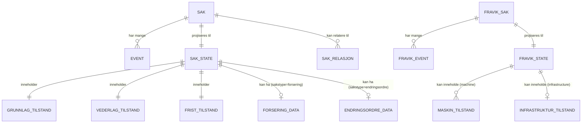
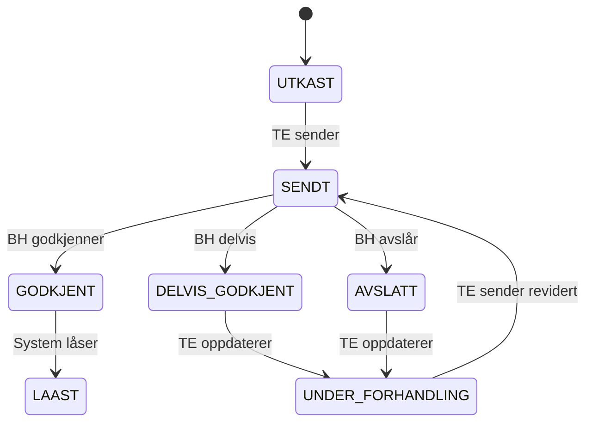
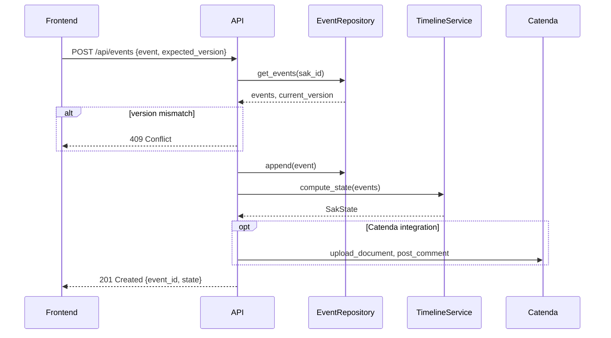
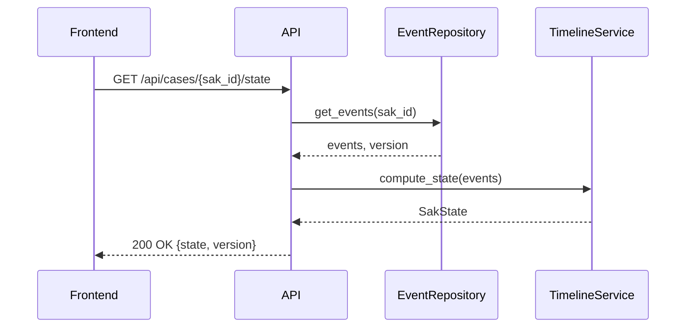
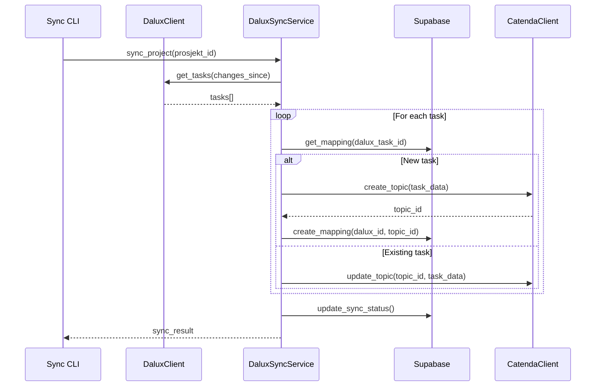

# Arkitektur og Datamodell

**Konseptuell oversikt over systemarkitektur, event sourcing og forretningslogikk**

*Sist oppdatert: 2026-01-22 (datamodell kvalitetssikret)*

> **Merk:** For detaljerte type-definisjoner, se kildekoden direkte:
> - KOE Event-modeller: `backend/models/events.py`
> - KOE State-modeller: `backend/models/sak_state.py`
> - Fravik Event-modeller: `backend/models/fravik_events.py`
> - Fravik State-modeller: `backend/models/fravik_state.py`
> - TypeScript-typer: `src/types/timeline.ts`, `src/types/fravik.ts`
> - API-spesifikasjon: `backend/docs/openapi.yaml` (auto-generert)

---

## Innhold

1. [Innledning](#1-innledning)
2. [Systemarkitektur](#2-systemarkitektur)
3. [Event Sourcing](#3-event-sourcing)
4. [Domenemodell](#4-domenemodell)
5. [Tre-spor modellen](#5-tre-spor-modellen)
6. [Port-modellen](#6-port-modellen)
7. [Subsidiær logikk](#7-subsidiær-logikk)
8. [Forsering (§33.8)](#8-forsering-338)
9. [Endringsordre (§31.3)](#9-endringsordre-313)
10. [Dataflyt](#10-dataflyt)
11. [Dalux-Catenda integrasjon](#11-dalux-catenda-integrasjon)

---

## 1. Innledning

### Begreper

| Begrep | Forklaring |
|--------|------------|
| **Event Sourcing** | Arkitekturmønster der alle endringer lagres som uforanderlige hendelser |
| **CQRS** | Command Query Responsibility Segregation - separasjon av lese- og skriveoperasjoner |
| **Spor** | Uavhengig behandlingslinje: Grunnlag, Vederlag, Frist |
| **Port-modell** | NS 8407-basert vurderingsstruktur med sekvensielle "porter" |
| **Subsidiært standpunkt** | BH tar prinsipal stilling men angir også hva resultatet ville vært hvis prinsipalt ikke får medhold |
| **Projeksjon** | Beregning av nåværende tilstand fra event-loggen |
| **Forsering** | Akselerasjon av arbeid når BH avslår berettiget fristkrav (§33.8) |
| **Endringsordre (EO)** | Formell instruks fra BH som endrer kontraktens omfang (§31.3) |
| **KOE** | Krav om endringsordre - standardsak som kan inkluderes i en EO |

---

## 2. Systemarkitektur

### Høynivå arkitektur

```
┌─────────────────────────────────────────────────────────────────────────┐
│                              FRONTEND                                    │
│                     React 19 + TypeScript + Vite                        │
└─────────────────────────────────┬───────────────────────────────────────┘
                                  │ HTTP/REST
                                  ▼
┌─────────────────────────────────────────────────────────────────────────┐
│                              BACKEND                                     │
│                     Flask 3 + Python + Pydantic v2                      │
├─────────────────────────────────────────────────────────────────────────┤
│                                                                         │
│   ┌─────────────────────┐              ┌─────────────────────┐         │
│   │    WRITE SIDE       │              │     READ SIDE       │         │
│   │  POST /api/events   │              │  GET /api/.../state │         │
│   │                     │              │                     │         │
│   │  • Validering       │              │  • Hent events      │         │
│   │  • Forretningsregler│              │  • Projiser state   │         │
│   │  • Persist event    │              │  • Returner view    │         │
│   └──────────┬──────────┘              └──────────▲──────────┘         │
│              │                                    │                     │
│              └────────────►  TimelineService  ◄───┘                     │
│                            (State Projection)                           │
│                                                                         │
└─────────────────────────────────────────────────────────────────────────┘
          │                         │                         │
          ▼                         ▼                         ▼
┌──────────────────┐    ┌───────────────────────┐    ┌───────────────────┐
│   SUPABASE       │    │       CATENDA         │    │      DALUX        │
│   (PostgreSQL)   │    │   Prosjekthotell      │    │   Build API       │
│                  │    │   Topics, Docs        │    │   (Tasks/Issues)  │
│ • Event Store    │    └───────────────────────┘    └─────────┬─────────┘
│ • Metadata       │              ▲                            │
│ • Synk-status    │              │                            │ Polling
│ • FK constraints │              └────────────────────────────┘
└──────────────────┘                    Dalux → Catenda Sync
```

### Database-arkitektur

**Primær database: Supabase (PostgreSQL)**

Systemet bruker Supabase som primær database for alle persistente data:

| Tabell | Innhold |
|--------|---------|
| `sak_metadata` | Metadata og cache for saker (sak_id, prosjekt_id, cached_status) |
| `koe_events` | Event log for standard KOE-saker |
| `forsering_events` | Event log for forseringssaker |
| `endringsordre_events` | Event log for endringsordrer |
| `fravik_events` | Event log for fravik-søknader |
| `dalux_sync_*` | Synkroniseringsmetadata for Dalux-integrasjon |

**Transaksjoner:** Supabase PostgREST støtter ikke client-side transaksjoner. Systemet bruker FK constraints og manuell rollback for å sikre dataintegritet. Se `backend/docs/DATABASE_ARCHITECTURE.md` for detaljer om begrensninger og produksjonsalternativer (Azure PostgreSQL/SQL).

### Lagdelt backend-arkitektur

```
Routes (HTTP-lag)
       │
       ▼
Services (Forretningslogikk)
       │
       ▼
Repositories (Data Access)
       │
       ▼
Supabase (PostgreSQL)
```

---

## 3. Event Sourcing

### Konsept

Event Sourcing lagrer **alle endringer som uforanderlige hendelser**. I stedet for å lagre bare "nåværende tilstand", lagrer vi *historikken* av alt som har skjedd.

```
Tradisjonell database:           Event Sourcing:
┌──────────────────────┐         ┌──────────────────────┐
│ sak_id: KOE-001      │         │ Event 1: sak_opprettet        │
│ status: GODKJENT     │         │ Event 2: grunnlag_opprettet   │
│ belop: 150000        │         │ Event 3: vederlag_krav_sendt  │
│ godkjent_belop: 120000│        │ Event 4: respons_grunnlag     │
└──────────────────────┘         │ Event 5: respons_vederlag     │
                                 └──────────────────────┘
      ↑                                    ↑
  Kun sluttresultat              Komplett historikk
```

### Fordeler

| Fordel | Beskrivelse |
|--------|-------------|
| **Komplett historikk** | Alle handlinger er logget - hvem gjorde hva, når |
| **Audit trail** | Tilfredsstiller krav til sporbarhet i offentlig sektor |
| **Debugging** | Kan "spole tilbake" og se tilstand på et gitt tidspunkt |
| **Konfliktfri** | Append-only betyr ingen UPDATE-konflikter |

### State Projection

Nåværende tilstand beregnes ved å "replay" alle events:

```python
def compute_state(events: List[SakEvent]) -> SakState:
    state = SakState(sak_id=events[0].sak_id)
    for event in events:
        state = apply_event(state, event)
    return state
```

Se `backend/services/timeline_service.py` for full implementasjon.

### Optimistisk låsing

```
1. Klient henter state + version
2. Bruker gjør endring i UI
3. Klient sender: { event, expected_version }
4. Server sjekker: expected_version == actual_version?
   ├── JA:  Lagre event, increment version, returner ny state
   └── NEI: 409 Conflict - klient må hente ny state og bekrefte
```

---

## 4. Domenemodell



### Detaljert datamodell (KOE, Forsering, Endringsordre)

```
┌─────────────────────────────────────────────────────────────────────────────────────┐
│                           EVENT SOURCING DATAMODELL                                  │
│                        (KOE, Endringsordre, Forsering)                              │
└─────────────────────────────────────────────────────────────────────────────────────┘

                                    ┌──────────────────┐
                                    │      EVENT       │
                                    ├──────────────────┤
                                    │ event_id     PK  │
                                    │ sak_id       FK  │
                                    │ event_type       │  ← 35+ event-typer
                                    │ tidsstempel      │
                                    │ aktor            │
                                    │ aktor_rolle      │  ← "TE" | "BH"
                                    │ kommentar        │
                                    │ refererer_til_   │
                                    │   event_id       │
                                    │ data         JSON│  ← Event-spesifikk payload
                                    └────────┬─────────┘
                                             │ projiseres til
                                             ▼
┌───────────────────────────────────────────────────────────────────────────────────────┐
│                                     SAK_STATE                                          │
├───────────────────────────────────────────────────────────────────────────────────────┤
│ sak_id                  PK                                                            │
│ sakstittel              string                                                        │
│ sakstype                enum     ← "standard" | "forsering" | "endringsordre"         │
│ catenda_topic_id        string?                                                       │
│ catenda_project_id      string?                                                       │
│ entreprenor             string?  ← TE                                                 │
│ byggherre               string?  ← BH                                                 │
│ prosjekt_navn           string?                                                       │
│ opprettet               datetime                                                      │
│ siste_aktivitet         datetime                                                      │
│ antall_events           int                                                           │
│───────────────────────────────────────────────────────────────────────────────────────│
│ COMPUTED FIELDS:                                                                      │
│ overordnet_status       string   ← "UTKAST"|"VENTER_PAA_SVAR"|"UNDER_FORHANDLING"... │
│ kan_utstede_eo          bool                                                          │
│ er_subsidiaert_vederlag bool     ← Grunnlag avslått MEN vederlag godkjent            │
│ er_subsidiaert_frist    bool     ← Grunnlag avslått MEN frist godkjent               │
│ er_frafalt              bool     ← §32.3 c frafall                                   │
│ neste_handling          dict     ← {rolle, handling, spor}                            │
│ sum_krevd               float                                                         │
│ sum_godkjent            float                                                         │
└───────────────────────────────────────────────────────────────────────────────────────┘
         │                              │                              │
         │ inneholder                   │ inneholder                   │ inneholder
         ▼                              ▼                              ▼
┌─────────────────────┐    ┌─────────────────────────┐    ┌─────────────────────────────┐
│  GRUNNLAG_TILSTAND  │    │   VEDERLAG_TILSTAND     │    │      FRIST_TILSTAND         │
├─────────────────────┤    ├─────────────────────────┤    ├─────────────────────────────┤
│ status              │    │ status                  │    │ status                      │
│ tittel              │    │ metode                  │    │ varsel_type                 │
│ hovedkategori       │    │ belop_direkte           │    │ krevd_dager                 │
│ underkategori       │    │ kostnads_overslag       │    │ begrunnelse                 │
│ beskrivelse         │    │ krever_justert_ep       │    │─────────────────────────────│
│ dato_oppdaget       │    │ begrunnelse             │    │ VARSLER:                    │
│ grunnlag_varsel     │    │─────────────────────────│    │ noytralt_varsel (VarselInfo)│
│ kontraktsreferanser │    │ SÆRSKILTE KRAV (§34.1.3)│    │ spesifisert_varsel          │
│─────────────────────│    │ saerskilt_krav    dict  │    │─────────────────────────────│
│ BH RESPONS:         │    │  └─ rigg_drift {belop,  │    │ BH RESPONS PORT 1 (Varsel): │
│ bh_resultat         │    │       dato_klar_over}   │    │ noytralt_varsel_ok          │
│ bh_begrunnelse      │    │  └─ produktivitet {...} │    │ spesifisert_krav_ok         │
│ laast               │    │─────────────────────────│    │ har_bh_etterlyst            │
│ bh_respondert_ver.  │    │ VARSLER:                │    │ begrunnelse_varsel          │
│─────────────────────│    │ rigg_drift_varsel       │    │─────────────────────────────│
│ METADATA:           │    │ justert_ep_varsel       │    │ BH RESPONS PORT 2 (Vilkår): │
│ siste_event_id      │    │ regningsarbeid_varsel   │    │ vilkar_oppfylt              │
│ siste_oppdatert     │    │ produktivitetstap_varsel│    │ begrunnelse_vilkar          │
│ antall_versjoner    │    │ krav_fremmet_dato       │    │─────────────────────────────│
└─────────────────────┘    │─────────────────────────│    │ BH RESPONS PORT 3 (Beregn.):│
                           │ BH RESPONS PORT 1:      │    │ bh_resultat                 │
                           │ saerskilt_varsel_ok     │    │ bh_begrunnelse              │
                           │ varsel_justert_ep_ok    │    │ godkjent_dager              │
                           │ varsel_start_regning_ok │    │ ny_sluttdato                │
                           │ krav_fremmet_i_tide     │    │ frist_for_spesifisering     │
                           │ begrunnelse_varsel      │    │─────────────────────────────│
                           │─────────────────────────│    │ SUBSIDIÆRT:                 │
                           │ BH RESPONS PORT 2:      │    │ subsidiaer_triggers  List   │
                           │ bh_resultat             │    │ subsidiaer_resultat         │
                           │ bh_begrunnelse          │    │ subsidiaer_godkjent_dager   │
                           │ bh_metode               │    │ subsidiaer_begrunnelse      │
                           │ godkjent_belop          │    │─────────────────────────────│
                           │─────────────────────────│    │ METADATA + COMPUTED:        │
                           │ SUBSIDIÆRT:             │    │ bh_respondert_versjon       │
                           │ subsidiaer_triggers     │    │ siste_event_id              │
                           │ subsidiaer_resultat     │    │ antall_versjoner            │
                           │ subsidiaer_godkjent_bel.│    │ differanse_dager (computed) │
                           │ subsidiaer_begrunnelse  │    │ visningsstatus (computed)   │
                           │─────────────────────────│    └─────────────────────────────┘
                           │ METADATA + COMPUTED:    │
                           │ bh_respondert_versjon   │
                           │ siste_event_id          │
                           │ antall_versjoner        │
                           │ krevd_belop (computed)  │
                           │ differanse (computed)   │
                           │ visningsstatus (comp.)  │
                           └─────────────────────────┘
```

#### Sakstype-spesifikke datastrukturer

SAK_STATE har én av disse basert på sakstype:

```
┌────────────────────────────────────┐       ┌────────────────────────────────────────┐
│       FORSERING_DATA (§33.8)       │       │      ENDRINGSORDRE_DATA (§31.3)        │
│   (kun når sakstype="forsering")   │       │  (kun når sakstype="endringsordre")    │
├────────────────────────────────────┤       ├────────────────────────────────────────┤
│ avslatte_fristkrav     List[str]   │       │ eo_nummer                string        │
│ dato_varslet           string?     │       │ revisjon_nummer          int           │
│ estimert_kostnad       float?      │       │ beskrivelse              string        │
│ bekreft_30_prosent_regel bool      │       │ vedlegg_ids              List[str]     │
│ begrunnelse            string?     │       │────────────────────────────────────────│
│────────────────────────────────────│       │ KONSEKVENSER (EOKonsekvenser):         │
│ KALKULASJON:                       │       │ sha, kvalitet, fremdrift, pris, annet  │
│ avslatte_dager         int         │       │ konsekvens_beskrivelse   string?       │
│ dagmulktsats           float       │       │────────────────────────────────────────│
│ maks_forseringskostnad float       │       │ VEDERLAG:                              │
│ kostnad_innenfor_grense (computed) │       │ oppgjorsform             string?       │
│────────────────────────────────────│       │ kompensasjon_belop       float?        │
│ STATUS:                            │       │ fradrag_belop            float?        │
│ er_iverksatt           bool        │       │ er_estimat               bool          │
│ dato_iverksatt         string?     │       │ netto_belop (computed)                 │
│ er_stoppet             bool        │       │────────────────────────────────────────│
│ dato_stoppet           string?     │       │ FRIST:                                 │
│ paalopte_kostnader     float?      │       │ frist_dager              int?          │
│────────────────────────────────────│       │ ny_sluttdato             string?       │
│ VEDERLAG (ForseringVederlag):      │       │────────────────────────────────────────│
│ metode                 string      │       │ STATUS OG RELASJONER:                  │
│ saerskilt_krav         dict?       │       │ status                   EOStatus      │
│ rigg_drift_varsel      dict?       │       │  ← "utkast"|"utstedt"|"akseptert"|     │
│ produktivitet_varsel   dict?       │       │    "bestridt"|"revidert"               │
│────────────────────────────────────│       │ relaterte_koe_saker      List[str]     │
│ BH RESPONS (ForseringBHRespons):   │       │ dato_utstedt             string?       │
│ vurdering_per_sak      List[dict]? │       │ utstedt_av               string?       │
│ dager_med_forseringsrett int?      │       │────────────────────────────────────────│
│ trettiprosent_overholdt bool?      │       │ TE RESPONS:                            │
│ trettiprosent_begrunnelse str?     │       │ te_akseptert             bool?         │
│ aksepterer             bool        │       │ te_kommentar             string?       │
│ godkjent_belop         float?      │       │ dato_te_respons          string?       │
│ begrunnelse            string      │       │────────────────────────────────────────│
│ rigg_varslet_i_tide    bool?       │       │ COMPUTED:                              │
│ godkjent_rigg_drift    float?      │       │ har_priskonsekvens       bool          │
│ godkjent_produktivitet float?      │       │ har_fristkonsekvens      bool          │
│ subsidiaer_triggers    List[str]?  │       └────────────────────────────────────────┘
│ subsidiaer_godkjent_belop float?   │
│ subsidiaer_begrunnelse string?     │
│ total_godkjent (computed)          │
└────────────────────────────────────┘
```

#### Sak-relasjoner

SAK_STATE.relaterte_saker inneholder liste av SakRelasjon:

| Felt | Type | Beskrivelse |
|------|------|-------------|
| `relatert_sak_id` | string | Lokal sak-ID |
| `relatert_sak_tittel` | string? | Cached tittel for display |
| `catenda_topic_id` | string? | Catenda topic GUID |
| `bimsync_issue_board_ref` | string? | Topic board ID |
| `bimsync_issue_number` | int? | Lesbart saksnummer |

**Relasjonstyper (utledes fra kontekst):**
- FORSERING → KOE: "basert_paa" (avslåtte fristforlengelser)
- ENDRINGSORDRE → KOE: "samler" (KOE-er som inngår i EO)

#### Enums og støttemodeller

| Enum | Verdier |
|------|---------|
| **SporStatus** | `IKKE_RELEVANT`, `UTKAST`, `SENDT`, `UNDER_BEHANDLING`, `GODKJENT`, `DELVIS_GODKJENT`, `AVSLATT`, `UNDER_FORHANDLING`, `TRUKKET`, `LAAST` |
| **GrunnlagResponsResultat** | `GODKJENT`, `DELVIS_GODKJENT`, `AVSLATT`, `FRAFALT` (§32.3 c), `KREVER_AVKLARING` |
| **VederlagBeregningResultat** | `GODKJENT`, `DELVIS_GODKJENT`, `AVSLATT`, `HOLD_TILBAKE` (§30.2) |
| **FristBeregningResultat** | `GODKJENT`, `DELVIS_GODKJENT`, `AVSLATT` |
| **VederlagsMetode** | `ENHETSPRISER` (§34.3), `REGNINGSARBEID` (§30.2/§34.4), `FASTPRIS_TILBUD` (§34.2.1) |
| **SubsidiaerTrigger** | `GRUNNLAG_AVSLATT`, `FORSERINGSRETT_AVSLATT`, `PREKLUSJON_RIGG`, `PREKLUSJON_PRODUKTIVITET`, `PREKLUSJON_EP_JUSTERING`, `PREKLUSJON_NOYTRALT`, `PREKLUSJON_SPESIFISERT`, `INGEN_HINDRING`, `METODE_AVSLATT` |

**VarselInfo-struktur:**
```
{
  dato_sendt: string?
  metode: List[str]?  // "epost", "byggemote", "telefon", etc.
}
```

### Sakstyper

| Sakstype | Beskrivelse | Hjemmel |
|----------|-------------|---------|
| `standard` | Ordinær KOE-sak med tre-spor behandling | NS 8407 |
| `forsering` | Akselerasjonssak basert på avslåtte fristkrav | §33.8 |
| `endringsordre` | Formell EO som samler godkjente KOE-saker | §31.3 |
| `fravik` | Søknad om fravik fra utslippsfrie krav på byggeplass | Utslippsfrie byggeplasser |

#### Fravik-søknader

Fravik er en separat sakstype for håndtering av søknader om unntak fra utslippsfrie krav på byggeplasser. Støtter to søknadstyper:

| Søknadstype | Beskrivelse |
|-------------|-------------|
| `machine` | Søknad om fravik for spesifikke maskiner/kjøretøy |
| `infrastructure` | Søknad om fravik for elektrisk infrastruktur på byggeplass |

**Godkjenningsflyt:** Søker → Miljørådgiver → Prosjektleder → Arbeidsgruppe → Eier

Se `backend/models/fravik_events.py` og `backend/models/fravik_state.py` for detaljer.

### Event-kategorier

Systemet har **45+ event-typer** fordelt på:

| Kategori | Eksempler | Aktør |
|----------|-----------|-------|
| Grunnlag | `grunnlag_opprettet`, `grunnlag_oppdatert` | TE |
| Vederlag | `vederlag_krav_sendt`, `vederlag_krav_oppdatert` | TE |
| Frist | `frist_krav_sendt`, `frist_krav_oppdatert` | TE |
| Respons | `respons_grunnlag`, `respons_vederlag`, `respons_frist` | BH |
| Forsering | `forsering_varsel`, `forsering_stoppet`, `forsering_respons` | TE/BH |
| Endringsordre | `eo_opprettet`, `eo_utstedt`, `eo_akseptert` | BH/TE |
| Fravik | `fravik_soknad_opprettet`, `fravik_miljo_vurdering`, `fravik_eier_godkjent` | Søker/Miljø/PL/Eier |

Se `backend/models/events.py` for komplett liste med EventType enum.

---

## 5. Tre-spor modellen

Saksbehandlingen er delt i tre **uavhengige spor** som kan behandles parallelt:

```
┌─────────────────────────────────────────────────────────────────────────┐
│                              SAK (KOE)                                   │
├─────────────────────────────────────────────────────────────────────────┤
│                                                                         │
│  ┌─────────────────┐  ┌─────────────────┐  ┌─────────────────┐         │
│  │    GRUNNLAG     │  │    VEDERLAG     │  │      FRIST      │         │
│  │   (Ansvar)      │  │   (Penger)      │  │     (Tid)       │         │
│  │                 │  │                 │  │                 │         │
│  │ "Har TE krav    │  │ "Hva koster     │  │ "Hvor lang      │         │
│  │  på endring?"   │  │  det?"          │  │  tid trengs?"   │         │
│  │                 │  │                 │  │                 │         │
│  │ § 33.1 a-c      │  │ § 34.1-34.4    │  │ § 33.4-33.8    │         │
│  └────────┬────────┘  └────────┬────────┘  └────────┬────────┘         │
│           │                    │                    │                   │
│           └────────────────────┼────────────────────┘                   │
│                                │                                        │
│                                ▼                                        │
│                    ┌──────────────────────┐                            │
│                    │  ENDRINGSORDRE (EO)  │                            │
│                    │      § 31.3          │                            │
│                    └──────────────────────┘                            │
│                                                                         │
└─────────────────────────────────────────────────────────────────────────┘
```

### Spor-statuser



---

## 6. Port-modellen

Hver BH-respons følger en **port-struktur** der vurderinger skjer sekvensielt:

### Grunnlag - Port 1 (Ansvar)

BH vurderer: Er TE's ansvarsgrunnlag gyldig?
- `godkjent` / `delvis_godkjent` / `avslatt` / `frafalt` (§32.3 c)

### Vederlag - Port 1 + Port 2

**Port 1 (Varsling/Preklusjon):**
- Ble BH varslet i tide om kostnadene?
- `saerskilt_varsel_rigg_drift_ok` (§34.1.3)
- `varsel_justert_ep_ok` (§34.3.3)
- `varsel_start_regning_ok` (§30.1)

**Port 2 (Beregning/Utmåling):**
- Er beløpet riktig beregnet?
- `godkjent` / `delvis_godkjent` / `avslatt` / `hold_tilbake` (§30.2)

### Frist - Port 1 + Port 2 + Port 3

**Port 1 (Varsling/Preklusjon):**
- `noytralt_varsel_ok` (§33.4)
- `spesifisert_krav_ok` (§33.6)
- `har_bh_etterlyst` (§33.6.2)

**Port 2 (Vilkår/Årsakssammenheng):**
- Medførte forholdet faktisk forsinkelse?
- `vilkar_oppfylt` (§33.1)

**Port 3 (Utmåling):**
- Hvor mange dager godkjennes?
- `godkjent` / `delvis_godkjent` / `avslatt`

---

## 7. Subsidiær logikk

Subsidiært standpunkt brukes når BH tar **prinsipal stilling** men også vil angi hva resultatet ville vært **hvis prinsipalt standpunkt ikke får medhold**.

### Eksempel

```
┌─────────────────────────────────────────────────────────────────┐
│                    BH's RESPONS                                  │
├─────────────────────────────────────────────────────────────────┤
│                                                                  │
│  PRINSIPALT STANDPUNKT:                                         │
│  Grunnlag: AVSLÅTT (BH mener TE har ansvaret selv)              │
│  Vederlag: Ikke aktuelt (følger av grunnlagsavslag)             │
│                                                                  │
│  SUBSIDIÆRT STANDPUNKT:                                         │
│  "Dersom BH ikke får medhold i prinsipalt standpunkt,           │
│   erkjennes det at vederlagskravet på 150 000 kr er             │
│   korrekt beregnet."                                            │
│                                                                  │
│  subsidiaer_triggers: [GRUNNLAG_AVSLATT]                        │
│  subsidiaer_resultat: GODKJENT                                  │
│  subsidiaer_godkjent_belop: 150000                              │
│                                                                  │
└─────────────────────────────────────────────────────────────────┘
```

### Hvorfor subsidiær godkjenning?

Subsidiær godkjenning er en **forhandlingsposisjon**, ikke en endelig løsning:
- Partene er **ikke enige** - det er fortsatt tvist om ansvarsgrunnlaget
- Saken er **ikke omforent** - TE har ikke fått det de krevde
- Hvis TE aksepterer avslaget → får ingenting
- Hvis TE tar saken videre og vinner på ansvaret → beløpet er allerede avklart

### SubsidiaerTrigger

Årsaker til at subsidiær vurdering er relevant:

| Trigger | Beskrivelse |
|---------|-------------|
| `GRUNNLAG_AVSLATT` | BH avslår ansvarsgrunnlaget |
| `PREKLUSJON_RIGG` | For sent varsel om rigg/drift (§34.1.3) |
| `PREKLUSJON_NOYTRALT` | For sent nøytralt varsel (§33.4) |
| `PREKLUSJON_SPESIFISERT` | For sent spesifisert krav (§33.6) |
| `INGEN_HINDRING` | BH mener ingen faktisk hindring (§33.5) |

Se `backend/models/events.py` for komplett SubsidiaerTrigger enum.

---

## 8. Forsering (§33.8)

Forsering gir TE rett til å akselerere arbeidet når BH uberettiget avslår fristforlengelseskrav.

### Konsept

```
┌─────────────────────────────────────────────────────────────────────────┐
│                    FORSERING KONSEPT (§33.8)                             │
├─────────────────────────────────────────────────────────────────────────┤
│                                                                          │
│  SITUASJON:                                                              │
│  • TE mener de har krav på fristforlengelse                             │
│  • BH avslår (helt eller delvis)                                        │
│  • TE ønsker likevel å overholde opprinnelig frist                      │
│                                                                          │
│  FORSERINGSRETT:                                                         │
│  • TE kan varsle at de vil forsere (akselerere)                         │
│  • TE får dekket forseringskostnader opp til en grense                  │
│  • Grense = (Avslåtte dager × Dagmulktsats) × 1.3 (30%-regelen)         │
│                                                                          │
│  EKSEMPEL:                                                               │
│  • BH avslår 15 dager fristforlengelse                                  │
│  • Dagmulktsats: 10 000 NOK/dag                                         │
│  • Dagmulkt totalt: 15 × 10 000 = 150 000 NOK                           │
│  • 30% buffer: 150 000 × 0.3 = 45 000 NOK                               │
│  • Maks forseringskostnad: 195 000 NOK                                  │
│                                                                          │
└─────────────────────────────────────────────────────────────────────────┘
```

### Livssyklus

1. **OPPRETTET** - Refererer til saker med avslåtte fristkrav, validerer 30%-regelen
2. **VARSLET** - TE varsler BH, angir estimert kostnad
3. **IVERKSATT** - Forsering startet, kan oppdatere påløpte kostnader underveis
4. **STOPPET** (hvis BH godkjenner frist) - TE får dekket påløpte kostnader
5. **BH-RESPONS** - BH aksepterer/avslår forsering

Se `backend/models/sak_state.py` (ForseringData) og `backend/services/forsering_service.py`.

---

## 9. Endringsordre (§31.3)

Endringsordre (EO) er en formell instruks fra BH som endrer kontraktens omfang.

### Konsept

```
┌──────────────────────────────────────────┐
│          ENDRINGSORDRE (EO)               │
│  EO-nummer: EO-2025-042                   │
│                                           │
│  Konsekvenser:                            │
│    ☑ Pris    ☑ Frist    ☐ SHA            │
│                                           │
│  Kompensasjon: 245 000 NOK               │
│  Fristforlengelse: 12 dager              │
└───────────────┬───────────────────────────┘
                │
    ┌───────────┼───────────┐
    │           │           │
    ▼           ▼           ▼
┌───────┐   ┌───────┐   ┌───────┐
│ KOE-1 │   │ KOE-2 │   │ KOE-3 │
│ 95 000│   │ 85 000│   │ 65 000│
└───────┘   └───────┘   └───────┘
```

### Livssyklus

1. **UTKAST** - BH oppretter EO, velger KOE-saker, angir konsekvenser
2. **UTSTEDT** - BH utsteder EO formelt, TE mottar varsel
3. **AKSEPTERT** - TE aksepterer, saken lukkes
4. **BESTRIDT** - TE bestrider med begrunnelse
5. **REVIDERT** - BH reviderer etter bestridelse, ny versjon

### KOE-kandidater

En KOE-sak er kandidat for EO når `kan_utstede_eo = true`:
- Grunnlag-sporet er GODKJENT eller LAAST
- Vederlag-sporet er GODKJENT/LAAST (eller IKKE_RELEVANT)
- Frist-sporet er GODKJENT/LAAST (eller IKKE_RELEVANT)

Se `backend/models/sak_state.py` (EndringsordreData) og `backend/services/endringsordre_service.py`.

---

## 10. Dataflyt

### Event submission (Write Side)



### State retrieval (Read Side)



---

## 11. Dalux-Catenda integrasjon

Systemet støtter enveis synkronisering av tasks fra Dalux Build til Catenda Topics.

### Konsept

```
┌──────────────────┐                    ┌──────────────────┐
│   DALUX BUILD    │                    │     CATENDA      │
│                  │    Polling (CLI)   │                  │
│   Tasks/Issues   │ ─────────────────► │   Topics/Docs    │
│   (read-only)    │    15 min interval │   (write)        │
└──────────────────┘                    └──────────────────┘
```

### Arkitekturbeslutninger

| Beslutning | Valg | Begrunnelse |
|------------|------|-------------|
| Synk-retning | Enveis Dalux → Catenda | Dalux API har kun lesing, ingen skrivetilgang |
| Synk-mekanisme | Polling (15 min) | Dalux har ikke webhook-støtte |
| Trigger | Manuell CLI (Fase 1) | Unngår infrastruktur-overhead i prototype |
| Database | Supabase | Konsistent med øvrig arkitektur |
| Event Sourcing | Nei (direkte CRUD) | Synk er infrastruktur, ikke forretningsdomene |

### Dataflyt



### Kjøring

```bash
# Manuell synkronisering (Fase 1)
cd backend && python scripts/dalux_sync.py sync

# Interaktiv meny
cd backend && python scripts/dalux_menu.py
```

**Fremtidig:** Azure Functions Timer Trigger for automatisk synkronisering.

Se [ADR-001: Dalux Sync](ADR-001-dalux-sync.md) for fullstendige arkitekturbeslutninger.

---

## Kildekode-referanser

| Område | Filer |
|--------|-------|
| **KOE Event-modeller** | `backend/models/events.py` |
| **KOE State-modeller** | `backend/models/sak_state.py` |
| **Fravik Event-modeller** | `backend/models/fravik_events.py` |
| **Fravik State-modeller** | `backend/models/fravik_state.py` |
| **State-projeksjon** | `backend/services/timeline_service.py` |
| **Forsering-logikk** | `backend/services/forsering_service.py` |
| **Endringsordre-logikk** | `backend/services/endringsordre_service.py` |
| **Fravik-logikk** | `backend/services/fravik_service.py` |
| **Dalux-synk** | `backend/services/dalux_sync_service.py` |
| **API-routes** | `backend/routes/*.py` |
| **TypeScript-typer** | `src/types/timeline.ts`, `src/types/fravik.ts` |
| **API-spesifikasjon** | `backend/docs/openapi.yaml` (auto-generert) |
| **Database-arkitektur** | `backend/docs/DATABASE_ARCHITECTURE.md` |

## Relatert dokumentasjon

- [README.md](../README.md) - Prosjektoversikt
- [ADR-001-dalux-sync.md](ADR-001-dalux-sync.md) - Dalux synk arkitekturbeslutninger
- [dalux-catenda-integrasjon.md](dalux-catenda-integrasjon.md) - Integrasjonsplan og krav
- [backend/docs/DATABASE_ARCHITECTURE.md](../backend/docs/DATABASE_ARCHITECTURE.md) - Database og transaksjoner
- [CLAUDE.md](../CLAUDE.md) - AI-assistentkontekst
- [backend/STRUCTURE.md](../backend/STRUCTURE.md) - Backend-arkitektur
