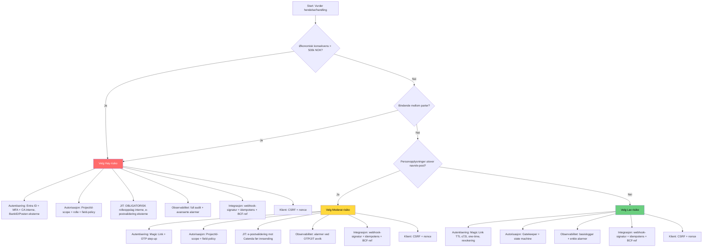

# Digital Samhandlingsplattform for Byggeprosjekter

**Fra manuelle skjemaer til datadrevet prosess**

November 2025

---

## Agenda

1. Problemstilling
2. Løsningsoversikt
3. Teknisk arkitektur (L1D)
4. Brukeropplevelse
5. Sikkerhet
6. L1D vs Power Pages React
7. Gevinster og kostnader
8. Veien videre

⠀
---

# Del 1: Problemstilling

---

## Dagens situasjon

**Prosess: Fravik og Endringsordre**

Prosessen håndteres via e-post og Word-maler. PDF-vedlegg sendes frem og tilbake mellom partene. All dokumentasjon arkiveres manuelt i Catenda.

**Hva er Catenda?** Catenda er et prosjektinformasjonsmodell-system (PIM) - en digital arbeidsflate hvor alle prosjektdokumenter, tegninger og saker samles og struktureres. Det fungerer som et samarbeidsverktøy for byggeprosjekter der alle parter (byggherre, entreprenører, rådgivere) har tilgang til relevant informasjon.

---

## Konsekvenser

**Datatap:**

Informasjonen blir innelåst i PDF-format, noe som betyr at dataene ikke kan søkes, sorteres eller analyseres automatisk. Når data ligger i PDF-filer kan vi ikke rapportere på tvers av prosjekter eller aggregere (samle og summere) informasjon for å få helhetlig innsikt i organisasjonen.

**Ineffektivitet:**

Prosjektledere (PL) bruker tid på å flytte filer mellom systemer manuelt. Behandlingstiden for en typisk søknad er 5-7 dager. Det skjer ofte dobbeltregistrering fordi samme informasjon må skrives inn på flere steder.

**Høy terskel:**

Leverandører sliter med å få tilgang til portaler og faller tilbake på e-post som kommunikasjonsform, noe som skaper mer manuelt arbeid.

---

## Hva vi trenger

**Krav:**

* **Strukturerte data** - informasjon som ligger i databaser hvor hvert datafelt har sin plass (ikke innelåst i PDF-filer)
* **Lav terskel** for eksterne brukere - enkelt å komme i gang uten kompliserte innloggingsprosesser
* **Automatisk arkivering** - dokumenter lagres riktig sted uten manuell håndtering
* **Sikker samhandling** - trygg deling av informasjon mellom parter
* **Skalerbart** til 50+ prosjekter - løsningen må fungere like godt om vi har 5 eller 50 prosjekter
**Hva er skalerbart?** En løsning som kan håndtere økt belastning (flere brukere, mer data) uten at det krever store endringer eller investeringer. Tenk på det som et hus med fleksible vegger - du kan enkelt gjøre det større når du trenger det.

---

# Del 2: Løsningsoversikt

---

## To pilot-applikasjoner

**1. Fravik utslippsfri byggeplass**

En leverandør søker om unntak fra miljøkrav (f.eks. bruk av dieselekskovator i stedet for elektrisk, eller arbeid som gir støy). En rådgiver vurderer søknaden faglig, og prosjektleder fatter endelig vedtak.

**2. Krav om Endringsordre (KOE)**

En prosess som starter med varsel om et forhold (f.eks. endrede tegninger), utvikler seg til et krav om endring, mottar svar fra byggherre, og ender i en kontraktsendring med økonomisk konsekvens. Denne prosessen krever høyere sikkerhet på grunn av de økonomiske implikasjonene.

**Hva er en endringsordre?** Når noe må endres i et byggeprosjekt etter at kontrakten er signert (f.eks. nye tegninger, uforutsette forhold), må dette formelt dokumenteres og prissettes. Dette kalles en endringsordre og kan påvirke både tid og kostnader.

---

## Felles plattform

**Konsept: "Samhandlingsfabrikken"**

Løsningen bygger på samme tekniske fundament med gjenbrukbare komponenter og én felles datamodell. Dette betyr at vi ikke lager separate, løsrevne applikasjoner for hvert prosjekt, men bygger komponenter som kan brukes på tvers.

**Hva er gjenbrukbare komponenter?** Tenk på LEGO-klosser - i stedet for å lage helt nye klosser hver gang, bruker vi de samme klossene (f.eks. en "godkjenn-knapp", et "filopplastings-felt", en "PDF-generator") i forskjellige sammenhenger. Dette sparer tid og penger.

**Hva er en datamodell?** En strukturert beskrivelse av hvilke data vi lagrer og hvordan de henger sammen. For eksempel: En søknad tilhører ett prosjekt, et prosjekt har én prosjektleder, en søknad kan ha flere vedlegg. Dette sikrer at informasjonen er organisert og konsistent.

---

## Teknologivalg: L1D

**L1D: React + Dataverse + Azure Functions**

**Hvorfor "1D"?**

* **L1** = Custom React frontend (en skreddersydd brukerflate laget med React-teknologi)
* **D** = Dataverse (en kraftig database fra Microsoft, ikke SharePoint)
**Hva er React?** React er et JavaScript-bibliotek for å bygge brukergrensesnitt. Tenk på det som LEGO-klosser for websider - du bygger små, gjenbrukbare komponenter (som knapper, skjemafelt, tabeller) som kan settes sammen til komplette applikasjoner. Når data endres, oppdaterer React automatisk kun de delene av siden som må endres, uten å laste hele siden på nytt.

**Hva er Dataverse?** Dataverse er Microsofts skybaserte database-plattform, spesielt designet for forretningsapplikasjoner. Den har innebygd sikkerhet, relasjoner mellom data, og integrasjon med andre Microsoft-verktøy som Power BI. Fordelen fremfor SharePoint er at Dataverse ikke har samme begrensninger på antall dataposter og kan håndtere mer komplekse datastrukturer.

**Hva er Azure Functions?** Azure Functions er "serverless" kode - små programfunksjoner som kjører i skyen kun når de trengs. Du betaler bare for den tiden koden faktisk kjører, ikke for servere som står og venter. Det er som å leie en bil kun når du kjører, i stedet for å eie en bil som står parkert mesteparten av tiden.

**Alternativ evaluert:**

Power Pages med React SPA (L4) - en annen løsning som ble vurdert, men valgt bort (mer om dette senere).

**Hva er SPA?** SPA står for Single Page Application - en webapplikasjon som laster én side og deretter dynamisk oppdaterer innholdet når brukeren interagerer med den, i stedet for å laste hele nye sider fra serveren. Dette gir en raskere og mer flytende brukeropplevelse, som føles mer som en desktop-app enn en tradisjonell nettside.

---

# Del 3: Teknisk arkitektur (L1D)

---

## Arkitektur-oversikt

```
[Bruker] 
   ↓
[Azure Front Door + WAF]
   ↓
[Azure Static Web Apps - React]
   ↓
[Azure Functions - Python]
   ↓
[Dataverse] ↔ [Catenda]
```

**Forklaring av flyten:**

1. **Bruker** - person som åpner applikasjonen i nettleseren
2. **Azure Front Door + WAF** - inngangsport med sikkerhetsfilter (mer om dette under sikkerhet)
3. **Azure Static Web Apps** - hvor React-applikasjonen ligger lagret og serveres fra
4. **Azure Functions** - forretningslogikken som håndterer forespørsler
5. **Dataverse** - database hvor data lagres permanent
6. **Catenda** - eksisterende system som mottar ferdig dokumentasjon

⠀
**Hva er Azure Front Door?** En global inngangsport til applikasjonen som sikrer at brukere får raskest mulig respons uansett hvor i verden de befinner seg. Den ruter trafikk til nærmeste tilgjengelige server.

**Hva er WAF?** WAF står for Web Application Firewall - en brannmur som beskytter webapplikasjoner mot angrep. Den filtrerer og overvåker HTTP-trafikk og blokkerer mistenkelige forespørsler før de når applikasjonen.

**Hva er Azure Static Web Apps?** En Azure-tjeneste optimalisert for å hoste moderne webapplikasjoner (som React-apper). "Statisk" betyr at HTML/CSS/JavaScript-filene er ferdig bygget og ligger klare til å serveres - de genereres ikke dynamisk for hver forespørsel. Dette gjør det ekstremt raskt og billig.

---

## Frontend: React + Punkt

**Stack:**

* **React 19** - den nyeste versjonen av React
* **TypeScript** - et programmeringsspråk som bygger på JavaScript med bedre typesikkerhet
* **Vite** - et moderne byggeverktøy som gjør utviklingsprosessen raskere
* **Punkt (Oslo kommunes designsystem)** - ferdiglagde komponenter med riktig visuell profil
* **Tailwind CSS** - et verktøy for å style komponenter effektivt
**Hva er TypeScript?** En utvidelse av JavaScript som legger til "typer" - du må spesifisere hva slags data en variabel skal inneholde (f.eks. "dette er et tall", "dette er tekst"). Dette fanger opp mange feil allerede når koden skrives, ikke først når den kjører.

**Hva er Vite?** Et byggeverktøy som tar React-koden (som er skrevet på en måte som er lett for utviklere å jobbe med) og konverterer den til optimaliserte filer som nettleseren kan kjøre raskt. Tenk på det som en kompilator som pakker koden sammen, fjerner unødvendig informasjon og optimaliserer for hastighet. Vite er spesielt kjent for å være ekstremt rask under utvikling.

**Hva er Punkt?** Punkt er Oslo kommunes designsystem - en samling av ferdigutviklede komponenter (knapper, skjema, farger, typografi) som sikrer at alle kommunale digitale tjenester ser like ut og oppfører seg konsistent. Dette gjør det enklere for innbyggere å kjenne igjen kommunale tjenester og reduserer utviklingstiden fordi vi ikke må "finne opp hjulet på nytt" hver gang.

**Hva er Tailwind CSS?** Et CSS-rammeverk som lar deg style komponenter ved å legge til små, gjenbrukbare klasser direkte i HTML-en. I stedet for å skrive egne CSS-filer, bruker du forhåndsdefinerte klasser som "bg-blue-500" (blå bakgrunn) eller "p-4" (padding). Dette gir rask utvikling og konsistent design.

**Fordeler:**

* **Responsivt design** - grensesnittet tilpasser seg automatisk skjermstørrelsen (mobil, nettbrett, desktop) uten at vi må lage separate versjoner
* **WCAG 2.1 AA** - oppfyller internasjonal standard for universell utforming, som sikrer at tjenesten er tilgjengelig for personer med nedsatt syn, motoriske utfordringer eller andre funksjonsvariasjoner
* **Konsistent med kommunal profil** - brukere gjenkjenner tjenesten som offisiell og trygg
**Hva er WCAG?** Web Content Accessibility Guidelines - internasjonale retningslinjer for hvordan digitale tjenester skal utformes for å være tilgjengelige for alle, inkludert personer med funksjonsnedsettelser. "AA-nivå" er et middels strengt krav som de fleste offentlige tjenester må oppfylle.

**Hva er responsivt design?** Design som automatisk tilpasser seg skjermstørrelsen. På mobil vises innholdet i én kolonne, på nettbrett kanskje to kolonner, og på desktop tre kolonner. Knapper og tekst skaleres også for å være lesbare uansett enhet.

---

## Backend: Azure Functions

**Stack:**

* **Python 3.11** - programmeringsspråket vi bruker for backend-logikk
* **Serverless (Consumption Plan)** - vi betaler kun for faktisk kjøretid, ikke for servere som står idle
* **REST API** - kommunikasjonen mellom frontend og backend skjer via standardiserte HTTP-forespørsler med JSON-format
**Hva er Python?** Et populært programmeringsspråk kjent for å være lesbart og ha mange innebygde biblioteker for å løse vanlige oppgaver. Det er mye brukt i backend-utvikling, dataanalyse og automatisering.

**Hva er Serverless?** En modell hvor du ikke trenger å administrere servere selv. Cloud-leverandøren (Azure) håndterer all infrastruktur, skalering og vedlikehold. Du skriver bare koden, og den kjører automatisk når den trengs. "Consumption Plan" betyr at du betaler per kjøring, ikke for servere som alltid kjører.

**Hva er REST API?** REST (Representational State Transfer) er en arkitekturstil for å bygge APIer. Et REST API kommuniserer via standard HTTP-metoder (GET = hent data, POST = opprett data, PUT = oppdater data, DELETE = slett data) og bruker JSON-format for å utveksle data. Dette gjør det enkelt for ulike systemer å snakke sammen.

**Hva er JSON?** JavaScript Object Notation - et tekstformat for å strukturere data på en måte som både mennesker og maskiner lett kan lese. Eksempel: `{"navn": "Ole", "alder": 42, "rolle": "PL"}`. Dette er standard format for datautveksling på nettet.

**Pattern:**

* **Gatekeeper** - sikkerhet implementert direkte i koden (validering før data slipper inn)
* **Validering** før datautlevering - sjekker at forespørsler er gyldige og autoriserte
* **Managed Identity** til Dataverse - sikker tilkobling uten lagrede passord
**Hva er Gatekeeper-pattern?** Et designmønster hvor all trafikk må gjennom en "portvakt" som sjekker identitet og tillatelser før den slipper forespørsler videre til systemet. Dette sikrer at sikkerhet ikke "glemmes" noen steder i koden.

**Hva er Managed Identity?** En Azure-funksjon hvor applikasjoner får en automatisk identitet som kan få tilgang til andre Azure-tjenester uten at vi må lagre brukernavn og passord i koden. Azure håndterer all autentisering automatisk i bakgrunnen. Dette er mye sikrere enn å ha passord liggende i konfigurasjonsfiler.

---

## Database: Dataverse

**Hvorfor Dataverse?**

* **Ingen 5000-grense** - SharePoint har en begrensning på 5000 elementer per spørring/visning (List View Threshold), noe som skaper problemer ved høyt datavolum. Dataverse har ingen slik begrensning.
* **Row-level security (RLS)** - innebygd sikkerhet på radnivå for **interne** (Entra ID-brukere). For **eksterne** (Magic Link) håndheves tilgang i **API-laget** (Azure Functions) med server-side filtrering (prosjekt-scope + felttilgang).
* **Native Power BI connector** - direkte integrasjon med rapporteringsverktøy
* **Cloud-native skalerbarhet** - bygget for skyen fra grunnen av
**Hva er 5000-grensen i SharePoint?** En teknisk begrensning i SharePoint hvor spørringer som berører mer enn 5000 elementer blir throttlet (bremset) eller feiler. Dette er en ytelsesoptimalisering i SharePoint, men blir et reelt problem når man jobber med store datamengder. Dataverse har ingen slik begrensning.

**Hva er Row-level security (RLS)?** Sikkerhet som defineres på radnivå i databasen - for eksempel kan en bruker kun se rader (dataposter) som tilhører deres egne prosjekter. Dette håndteres automatisk av databasen, så du slipper å programmere dette i applikasjonskoden.

**Hva er en native connector?** En innebygd integrasjon som fungerer "ut av boksen" uten behov for tilleggskonfigurasjon eller mellomvare. Power BI har en native Dataverse-connector, noe som betyr at du kan koble Power BI direkte til Dataverse og begynne å lage rapporter med få klikk.

**Hva er cloud-native?** En applikasjon designet spesifikt for å kjøre i skyen (ikke bare "flyttet til skyen"). Cloud-native applikasjoner utnytter skalerbarhet, elastisitet og managed services i skyen. Dataverse er bygget for Azure fra grunnen av, i motsetning til tradisjonelle databaser som SQL Server som opprinnelig ble designet for on-premise servere.

**Datamodell:**

* **Applications** (søknader) - alle fravik-søknader og endringsordrer
* **Projects** (prosjekter) - metadata om byggeprosjektene
* **AuditLog** (revisjonslogg) - sporbarhet av alle endringer
**Hva er en datamodell?** En strukturert beskrivelse av hvilke tabeller (entities) vi har i databasen, hvilke felt (attributter) hver tabell har, og hvordan tabellene er relatert til hverandre. For eksempel: En Application tilhører ett Project via en ProjectID (fremmednøkkel).

**Hva er en AuditLog?** En logg som registrerer alle hendelser i systemet - hvem gjorde hva, når og hvorfor. Dette er kritisk for sporbarhet, feilsøking og å oppfylle juridiske krav om dokumentasjon. Eksempel: "Bruker X godkjente søknad Y den 15.11.2025 kl 14:32".

---

## Integrasjon: Catenda

**Rolle:**

* **Dokument-master** - Catenda er autoritativ kilde for ferdige PDF-dokumenter
* **Prosjektdata** - vi henter informasjon om prosjekter og deltakere via Catenda sitt API
**Hva er en "master"?** I arkitekturterminologi er "master" det systemet som er den autoritative kilden for en bestemt type data. "Dokument-master" betyr at Catenda er den offisielle kilden for alle prosjektdokumenter - hvis det er uenighet om hvilken versjon av et dokument som er riktig, er det Catenda sin versjon som gjelder.

**Hva er et API?** Application Programming Interface - et grensesnitt som lar to systemer kommunisere med hverandre programmatisk. I stedet for at en person må logge inn i Catenda og manuelt hente data, kan vårt system automatisk spørre Catenda sitt API om informasjon (f.eks. "Gi meg alle prosjektdeltakere for prosjekt X").

**API-bruk:**

* **Hent prosjektdeltakere** - for å populere listen i Link Generator (slik at PL kan velge hvem som skal motta lenke)
* **Last opp PDF (v2)** - automatisk arkivering av ferdig godkjente søknader til library
* **Opprett BCF document reference** - etter upload må dokumentet refereres på riktig BCF-topic
* **Post lenke tilbake til sak** - legger til klikkbar lenke i Catenda-saken

#### BCF document reference (påkrevd) og GUID-format

Catenda v2 returnerer **compact GUID (32 tegn)** ved opplasting; BCF krever **UUID (36)**. Vi **må** formatere:

```python
def catenda_compact_to_uuid(compact: str) -> str:
    c = compact.replace('-', '').lower()
    return f"{c[:8]}-{c[8:12]}-{c[12:16]}-{c[16:20]}-{c[20:32]}"
```

Deretter:

1) `POST /v2/.../items` (upload) → compact id
2) Konverter til UUID (36)
3) `POST /opencde/bcf/3.0/.../topics/{topic_guid}/document_references` med `document_guid` (36)
4) Håndter 429/5xx med **exponential backoff** + **retry**; logg audit.

**Webhook-trigger:**

Når en ny sak opprettes i Catenda, sender Catenda automatisk et signal (webhook) til vår backend. Vår backend genererer da en unik lenke til skjemaet og poster denne tilbake til Catenda-saken. Dette skjer helt automatisk uten manuell intervensjon.

**Hva er en webhook?** En måte for ett system å automatisk varsle et annet system når noe skjer. Tenk på det som et push-varsel: I stedet for at vårt system kontinuerlig må spørre Catenda "har det skjedd noe nytt?" (polling), sender Catenda automatisk beskjed til oss når noe relevant skjer (push). Dette er mer effektivt og sanntidsbasert.

#### Webhook-sikkerhet og idempotens

For å sikre at kun gyldige webhooker behandles, **må** vi:

1) **Validere Secret Token**: Siden Catenda ikke støtter HMAC-signering, benyttes Secret Token i URL query parameter (`?token=SECRET`). Backend verifiserer token mot delt hemmelighet lagret i **Azure Key Vault** med constant-time comparison. Ugyldig token → `401`.
2) **Idempotens**: Backend lagrer `eventId` og timestamp i Dataverse; samme event behandles ikke to ganger (returner `202` uten sideeffekter).

```python
# Pseudokode (Azure Functions - Produksjon)
def handle_webhook(req):
    received_token = req.params.get("token", "")
    secret = kv.get_secret("CatendaWebhookSecret")
    if not secrets.compare_digest(received_token, secret): return 401

    body = req.get_body()
    event_id = json.loads(body).get("event","") + ":" + json.loads(body)["data"]["caseId"]
    if already_processed(event_id): return 202
    mark_processed(event_id)
    # ... generer lenke, post tilbake, osv.
    return 202
```

**Prototype (lokal utvikling):**
- Benytter Secret Path i URL (`/webhook/catenda/{SECRET_PATH}`) for enkelhetens skyld
- **Kritisk:** Logger må konfigureres for log masking av webhook-path
- Dokumentert secret rotation-rutine ved mistanke om kompromittering

**Hva er constant-time comparison?** En sammenligningsmetode som tar like lang tid uavhengig av hvor mange tegn som matcher. Dette forhindrer "timing attacks" hvor en angriper måler responstid for å gjette hemmeligheten tegn for tegn.

---

## JIT-sjekk (Catenda → rolle)

Ved BH-innlogging (Entra ID) gjør vi en on-demand rolleoppslag mot Catenda:

1) **Normalisering av e-post**: lowercase, trim; alias-mapping ved behov (subsidiærer/domener)
2) **GET /projects/{id}/members**: finn match på e-post eller unik Catenda-ID
3) **Kortvarig cache (5–10 min)** per (user, project) for ytelse; invalidér ved feilsvar
4) **Audit**: lagre beslutning `{user, project, role, source:catenda, ts}` i AuditLog

Fallback: hvis Catenda utilgjengelig → read-only eller avslag; logg hendelse og alert PL.

### JIT-validering av TE-e-post (KOE innsending)

Ved innsending fra entreprenør:

1) Backend normaliserer e-post (lowercase/trim, alias-mapping).
2) `GET /projects/{id}/members` (Catenda) – sjekk om e-post finnes blant Project Members.
3) Finnes e-post → tillat innsending; logg audit `{email, project, memberFound:true, ts}`.
4) Finnes ikke → avvis med `403`, og informer om at innsender må være lagt inn i Catenda-prosjektet eller bruke personlig Magic Link (1:1).

Caching: kortvarig (5–10 min) for ytelse; invalidér ved feil.

---

## Dataverse throttling

**Service Protection Limits:**

* **6000 requests per 5 minutter** per bruker
Dataverse har innebygde begrensninger for å beskytte plattformen mot overbelastning. Hvis én bruker sender mer enn 6000 API-forespørsler på 5 minutter, vil Dataverse begynne å avvise forespørsler med en "429 Too Many Requests"-respons.

**Hva er throttling?** En mekanisme som begrenser hvor mange forespørsler et system vil akseptere innenfor en tidsperiode. Dette beskytter systemet mot overbelastning og sikrer at alle brukere får rettferdig tilgang. Tenk på det som fartshumper som sikrer at ikke én bil (bruker) kjører så fort at den skaper farlige situasjoner for andre.

**Håndtering:**

* **Exponential backoff** ved 429-respons - hvis vi får "429 Too Many Requests", venter vi litt før vi prøver igjen, og øker ventetiden for hver gang
* **Retry** - prøv igjen med økende intervaller: 1s → 2s → 4s → 8s
* **Circuit breaker** ved vedvarende feil - hvis feilene fortsetter, stopper vi helt midlertidig i stedet for å bombardere systemet
* **Asynkron kø** for ikke-kritiske operasjoner - mindre viktige oppgaver legges i en kø som behandles gradvis
**Hva er exponential backoff?** En strategi hvor vi dobler ventetiden for hver gang vi prøver igjen etter en feil. Første gang venter vi 1 sekund, neste gang 2 sekunder, så 4, så 8, osv. Dette gir systemet tid til å komme seg og unngår at vi overbelaster det ytterligere.

**Hva er en circuit breaker?** Inspirert av elektriske sikringer - hvis systemet oppdager vedvarende feil, "kobler det ut" midlertidig og prøver ikke å sende flere forespørsler før en cooldown-periode er over. Dette forhindrer at et allerede overbelastet system får enda mer trafikk.

**Hva er en asynkron kø?** En venteliste for oppgaver som ikke må skje umiddelbart. Oppgavene legges i en kø og behandles når systemet har kapasitet. Tenk på det som en printkø - dokumentene skrives ut i rekkefølge, ikke alle samtidig.

---

## PDF-generering

**Teknologi: Client-side rendering (@react-pdf)**

PDFen genereres lokalt i brukerens nettleser, ikke på serveren. Dette gjøres med et React-bibliotek kalt @react-pdf/renderer.

**Hva er client-side rendering?** Prosessering som skjer i brukerens nettleser (klienten), ikke på serveren. Dette betyr at brukerens datamaskin gjør jobben, noe som avlaster serveren og gir raskere respons. Ulempen er at eldre enheter kan oppleve treghet.

**Fordeler:**

* **100% WYSIWYG** - "What You See Is What You Get" - PDFen ser nøyaktig ut som skjermvisningen
* **Avlaster serveren** - brukerens maskin genererer PDFen, ikke Azure Functions
* **Sparer Azure-kostnader** - færre serveroperasjoner = lavere regning
**Flyt:**

1. Bruker fyller ut skjema
2. React genererer PDF-blob i sanntid mens brukeren fyller ut
3. Bruker ser preview og godkjenner
4. Ferdig PDF sendes til backend → Catenda for arkivering

⠀
**Hva er en blob?** Binary Large Object - et stort binært dataobjekt, typisk en fil (bilde, PDF, video). I dette tilfellet er det den genererte PDF-filen som ligger i minnet i nettleseren før den lastes opp.

---

## Filopplasting

**Microsoft Graph API:**

Microsoft Graph er et samlet API for å få tilgang til data på tvers av Microsoft 365-tjenester (Outlook, SharePoint, Teams, osv.). Vi bruker det til å laste opp vedlegg til SharePoint.

**Hva er Microsoft Graph API?** Et REST API som gir tilgang til data og intelligens i Microsoft 365-skyen. I stedet for å ha separate APIer for hver tjeneste (ett for SharePoint, ett for Outlook, osv.), gir Graph ett samlet grensesnitt. Tenk på det som en felles resepsjon for hele Microsoft 365-bygningen.

**Støtte:**

* **Upload til SharePoint** - vedlegg lagres på SharePoint-biblioteker knyttet til prosjektet
* **Resumable upload** - for store filer kan opplasting fortsette der den stoppet hvis nettverket bryter
**Hva er resumable upload?** En teknikk som deler store filer opp i mindre "chunks" (biter) som lastes opp sekvensielt. Hvis nettverksforbindelsen bryter under opplasting av en 200 MB-fil, kan opplastingen fortsette fra siste vellykkede chunk i stedet for å starte på nytt. Dette er kritisk for dårlige mobilforbindelser på byggeplasser.

**Filtyper:**

* Bilder (JPEG, PNG)
* Tegninger (PDF)
* Dokumenter (< 250 MB) - Microsoft Graph støtter filer opp til 250 MB via resumable upload
---

# Del 4: Brukeropplevelse

---

## Tre inngangsdører

**Konsept: Tilpass tilgang til kontekst**

Vi har tre ulike måter å få tilgang til skjemaet på, tilpasset brukerens situasjon og behov:

1. **Catenda-brukeren** (kontekstuell) - brukere som jobber i Catenda og klikker lenke derfra
2. **Invitasjonslenke** (Magic Link) - brukere som får tilsendt en personlig lenke via e-post
3. **Interne via MyApps** (SSO) - ansatte i Oslobygg som logger inn via Single Sign-On

⠀
**Hva er Single Sign-On (SSO)?** En påloggingsmekanisme hvor brukeren logger inn én gang (vanligvis ved oppstart av arbeidsdagen) og deretter får automatisk tilgang til alle systemer uten å måtte logge inn på nytt i hvert enkelt system. Dette reduserer "passordtretthet" og øker sikkerheten.

**Hva er MyApps?** Microsofts portal (myapps.microsoft.com) hvor ansatte finner alle sine arbeidsapplikasjoner som "fliser" - små ikoner de kan klikke på for å åpne applikasjonen. Det fungerer som en startmeny for virksomhetens digitale tjenester.

---

## Dør 1: Catenda-kontekst

**Scenario:**

En leverandør jobber med en sak i Catenda. Prosjektleder har lagt inn en lenke i saken. Leverandør klikker på lenken og kommer direkte til et forhåndsutfylt skjema.

**Ingen innlogging:**

Lenken er kontekstuell - den inneholder en unik identifikator (UUID) som kobler den til riktig prosjekt og sak. Prosjektdata er forhåndsutfylt basert på denne konteksten.

**Hva er en UUID?** Universally Unique Identifier - en 128-bit identifikator som er globalt unik. Den ser typisk slik ut: `550e8400-e29b-41d4-a716-446655440000`. Sannsynligheten for at to UUIDer er like er så lav at det i praksis aldri skjer (selv om milliarder genereres).

**Sikkerhet:**

Catenda fungerer som *autentiseringsgrense* - bare prosjektmedlemmer kan se lenken i Catenda-saken.

**Viktig presisering:** Lenken i saken er **ikke personlig**; den kan brukes av *alle* prosjektmedlemmer med tilgang til saken. Identiteten ved bruk av lenken er derfor **selvdeklarert** i skjemaet (navn/e-post), med audit og begrenset gyldighet (TTL ≤ 72t, one-time).

**Hva er en autentiseringsgrense?** Et punkt i systemarkitekturen hvor brukerens identitet verifiseres. I dette tilfellet stoler vi på at Catenda har gjort jobben med å verifisere hvem brukeren er og om de skal ha tilgang til denne saken. Vi "arver" Catendas sikkerhet i stedet for å bygge vår egen parallelle innlogging.

---

## Catenda som autentiseringsgrense

**Hva er Catenda?**

Et invitation-only PIM-system (prosjektinformasjonsmodell) hvor tilgang styres strengt. Alle brukere må inviteres til prosjektet.

**Autentisering:**

* **Interne brukere**: Logger inn via Entra ID (Microsofts identitetstjeneste)
* **Eksterne brukere**: Inviteres til prosjektet via e-post
**Hva er Entra ID?** Microsofts skybaserte identitets- og tilgangsstyringssystem (tidligere kalt Azure Active Directory). Det håndterer innlogging, flerfaktorautentisering, tilgangskontroll og mer. Tenk på det som den digitale portvakten for alle Microsoft-tjenester.

**For å se lenken i Catenda:**

1. Bruker må være logget inn i Catenda
2. Bruker må være medlem av prosjektet
3. Bruker må ha tilgang til saken

⠀
**Tillit:**

Hvis du kan klikke lenken i Catenda, er du allerede autorisert. Vår løsning stoler på Catendas tilgangskontroll.

**Hva er tillit mellom systemer?** Et sikkerhetsprinsipp hvor ett system (vårt) aksepterer autentiseringen fra et annet system (Catenda) uten å gjenta prosessen. Dette kalles også "federated trust" - vi inngår en "tillitsavtale" med Catenda om at deres brukerkontroll er god nok for oss.

---

## Dør 2: Magic Link

**Scenario:**

Prosjektleder skal invitere noen som ikke er med i Catenda-saken ennå (f.eks. en ny underleverandør).

**Hva er en Magic Link?** En spesiell type lenke som gir tilgang til et system uten tradisjonell brukernavn/passord-pålogging. Lenken selv fungerer som "nøkkelen" - hvis du har lenken, får du tilgang. Dette er samme konsept som "Glemt passord"-lenker du får på e-post.

**Flyt:**

1. PL åpner "Link Generator" i applikasjonen
2. PL velger mottaker fra en liste (hentet fra Catenda API)
3. Systemet genererer en unik UUID-lenke
4. E-post sendes automatisk til mottaker
5. Mottaker klikker lenken i e-posten → kommer direkte til forhåndsutfylt skjema

⠀
**Sikkerhet:**

* **UUID v4** - 3.4×10³⁸ mulige kombinasjoner (praktisk talt umulig å gjette)
* **TTL ≤ 72 timer** - lenken utløper innen 3 døgn (konfigurerbart per prosess)
* **One-time token** - lenken blir **ugyldig** etter første gyldige bruk (single-use)
* **Revokering** - lenken revokeres automatisk ved statusendring (f.eks. Submitted/Closed) eller ved mistenkelig aktivitet
* **Personlig lenke (1:1)** - gjelder **kun** lenker som sendes direkte til en spesifikk e-postadresse fra *Link Generator*. Lenker postet inne i Catenda-saken er **ikke** 1:1
**Hva er TTL (Time To Live)?** En "utløpsdato" på lenken. Etter 30 dager blir lenken automatisk ugyldig, selv om noen skulle få tak i den. Dette reduserer risikoen ved at lenker deles eller havner på avveie. Tenk på det som en adgangskode til et hotellrom som kun virker under oppholdet ditt.

**Hva er 1:1 mapping?** Hver lenke er unik knyttet til én spesifikk person. Lenken lagres i databasen sammen med informasjon om hvem den er sendt til. Dette gir sporbarhet - vi vet alltid hvem som har brukt hvilken lenke.

---

## Dør 3: Interne via SSO

**Scenario:**

En prosjektleder skal behandle innkomne søknader og trenger tilgang til saksbehandlingsfunksjoner.

**Autentisering:**

* **Entra ID (Single Sign-On)** - bruker er allerede logget inn i Microsoft-økosystemet
* **MFA** (Multi-Factor Authentication) arves fra organisasjonens sikkerhetsregler
**Hva er MFA (Multi-Factor Authentication)?** Flerfaktorautentisering - du må bevise identiteten din på minst to måter. Typisk: (1) noe du vet (passord) + (2) noe du har (engangskode på mobil) eller (3) noe du er (fingeravtrykk). Dette gjør det mye vanskeligere for hackere å få tilgang selv om de stjeler passordet ditt.

**Tilgang:**

* **Saksbehandlingsmodus** - kan se og behandle søknader (Fane 2)
* **Link Generator** - kan generere Magic Links til eksterne
* **Alle prosjekter** - ser søknader på tvers, ikke bare egne
---

## TE-bekreftelse før innsending (KOE)

Før en entreprenør (TE) kan sende inn **Krav om Endringsordre**, må TE:

1) Bekrefte **navn og e-post** i skjemaet (forhåndsutfylt prosjektinfo, men identitet må oppgis).
2) Passere en **e-postvalidering** mot Catendas Project Members for aktuell **ProjectID** (JIT-oppslag i backend).
3) Ved **mismatch** (e-post finnes ikke i prosjektets medlemsliste) → systemet returnerer **403** og forklarer at vedkommende må være registrert i Catenda-prosjektet (evt. kontakte PL).

Valideringen skjer **før** innsending (server-side) og logges i AuditLog.

---

## Saksbehandling: To moduser

**Modus 1: Innsending (Writer Mode)**

Søkeren fyller ut skjemaet, ser PDF-preview i sanntid (live oppdatering), og sender inn. Når søknaden sendes inn, låses dataene - de kan ikke endres lenger.

**Modus 2: Behandling (Reader/Decision Mode)**

Saksbehandleren (typisk prosjektleder) åpner søknaden i to faner:

* **Fane 1: Søknad** (låst, read-only) - originalt saksgrunnlag som ble sendt inn
* **Fane 2: Behandling** (åpen, editable) - område for vurdering og vedtak
Kun interne brukere (med SSO via Entra ID) har tilgang til Fane 2.

**Hvorfor to faner?** Dette sikrer integritet i saksbehandlingen - det opprinnelige grunnlaget for vedtaket (Fane 1) kan ikke endres i etterkant. Samtidig kan saksbehandler dokumentere sin vurdering i Fane 2. Dette er viktig for juridisk sporbarhet - vi kan alltid vise hva søker sa, og hva saksbehandler konkluderte med.

---

# Del 5: Sikkerhet

---

## "Security in Code" vs "Security in Config"

**Vår tilnærming (L1D):**

Sikkerhet er eksplisitt programmert i Azure Functions-koden. Hver sikkerhetsregel er skrevet som programkode, versjonskontrollert i Git, og kan testes automatisk med unit tests.

**Hva er Git?** Et versjonkontrollsystem som holder oversikt over alle endringer i koden over tid. Hvis noen gjør en feil, kan vi "rulle tilbake" til en tidligere versjon. Det fungerer som "track changes" i Word, men for kode. Git lar også flere utviklere jobbe på samme kodebase samtidig uten å overskrive hverandres arbeid.

**Hva er unit tests?** Automatiske tester som verifiserer at små deler av koden fungerer som forventet. For eksempel: "Hvis en bruker prøver å åpne en utløpt lenke, skal de få en 403 Forbidden-respons". Disse testene kjøres automatisk hver gang koden endres, slik at vi raskt oppdager om noe går galt.

**Fordeler:**

* ✅ Sikkerhet er **eksplisitt** - du kan lese nøyaktig hva som sjekkes i koden
* ✅ **Versjonert** - alle endringer i sikkerhet logges i Git med tidsstempel og begrunnelse
* ✅ **Testbart** - vi kan automatisk teste om sikkerheten fungerer
* ✅ **Transparent** - alle med tilgang kan lese og revidere sikkerhetskoden
**Power Pages:**

I kontrast implementeres sikkerhet i Power Pages via GUI-konfigurasjon (pek-og-klikk i et admin-panel). Dette er enklere for ikke-programmerere, men har noen ulemper:

* ⚠️ Sikkerhet er **implisitt** - skjult i konfigurasjon, ikke åpenbart i koden
* ⚠️ **Risiko for feilkonfigurasjon** ved miljøflytting (test → produksjon)
* ⚠️ **Vanskelig å teste automatisk** - krever manuell testing
* ⚠️ **Kompleks avhengighet** - sikkerhet er spredt over flere konfigurasjoner (web-roller × table permissions × column permissions)
**Hva er miljøflytting?** Prosessen med å flytte en applikasjon fra ett miljø (f.eks. "test") til et annet (f.eks. "produksjon"). I et GUI-basert system må hver konfigurasjon gjøres manuelt i begge miljøer, noe som øker risikoen for at noe glemmes eller settes feil.

**Hva er table permissions og column permissions?** I Dataverse/Power Pages styres tilgang på flere nivåer: (1) hvilke tabeller (entities) en bruker kan se, (2) hvilke rader i tabellen de kan se (row-level), og (3) hvilke kolonner (felter) i hver rad de kan se. Disse må konfigureres sammen med web-roller for å gi riktig tilgang - en kompleks matrise av avhengigheter.

#### Server-side autorisasjon (prosjekt-scope + TE/BH-felttilgang)

Alle kall må valideres med:

1) **ProjectId-scope** i token/lenke, matchet mot forespørsel
2) **Rolle** (TE/BH/Admin) - TE kan kun lese/skrive TE-felt; BH kan kun lese/skrive BH-felt
3) **Tilstand** - operasjon tillates kun i riktig status

```python
# Pseudokode: GET/PUT application
def get_or_update(app_id, scope_project, role, payload=None):
    app = dv.get(app_id)
    if app.project_id != scope_project: return 403
    if role == "TE" and payload and touches_bh_fields(payload): return 403
    if role == "BH" and payload and touches_te_locked_fields(payload): return 403
    if not state_allows_operation(app.status): return 409
    # ...
```

---

## 5 lag med forsvar

**"Defense in Depth"** - en sikkerhetsstrategi hvor vi har flere uavhengige sikkerhetslag. Hvis ett lag svikter, fanger de andre lagene opp trusler. Tenk på det som flere låste dører i et hus - selv om en innbruddstyv kommer seg forbi ytterdøren, er det fortsatt flere låste dører inni huset.

**Lag 1: Nettverk**

* **Azure Front Door + WAF** - filtrerer ondsinnede forespørsler før de når applikasjonen
* **DDoS Protection** - beskytter mot overbelastningsangrep
* **Rate limiting** - maksimalt 100 forespørsler per minutt per IP-adresse
**Hva er DDoS Protection?** Beskyttelse mot "Distributed Denial of Service"-angrep, hvor en angriper sender så mange forespørsler til systemet at legitime brukere ikke får tilgang. Azure DDoS Protection filtrerer ut ondsinnede forespørsler automatisk.

**Hva er rate limiting?** En begrensning på hvor mange forespørsler en enkelt bruker/IP-adresse kan sende per tidsenhet. Hvis noen sender 100+ forespørsler per minutt, blokkeres de automatisk. Dette forhindrer både automatiserte angrep og utilsiktet overbelastning.

**Lag 2: Autentisering**

* **Catenda** (invitation-only) - eksterne må være invitert til prosjektet
* **Entra ID** (interne) - ansatte må være registrert i organisasjonens identitetssystem
**Hva er autentisering?** Prosessen med å verifisere hvem noen er. "Er du virkelig den du sier du er?" Dette er forskjellig fra autorisasjon (som handler om hva du har lov til å gjøre).

---

## 5 lag (fortsatt)

**Lag 3: Autorisasjon**

* **Azure Functions Gatekeeper** - all forretningslogikk sjekker tilgang før den utfører operasjoner
* **UUID-validering** - lenken må være gyldig og kjent i databasen
* **TTL-kontroll** - lenken må ikke være utløpt
* **Tilstandskontroll** - søknaden må være i riktig tilstand (f.eks. ikke allerede lukket)
**Hva er autorisasjon?** Prosessen med å verifisere hva noen har lov til å gjøre. "Nå som vi vet hvem du er (autentisering), har du lov til å gjøre dette (autorisasjon)?" For eksempel: Alle ansatte kan lese søknader (autentisert), men bare prosjektledere kan godkjenne dem (autorisert).

**Hva er tilstandskontroll?** En sjekk av statusen til en dataobjekt. En søknad har en livssyklus: Draft → Submitted → Under Review → Approved/Rejected → Closed. Tilstandskontroll sikrer at operasjoner kun skjer i riktig tilstand - for eksempel kan man ikke "sende inn" en søknad som allerede er godkjent.

**Lag 4: Data**

* **Dataverse RLS** (Row-Level Security) - databasen selv håndhever at brukere kun ser sine egne data
* **Managed Identity** - sikker tilkobling fra Azure Functions til Dataverse uten lagrede passord
**Lag 5: Observerbarhet**

**Application Insights** - logg structured events (login, link_use, submit, sign, jit_role, webhook_received, webhook_rejected)

**Azure Monitor Alerts** - terskler og KQL for misbruk:

```kql
// Mistenkelig aktivitet: mange 403 fra samme IP
requests
| where resultCode == "403"
| summarize count() by client_IP, bin(timestamp, 5m)
| where count_ > 20
```

```kql
// Bruk av utløpt eller brukt token
customEvents
| where name in ("link_use")
| where tostring(customDimensions["token_status"]) in ("expired","used")
| summarize count() by user_Id, bin(timestamp, 15m)
| where count_ > 3
```

Alert policy: ved treff → **revoker token**, flagg sak, varsle PL (Teams/e-post).

**Hva er observerbarhet?** Evnen til å forstå hva som skjer inne i et system ved å overvåke loggdata, metrics og traces. God observerbarhet lar oss oppdage problemer raskt og feilsøke effektivt. Det er som å ha overvåkningskameraer og alarmer i et hus.

**Hva er Application Insights?** En Azure-tjeneste som samler telemetri (brukerdata, ytelsesmetrikker, feil, logger) fra applikasjonen og visualiserer dette i dashboards. Vi kan se hvor lang tid en operasjon tok, hvor mange brukere som er aktive, hvilke feil som oppstår, osv.

**Hva er Azure Monitor Alerts?** Automatiske varsler som sendes når visse vilkår oppstår. For eksempel: "Hvis mer enn 10 forespørsler får 403 Forbidden fra samme IP på 5 minutter, send varsel til sikkerhetsteamet". Dette lar oss reagere raskt på potensielle angrep.

---

### CSRF og anti-replay (på alle skriveoperasjoner)

For å hindre cross-site request forgery og replay-angrep:

* **CSRF-token** i form-post (double-submit cookie eller SameSite=strict)
* **Nonce/State** pr. operasjon (signert, kortlevd)
* **Reject** hvis token/nonce mangler eller er brukt tidligere

Dette gjelder alle `POST/PUT` (innsending, vedtak, signering).

---

## UUID-sikkerhet

**UUID v4:**

* **128-bit tilfeldig generert** identifikator
* **3.4 × 10³⁸ mulige kombinasjoner** (34 fulgt av 37 nuller)
**Hvor sikkert er dette mot gjetting?**

La oss anta et ekstremt scenario:

* En angriper prøver 1 milliard UUIDer per sekund
* Det er 1 million gyldige lenker i systemet
* Forventet tid for å gjette én gyldig lenke: **10²² år** (det er 10 000 000 000 000 000 000 000 år)
Til sammenligning er universet ca. 13.8 milliarder år gammelt (1.38 × 10¹⁰ år). Det ville ta 726 milliarder ganger universets alder å gjette en UUID.

**Ytterligere beskyttelse:**

* **Azure WAF** blokkerer brute-force-forsøk (mange forespørsler etter hverandre)
* **Rate Limiting** stopper angripere som sender mer enn 100 forespørsler/minutt
**Hva er brute-force?** En angrepsteknikk hvor angriperen systematisk prøver alle mulige kombinasjoner inntil de finner den riktige. Dette fungerer mot svake passord (som "123456"), men er ubrukelig mot UUIDer på grunn av det enorme antallet kombinasjoner.

---

## Hybrid sikkerhetspolicy

Vi har to ulike sikkerhetsnivåer tilpasset sensitiviteten i dataene:

**Nivå 1: Fravik (lav sensitivitet)**

Fravikssøknader inneholder ikke økonomiske data eller personopplysninger, kun praktisk informasjon (f.eks. "Vi trenger å bruke dieselmaskin i to dager").

Sikkerhet:

* Catenda-autentisering + UUID + **TTL ≤ 72t** + **one-time token**
* Selvdeklarert identitet (brukeren oppgir selv navn og epost)
* **Akseptert residual risiko:** Lenken kan videresendes til andre
**Hva er residual risiko?** Den risikoen som gjenstår etter at alle sikkerhetstiltak er implementert. Vi aksepterer at noen kan videresende lenken fordi konsekvensen er lav - det verste som kan skje er at feil person ser en fravikssøknad, noe som ikke er kritisk.

**Hva er selvdeklarert identitet?** Brukeren fyller selv ut navn og e-post uten at dette verifiseres mot et identitetssystem. Vi stoler på at informasjonen er korrekt, men har ingen teknisk verifisering. Dette er akseptabelt for fravikssøknader der risikoen er lav.

**Nivå 2: KOE (høy sensitivitet)**

Krav om Endringsordre inneholder økonomiske konsekvenser (ofte millionbeløp) og krever derfor strengere sikkerhet.

Sikkerhet: Alt fra Nivå 1 **PLUSS**

* **OTP step-up** ved signering av endringer
* **E-postverifisering** med 6-sifret kode (5 minutters gyldighet)
* Vurder **step-up Entra ID** for bindende handlinger med økonomisk konsekvens (non-repudiation)
**Hva er OTP (One-Time Password)?** En engangskode som kun kan brukes én gang og har kort levetid. Du mottar den typisk via SMS eller e-post. Når du har brukt den, blir den ugyldig - selv om noen stjeler koden, kan de ikke bruke den igjen.

**Hva er step-up autentisering?** En sikkerhetsteknikk hvor normale operasjoner krever lav autentisering (f.eks. bare UUID-lenke), men kritiske operasjoner (som å signere en økonomisk endring) krever ekstra autentisering (OTP). Tenk på det som banken din: Du kan se saldoen med bare innlogging, men for å overføre penger må du også bekrefte med BankID.

#### Fremtidig opsjon: Avansert signering (BankID / Posten)

For enkelte tilfeller med høy juridisk og økonomisk risiko (f.eks. endringsordre med millionbeløp), kan vi tilby integrasjon mot:

* **BankID signering** – kvalifisert elektronisk signatur, juridisk bindende i EU/EØS.
* **Posten signeringstjeneste** – REST API, støtter BankID, Buypass og MinID.

Fordeler:

* Non-repudiation med høyeste bevisstyrke.
* EIDAS-kompatibel, akseptert i offentlig sektor.

Kostnad:

* BankID: ca. 4,3 NOK per signering.
* Posten: ca. 4–5 NOK per signering (+ SMS-varsling ~0,60 NOK).

Integrasjon:

* API-basert, moderat kompleksitet (sertifikat og OIDC for BankID; HMAC og REST for Posten).

Vi anbefaler å starte med OTP step-up (MVP) og vurdere BankID/Posten for kritiske prosesser i Fase 3.

---

## Beslutningsmatrise for sikkerhetstiltak

**Formål:** Denne matrisen kobler informasjonsverdi og risikonivå til konkrete tekniske sikkerhetstiltak, og fungerer som et praktisk verktøy for ROS-arbeid (Risiko- og sårbarhetsanalyse).

**Hva er ROS-analyse?** Risiko- og sårbarhetsanalyse er en systematisk gjennomgang av potensielle trusler mot systemet, deres sannsynlighet og konsekvens. ROS brukes til å identifisere og prioritere sikkerhetstiltak basert på faktisk risiko, ikke bare teoretiske trusler.

**Hvordan bruke matrisen:**

1. Start med klassifiseringskriteriene (tabell 1) for å vurdere risikonivå
2. Bruk beslutningstreet (Mermaid-diagram) for visuell veiledning
3. Velg tiltakspakke basert på risikonivå (tabell 3)
4. Dokumenter i ROS-tabellen (tabell 4)
5. Bruk operasjonell sjekkliste ved implementering

**Nivåer:** Lav risiko (Fravik), Moderat risiko, Høy risiko (KOE/kontraktkritisk)

### 1) Klassifiseringskriterier (verdivurdering)

| Kriterium | Lav risiko (Fravik) | Moderat risiko | Høy risiko (KOE / kritisk) |
|-----------|---------------------|----------------|----------------------------|
| **Økonomisk konsekvens** | Ingen eller minimal (< 100 000 NOK) | 100 000–500 000 NOK (eller >1% av prosjektramme) | > 500 000 NOK (eller >5% av prosjektramme) |
| **Juridisk binding** | Ikke bindende | Delvis bindende (interne vedtak, dokumentasjon) | Bindende mellom parter (kontraktsendring) |
| **Personopplysninger** | Ingen/begrenset (navn, e-post) | Moderat (rolle, organisasjon, kontaktinfo) | Utvidet (signaturdata¹, IP-logging, detaljert audit trail) |
| **Tilgjengelighet** | Lav (kan vente >24t) | Normal (respons 1-24t) | Høy (< 1t, tidskritisk) |
| **Fortrolighet** | Offentlig/Intern | Begrenset (kun prosjektdeltakere) | Konfidensiell (kontraktsforhandlinger) |

¹ *Signaturdata fra BankID inkluderer fødselsnummer - klassifiseres som GDPR Article 9 spesielle kategorier dersom brukt til identifisering.*

### 2) Tiltakskategorier og konkrete kontroller

#### A. Nettverk og perimeter

**Webapplikasjonsbrannmur (Web Application Firewall - WAF)** – Tiltak: Aktiver i Azure Front Door; blokkering av kjente angrepsmønstre, geo-filtrering, bot-beskyttelse.

**Tjenestenekt-beskyttelse (Distributed Denial of Service Protection - DDoS)** – Tiltak: Azure DDoS Protection på relevant lag.

**Begrensning av forespørsler (Rate Limiting)** – Tiltak: Maks X forespørsler/minutt per IP, differensiert per endepunkt (innsending, signering).

**Hva er Rate Limiting?** En begrensning på hvor mange forespørsler en enkelt bruker/IP-adresse kan sende per tidsenhet. Forskjellige endepunkter kan ha ulike grenser - for eksempel kan innsending av søknad tillate færre forespørsler enn lesing av data.

#### B. Autentisering (hvem er du?)

**Magic Link (unik lenke med begrenset levetid - Time To Live)** – Tiltak: UUID v4, TTL ≤ 72 timer, engangsbruk (one-time token), revokering ved statusendring. → *Se også: [Dør 2: Magic Link](#dør-2-magic-link)*

**Microsoft Entra ID (tidligere Azure AD) for interne brukere** – Tiltak: Single-tenant, betinget tilgang (Conditional Access), flerfaktorautentisering (Multi-Factor Authentication). → *Se også: [Dør 3: Interne via SSO](#dør-3-interne-via-sso)*

**Hva er Conditional Access?** En funksjon i Entra ID som krever at visse betingelser er oppfylt før tilgang gis - for eksempel at brukeren logger inn fra en godkjent enhet, fra et bestemt nettverk, eller har gjennomført MFA.

**Elektronisk signering med BankID / Posten signeringstjeneste** – Tiltak: Bruk til bindende handlinger; PAdES/SEID-SDO ved langtidsarkivering (>10 år) eller juridisk krav til kvalifisert signatur; inkluder kvalifisert tidsstempling. → *Se også: [Fremtidig opsjon: Avansert signering](#fremtidig-opsjon-avansert-signering-bankid--posten)*

**Hva er PAdES?** PDF Advanced Electronic Signature - en standard for langtidsarkivering av elektronisk signerte PDF-dokumenter. PAdES sikrer at signaturen forblir gyldig selv om sertifikater utløper eller tilbakekalles.

**Hva er SEID-SDO?** Signed Data Object for Seid (Secure Electronic ID) - norsk standard for digital signatur som brukes av BankID og andre norske e-ID-leverandører.

**Hva er kvalifisert tidsstempling?** En tidsstempling fra en godkjent tredjepart som beviser nøyaktig når et dokument ble signert. Dette er kritisk for langtidsarkivering og juridisk bevis.

**Engangskode (One-Time Password - OTP) som opptrappingssteg (step-up)** – Tiltak: 6-sifret kode via e-post; gyldighet 5 minutter; logg suksess og feil. → *Se også: [OTP-flyt (KOE-signering)](#otp-flyt-koe-signering)*

#### C. Autorisasjon (hva har du lov til?)

**Portvakt i kode (Gatekeeper-mønster i Azure Functions)** – Tiltak: Valider prosjektomfang (ProjectId-scope), rolle (byggherre eller entreprenør), og operasjon (les/skriv). → *Se også: [Gatekeeper-pattern](#gatekeeper-pattern)*

**Filtrering av felt (Field-level policy)** – Tiltak: Entreprenør kan kun lese/skrive entreprenørfelt; byggherre kan kun lese/skrive byggherrefelt; server blokkerer kryssendringer.

**Databasetilgang for interne via radnivåsikkerhet (Row-Level Security - RLS i Dataverse)** – Tiltak: Gjelder kun interne; eksterne håndheves i API-laget.

**Prosjekttilganger i egen tabell (ProjectAccess)** – Tiltak: Subject (e-post/Entra-ID) ↔ ProjectId ↔ Role; API filtrerer alltid basert på denne tabellen. → *Se også: [Appendiks: Dataverse-tabeller](#appendiks-dataverse-tabeller)*

#### D. Integrasjonssikkerhet (Catenda og webhooks)

**Token-validering av webhook** – Tiltak: Secret Token i URL query parameter valideres mot hemmelighet i Azure Key Vault med constant-time comparison; avvis ved mismatch. **Merknad:** Catenda støtter ikke HMAC-signering. → *Se også: [Webhook-sikkerhet og idempotens](#webhook-sikkerhet-og-idempotens)*

**Log masking for webhook-hemmelighet** – Tiltak: Konfigurasjon av Application Insights, WAF og Load Balancer for å maskere webhook-URL og hindre at hemmelighet lagres i klartekst.

**Secret rotation rutine** – Tiltak: Dokumentert 4-trinns prosedyre for rotering av webhook-hemmelighet ved mistanke om kompromittering.

**Idempotens ved webhookbehandling** – Tiltak: Lagre event-ID og timestamp; samme event behandles kun én gang.

**Hva er idempotens?** En egenskap ved en operasjon hvor den kan utføres flere ganger uten at resultatet endres etter første gang. For webhooks betyr det at selv om Catenda sender samme event to ganger, behandler vi det kun én gang.

**Dokumentreferanse i BCF (Building Collaboration Format)** – Tiltak: Etter opplasting (v2) konverter kompakt GUID (32) til UUID (36) og post BCF document reference på riktig sak. → *Se også: [BCF document reference og GUID-format](#bcf-document-reference-påkrevd-og-guid-format)*

**Retry og tilbakeholdenhet (Exponential Backoff)** – Tiltak: Håndter 429/5xx; stopp midlertidig (Circuit Breaker) ved vedvarende feil.

**Hva er Circuit Breaker?** Et mønster inspirert av elektriske sikringer - hvis systemet oppdager vedvarende feil, "kobler det ut" midlertidig og prøver ikke å sende flere forespørsler før en cooldown-periode er over. Dette forhindrer at et allerede overbelastet system får enda mer trafikk.

#### E. Klientsikkerhet og forespørselssikring

**Beskyttelse mot forfalskede tverrforespørsler (Cross-Site Request Forgery - CSRF)** – Tiltak: Double-submit cookie eller SameSite=strict; valider token per POST/PUT. → *Se også: [CSRF og anti-replay](#csrf-og-anti-replay-på-alle-skriveoperasjoner)*

**Engangsindikator mot gjenbruk (Nonce / anti-replay)** – Tiltak: Unik nonce per kritisk operasjon; avvis ved gjenbruk eller utløp.

**Hva er en nonce?** "Number used once" - et tilfeldig generert tall eller streng som kun brukes én gang for å hindre replay-angrep. Hver kritisk operasjon får sin egen nonce som valideres server-side.

**Begrensning av opprinnelse (Origin/Referrer-sjekk)** – Tiltak: Tillat kun forventede opprinnelser/domener.

#### F. JIT-sjekk (Just-In-Time) mot Catenda

**Hva er JIT-sjekk?** Just-In-Time-sjekk betyr at vi validerer brukerens rolle eller tilgang på det tidspunktet den trengs, ikke på forhånd. For oss betyr det at vi spør Catenda om brukerens rolle akkurat når de logger inn eller sender inn data.

**Rolleoppslag for interne etter innlogging med Entra ID** – Tiltak: Backend kaller Catenda: "members for ProjectId"; returner rolle "byggherre" dersom e-post/ID match. → *Se også: [JIT-sjekk (Catenda → rolle)](#jit-sjekk-catenda--rolle)*

**Validering av entreprenørs e-post før innsending** – Tiltak: Normaliser e-post (lowercase/trim), aliasmapping (f.eks. ole.hansen@subsidiary.no → ole.hansen@hovedfirma.no); avvis hvis e-post ikke finnes i prosjektets medlemmer. → *Se også: [TE-bekreftelse før innsending](#te-bekreftelse-før-innsending-koe)*

**Kortvarig mellomlagring (Cache)** – Tiltak: 5–10 minutter cache av (bruker, prosjekt, rolle) med invalidasjon ved feil.

#### G. Dataintegritet og prosesskontroll

**To faner for saksbehandling (skille saksgrunnlag og vedtak)** – Tiltak: Fane 1 "Søknad" er skrivebeskyttet; Fane 2 "Behandling" er redigerbar kun for interne. → *Se også: [Saksbehandling: To moduser](#saksbehandling-to-moduser)*

**Tilstandsmaskin (State Machine)** – Tiltak: Draft → Submitted → Under Review → Approved/Rejected → Closed; blokker ugyldige overganger.

**Hva er en tilstandsmaskin?** Et system som kun kan være i én tilstand om gangen og har definerte regler for overganger mellom tilstander. For eksempel kan ikke en søknad gå direkte fra "Draft" til "Closed" - den må gjennom "Submitted" og "Under Review" først.

#### H. Observabilitet og hendelseshåndtering

**Programinnsikt (Application Insights)** – Tiltak: Logg strukturerte hendelser: login, link_use, jit_role, webhook_received/rejected, otp_issue/verify, sign_order. → *Se også: [Lag 5: Observerbarhet](#lag-5-observerbarhet)*

**Varsler (Azure Monitor Alerts) med spørringer** – Tiltak: Alarmer ved: mange 403/429 fra samme IP; bruk av utløpt/brukte tokens; gjentatte JIT-mismatch; uvanlig geografi/agent.

**Automatisk tiltak ved alarm** – Tiltak: Midlertidig sperr lenke (revocation), varsle prosjektleder, eskaler til sikkerhetsansvarlig.

#### I. Personvern og etterprøvbarhet

**Dataminimering** – Tiltak: Logg kun det som er nødvendig (e-post, tidsstempel, IP, user-agent).

**Tilgangsstyring til logger** – Tiltak: Rollebasert tilgang; reduser visning av personopplysninger der det ikke trengs.

**Sletting og lagringstid** – Tiltak: Definer TTL på tokens/OTP og loggretensjon i tråd med DPIA.

**Hva er DPIA?** Data Protection Impact Assessment - en systematisk vurdering av hvordan personopplysninger behandles og hvilke risikoer dette medfører. DPIA er påkrevd av GDPR for systemer som behandler personopplysninger med høy risiko. → *Se også: [Roadmap: Fase 2 (Hardening)](#roadmap-fase-2-hardening)*

### 3) Tiltaksnivåer – konkret pakke pr. risikonivå

#### Lav risiko (Fravik)

**Estimert tilleggskostnad:** ~5-10k NOK/år (Application Insights)

**Autentisering:** Magic Link (UUID v4, TTL ≤ 72 timer, engangsbruk, revokering ved statusendring).

**Autorisasjon:** Gatekeeper-sjekk (ProjectId-scope, felttilgang), tilstandsmaskin.

**Integrasjon:** Webhook-signatur + idempotens, BCF-referanse ved opplasting.

**Klient/forespørsel:** CSRF-token, nonce for innsending.

**JIT:** Valgfritt (ikke krav).

**Observabilitet:** Logg link_use, submit; enkle alarmer.

**Residual risiko:** Akseptert (potensial for videresending av lenke).

#### Moderat risiko

**Estimert tilleggskostnad:** +10-15k NOK/år (økt logging, OTP-infrastruktur)

Alt fra Lav risiko, **pluss:**

**Autentisering:** Engangskode (OTP) som opptrappingssteg ved innsending.

**JIT:** Valider entreprenørs e-post mot Catenda prosjektmedlemmer før innsending.

**Observabilitet:** Alarmer ved OTP-feilrater og JIT-mismatch.

#### Høy risiko (KOE / kontraktkritisk)

**Estimert tilleggskostnad:** +30-50k NOK/år (BankID ~4.3 NOK × 1000 signeringer, økt observabilitet)

Alt fra Moderat risiko, **pluss:**

**Autentisering:** Microsoft Entra ID med **OBLIGATORISK MFA + Conditional Access policies** (device compliance, trusted locations) for interne og BankID / Posten signeringstjeneste for bindende signeringer.

**Non-repudiation (ikke-benektelse):** Kvalifisert signatur og tidsstempling (PAdES/SEID-SDO ved langtidsarkivering >10 år eller juridisk krav).

**JIT:** Obligatorisk rolleoppslag for interne; e-postvalidering for eksterne.

**Observabilitet:** Full audit, avanserte alarmer, automatisk revokering ved avvik.

### 4) Beslutningstre for valg av sikkerhetstiltak



### 5) ROS-tabell (mal som kan fylles i per tiltak/endepunkt)

**Risikoberegning (S×K):** Beregnes som Sannsynlighet × Konsekvens:

* **L×L = Lav**, **L×M = Lav**, **L×H = Moderat**
* **M×L = Lav**, **M×M = Moderat**, **M×H = Høy**
* **H×L = Moderat**, **H×M = Høy**, **H×H = Kritisk**

| Endepunkt / handling | Trussel | Sannsynlighet (L/M/H) | Konsekvens (L/M/H) | Risiko før tiltak (S×K) | Tiltak (konkret) | Risiko etter tiltak | Kommentar |
|---------------------|---------|----------------------|-------------------|----------------------|------------------|-------------------|-----------|
| Innsending (POST /submit) | Cross-Site Request Forgery (CSRF) | M | M | Moderat | CSRF-token, SameSite=strict, nonce | Lav | Testcases i CI/CD |
| Innsending (POST /submit) | Gjenbruk av token (replay) | M | M | Moderat | Engangstoken (one-time), revokering etter bruk | Lav | Observabilitet: "token_status" |
| Webhook mottak (POST /webhook) | Spoofing (forfalskede webhooks) | L | H | Moderat | Secret Token validering, Key Vault hemmelighet, idempotens, log masking, secret rotation | Lav | Catenda støtter ikke HMAC |
| JIT e-postvalidering | E-post alias mismatch | M | M | Moderat | Normalisering (lowercase/trim), aliasmapping, cache 5–10 min | Lav | Rutine for aliaslisten |
| KOE signering | Benektelse (non-repudiation) | L | H | Moderat/Høy | BankID/Posten signering (kvalifisert signatur, tidsstempling) | Lav | Arkiver signaturbevis |
| Magic Link bruk | Videresending av lenke | M | L/M | Moderat | TTL ≤ 72t, engangsbruk, revokering ved statusendring | Lav | Alarmer ved uvanlig bruk |
| Felttilgang | Entreprenør endrer BH-felt | L/M | M/H | Moderat | Server-side field-policy, rolle-sjekk | Lav | Enhetstester |

### 6) Operasjonell sjekkliste (for gjennomføring)

| Kategori | Tiltak | Verifikasjon | Status |
|----------|--------|-------------|--------|
| **Perimeter** | Webapplikasjonsbrannmur aktiv | Azure Portal > Front Door > Policies | ☐ |
| **Perimeter** | Begrensning av forespørsler | Test: >100 req/min → 429 | ☐ |
| **Perimeter** | DDoS beskyttelse | Azure Portal > DDoS Protection Plan | ☐ |
| **Autentisering** | Magic Link (TTL ≤ 72t, one-time, revokering) | Unit test: utløpt lenke → 403 | ☐ |
| **Autentisering** | Entra ID for interne | MyApps portal tilgjengelig | ☐ |
| **Autentisering** | BankID/Posten for kritiske steg | Avtale signert, test-miljø validert | ☐ |
| **Autorisasjon** | Gatekeeper-sjekk (ProjectId-scope, rolle, operasjon) | Unit test: feil prosjekt → 403 | ☐ |
| **Autorisasjon** | Field-policy | Test: TE endrer BH-felt → 403 | ☐ |
| **Autorisasjon** | Dataverse RLS for interne | Dataverse > Security Roles | ☐ |
| **Integrasjon** | Webhook HMAC-signatur | Test: ugyldig signatur → 401 | ☐ |
| **Integrasjon** | Idempotens | Test: samme event 2× → 202 (ingen duplikat) | ☐ |
| **Integrasjon** | BCF-referanse + GUID-konvertering | Manuell test i Catenda | ☐ |
| **Integrasjon** | Retry med exponential backoff | Simuler 429 → verifiser backoff | ☐ |
| **Klient/forespørsel** | CSRF-token | Test: POST uten token → 403 | ☐ |
| **Klient/forespørsel** | Nonce/state | Test: gjenbruk av nonce → 403 | ☐ |
| **Klient/forespørsel** | Origin-sjekk | Test: ugyldig origin → 403 | ☐ |
| **JIT** | Rolleoppslag for interne | Logg inn med test-bruker → verifiser rolle | ☐ |
| **JIT** | E-postvalidering for eksterne | Test: ugyldig e-post → 403 | ☐ |
| **JIT** | Cache og audit | Verifiser cache-hit i Application Insights | ☐ |
| **Observabilitet** | Application Insights hendelser | Se events: login, link_use, submit, etc. | ☐ |
| **Observabilitet** | Azure Monitor Alerts | KQL-queries konfigurert, test alert | ☐ |
| **Observabilitet** | Automatisk revokering ved alarm | Simuler alarm → verifiser revokering | ☐ |
| **Personvern** | Dataminimering | Gjennomgå loggede felt | ☐ |
| **Personvern** | Tilgang til logger | Verifiser RBAC på Log Analytics | ☐ |
| **Personvern** | Sletting/retensjon | Konfigurer TTL i Dataverse og logs | ☐ |

---

## OTP-flyt (KOE-signering)

**Steg-for-steg:**

1. Bruker klikker "Godkjenn endring" i applikasjonen
2. Backend (Azure Functions) genererer en tilfeldig 6-sifret kode (f.eks. "847293")
3. Koden lagres i Dataverse med 5 minutters TTL og kobles til brukerens e-post
4. Backend sender e-post via Microsoft Graph API med koden
5. Bruker mottar e-posten og taster inn koden i applikasjonen
6. Backend validerer at koden stemmer og ikke er utløpt
7. Hvis validering OK: KOE markeres som "Signert" i databasen
8. Koden markeres som "brukt" og kan ikke gjenbrukes

⠀
**Resultat: Non-repudiation**

**Hva er non-repudiation?** Et juridisk begrep som betyr "ikke-benektelse" - du kan ikke senere påstå at du ikke signerte noe. Ved å kreve OTP-verifisering kan vi bevise at det var personen som eier e-postadressen som signerte (fordi bare de hadde tilgang til koden i innboksen sin).

---

## Gatekeeper-pattern

**Request flow - eksempel i Python-pseudokode:**

```
def get_application(app_id, token):
    # Steg 1: Valider UUID-format
    # Sjekk at app_id ser ut som en gyldig UUID
    if not is_valid_uuid(app_id):
        return 400  # Bad Request
    
    # Steg 2: Sjekk utløpsdato
    # Hent lenken fra databasen og sjekk TTL
    if token_expired(app_id):
        return 403  # Forbidden - lenken er utløpt
    
    # Steg 3: Sjekk tilstand
    # Hent søknaden fra Dataverse
    app = dataverse.query(app_id)
    if app.status == "Closed":
        # Søknaden er lukket - returner read-only versjon
        return app.readonly()
    
    # Steg 4: Returner data
    # Alt er OK - returner full søknad
    return app.to_dto()
```

**Forklaring:**

Dette viser hvordan hver forespørsel må gjennom flere "porter" (gates) før data utleveres:

**Steg 1 (Format-validering):** Sjekk at forespørselen ser riktig ut. Hvis noen sender "abc123" i stedet for en UUID, avvises de umiddelbart.

**Steg 2 (TTL-sjekk):** Sjekk at lenken ikke er utløpt. Hvis den ble opprettet for 31 dager siden (og TTL er 30 dager), avvises forespørselen.

**Steg 3 (Tilstandssjekk):** Sjekk søknadens status. Hvis den er "Closed", returneres en read-only versjon (ingen endringer tillatt). Dette forhindrer at noen kan endre en allerede behandlet søknad.

**Steg 4 (Datautlevering):** Hvis alle sjekker passerer, returneres dataene.

**Hva er DTO (Data Transfer Object)?** Et objekt som kun inneholder data (ingen forretningslogikk), optimalisert for å sendes over nettverket. Vi konverterer database-objekter til DTOer for å (1) skjule intern struktur, (2) redusere datastørrelse, og (3) unngå å sende sensitive felt som ikke skal eksponeres.

---

## Arkitekturprinsipper oppfylt

Løsningen oppfyller flere av Oslobyggs definerte arkitekturprinsipper:

**O-INF-001: SSOT (Single Source of Truth)**

Prinsippet om "én kilde til sannheten" - hver type data har ett definert hjem:

* **Dataverse** = Prosess-master (fravik, KOE, søknadsdata)
* **Catenda** = Dokument-master (ferdige PDF-er, tegninger)
* **SQL** = Økonomi-master (eksisterende, berøres ikke av denne løsningen)
Dette sikrer at det aldri er tvil om hvor man finner oppdatert informasjon.

**O-INFSEK-002: Defense in Depth (Forsvar i dybden)**

Prinsippet om flere sikkerhetslag - løsningen har 5 uavhengige lag som beskrevet tidligere.

**O-TEK-001: Skalerbarhet**

Prinsippet om at løsninger skal kunne håndtere vekst:

* **Serverless autoskalering** - Azure Functions skalerer automatisk fra 0 til 100+ instanser basert på belastning
* Ingen manuell kapasitetsplanlegging nødvendig
* Betaler kun for faktisk bruk
**Hva er en instans?** En kjørende kopi av applikasjonen. Med serverless kan Azure automatisk starte flere kopier (instanser) når trafikken øker, og stoppe dem når trafikken avtar. Det er som å ha et elastisk antall servere som automatisk tilpasser seg behovet.

---

# Del 6: L1D vs Power Pages React

---

## Power Pages React (L4)

**Hva det er:**

Power Pages er Microsofts portal-plattform for å bygge eksterne nettsteder integrert med Dataverse. "React SPA"-varianten lar deg hoste en React-applikasjon inne i Power Pages-portalen.

**Fordeler:**

* **Innebygd portal-infrastruktur** - ferdig funksjonalitet for brukerhåndtering, dashboards, etc.
* **Web-roller** (RBAC) - rollebasert tilgangskontroll via GUI
**Hva er RBAC (Role-Based Access Control)?** En tilgangskontrollmodell hvor tillatelser tildeles til roller (f.eks. "Prosjektleder", "Leverandør"), og brukere får deretter tildelt roller. Dette er enklere å administrere enn å gi tillatelser direkte til individuelle brukere. Hvis en ny prosjektleder ansettes, gir vi dem bare rollen "Prosjektleder" i stedet for å konfigurere 50 individuelle tillatelser.

**Hva er web-roller i Power Pages?** Forhåndsdefinerte roller i Power Pages (f.eks. "Anonymous", "Authenticated", "Administrator") som kan tildeles brukere. Hver rolle har et sett med tillatelser som styrer hva de kan se og gjøre i portalen.

**Ulemper:**

* **Ny teknologi** (GA i 2025) - "Generally Available" (offisielt lansert for produksjon) dette året
* **Høy kostnad** - $200 per 100 autentiserte brukere per måned (årlig betaling)
* **Sikkerhet i konfigurasjon** - sikkerhet settes opp via GUI, ikke kode
**Hva er GA (Generally Available)?** Statusen når et produkt går fra "beta" eller "preview" til å være offisielt lansert for produksjonsbruk. Produkter i GA-fase har typisk stabil funksjonalitet, god dokumentasjon og full support. Produkter før GA kan ha bugs og breaking changes (endringer som ødelegger eksisterende kode).

---

## Teknologi-modenhet

**L1D (vår valgte løsning):**

* **Azure Static Web Apps:** GA siden 2021 (4 år i produksjon, etablert)
* **Azure Functions:** Bransjestandard siden 2016, moden plattform
* **Dataverse:** Moden database-plattform, har eksistert i mange år
**Power Pages React (alternativet):**

* **GA i 2025** - dette året (altså meget ny)
* **Begrenset dokumentasjon** - få eksempler og best practices tilgjengelig
* **Liten community** - få utviklere med erfaring, vanskelig å få hjelp
* **Ukjente edge cases** - vi vet ikke hvilke problemer vi vil støte på
**Risiko:** Breaking changes (endringer som ødelegger eksisterende funksjonalitet), bugs som ikke er oppdaget ennå, manglende funksjonalitet som må workaroundes.

**Hva er edge cases?** Uvanlige situasjoner eller brukstilfeller som er vanskelige å forutse. For eksempel: "Hva skjer hvis en bruker har æ, ø, å i navnet?" eller "Hva skjer hvis 50 brukere trykker 'Send inn' samtidig?". I modne teknologier er slike edge cases allerede oppdaget og håndtert.

**Hva er en workaround?** En midlertidig løsning på et problem fordi den "riktige" løsningen ikke finnes eller ikke fungerer. Workarounds er typisk mer kompliserte og vedlikeholdskrevende enn native løsninger.

**Hva er en community?** Fellesskapet av utviklere som bruker en teknologi. En stor community betyr mange Stack Overflow-spørsmål, GitHub-eksempler, blogginnlegg og folk som kan hjelpe når du står fast. En liten community betyr du ofte er på egen hånd.

---

## Kostnad: Success penalty

**"Success penalty"** betyr at jo mer vellykkede vi er (flere brukere), desto mer koster løsningen. Dette er vanlig i per-user-lisensieringsmodeller.

**Power Pages:**

* **$200 per 100 autentiserte brukere per måned** (årlig betaling)
* Ved 50 eksterne: ~13k NOK/år
* Ved 200 eksterne: ~53k NOK/år
* **Lineær vekst** - dobbelt så mange brukere = dobbel kostnad
**L1D:**

* **Flat Azure-kostnad** (~50k NOK/år for infrastruktur)
* **Ingen lisens per bruker** - samme pris uansett om vi har 10 eller 1000 brukere
* **Skalerer uten straff** - vekst påvirker ikke lisenskostnadene betydelig
**Hva er en flat kostnad?** En fast kostnad som ikke øker proporsjonalt med bruk. Azure Functions har noe variabel kostnad basert på antall kjøringer, men denne er typisk lav sammenlignet med per-user-lisenser. Hovedkostnaden i L1D er relativt flat.

---

## TCO: 3 år

**TCO (Total Cost of Ownership)** - den totale kostnaden for å eie og drifte løsningen over en periode, inkludert lisenser, utvikling, vedlikehold og support.

**Forutsetninger:**

* 100 interne brukere (ansatte i Oslobygg)
* 50 eksterne brukere år 1-2, 200 eksterne år 3 (vekst)
* Dagsverk til 6000 kr (beregning av utviklings- og vedlikeholdskostnader)
* 36 måneder (3 år)
| Løsning | Lisens (3 år) | Utvikling | Vedlikehold (3 år) | **Total TCO** | 
|---|---|---|---|---|
| **L1D** | ~0 kr* | 30-48k | 108k | **138-156k** | 
| **PP React** | ~40k | 60-90k | 324k | **424-454k** | 
*Forutsetter at Dataverse allerede er tilgjengelig via eksisterende Power Platform-lisenser

**Besparelse: ~280k NOK over 3 år ved å velge L1D**

**Hvorfor er vedlikehold høyere for PP React?** Power Pages krever mer manuell konfigurasjon og testing. Endringer må gjøres i GUI (ikke kode), noe som tar mer tid. Sikkerhetskonfigurasjonen er mer kompleks og krever grundigere testing ved hver endring.

---

## Sikkerhet: Code vs Config

**L1D (Security in Code):**

✅ **Eksplisitt** - alle sikkerhetsregler er skrevet som kode og synlige i Git ✅ **Versjonert** - all endring i sikkerhet logges med hvem/hva/når/hvorfor ✅ **Automatisk testing** - CI/CD kjører sikkerhetstester ved hver endring ✅ **Transparent** - alle med tilgang kan lese og revidere sikkerhetskoden

**Hva er CI/CD?** Continuous Integration / Continuous Deployment - en automatisert pipeline som kjører tester og deployer kode. Hver gang en utvikler committer kode til Git, kjører CI/CD automatisk alle tester. Hvis testene passerer, deployes koden automatisk til test-miljø (og eventuelt produksjon). Dette sikrer at bugs oppdages raskt.

**Hva er versjonering?** Systemet for å holde styr på endringer over tid. Hver endring får et unikt versjonsnummer eller commit-hash. Vi kan alltid gå tilbake og se "Hvem endret denne sikkerhetsfunksjonen den 15. mars, og hvorfor?". Dette er kritisk for compliance og revisjon.

**Power Pages (Security in Config):**

⚠️ **Implisitt** - sikkerhet skjult i GUI-konfigurasjon, ikke åpenbar i kode ⚠️ **Risiko ved miljøflytting** - manuell konfigurering i hvert miljø øker feilrisiko ⚠️ **Manuell testing** - må testes manuelt ved hver endring ⚠️ **Kompleks avhengighet** - sikkerhet spredt over web-roller × table permissions × column permissions

**Eksempel på kompleks avhengighet:** For at en "Leverandør" skal kunne se sine søknader, må du:

1. Opprette web-rollen "Leverandør"
2. Gi rollen tilgang til "Application"-tabellen
3. Sette opp row-level security som filtrerer på "CreatedBy = CurrentUser"
4. Gi tilgang til kolonner (unntatt sensitive felt)
5. Konfigurere portal-sider som bruker rollen

⠀
Hvis ett av disse stegene glemmes eller settes feil, fungerer ikke tilgangen. I L1D er all denne logikken samlet i én Python-funksjon.

---

## UX: Ekstern tilgang

**L1D (Magic Link):**

✅ **Null friksjon** - bruker klikker lenke og er umiddelbart inne i skjemaet ✅ **Ingen "glemt passord"** - ingen passord å huske eller tilbakestille ✅ **Pre-filled prosjektdata** - prosjektinformasjon er allerede utfylt når brukeren åpner lenken

**Power Pages:**

⚠️ **Portal-innlogging** - bruker må opprette konto og logge inn (separat fra Catenda) ⚠️ **Må huske passord** - enda et passord å administrere ⚠️ **Høyere terskel** - flere steg før brukeren kommer i gang

**Resultat: L1D har bedre UX for eksterne brukere**

**Hvorfor er dette viktig?** Leverandører på byggeplasser har ofte dårlig tid, jobber fra mobil på byggeplassen, og er ikke "power users" av digitale systemer. En ekstra pålogging kan være nok til at de gir opp og sender e-post i stedet. Magic Link reduserer friksjon drastisk.

**Hva er friksjon i UX?** Motstand eller hindringer som gjør det vanskeligere for brukere å utføre oppgaver. Hver ekstra klikk, hvert skjema å fylle ut, hver feilmelding er friksjon. God UX minimerer friksjon.

---

## Når er Power Pages bedre?

**Power Pages React kan være riktig valg hvis:**

✅ Du trenger innebygd **portal-dashbord** med ferdig funksjonalitet (f.eks. "Mine søknader", "Mine prosjekter") ✅ Du har **få autentiserte brukere** (< 100) - da blir lisenskostnaden akseptabel ✅ Du kan **akseptere risiko** med ny teknologi og er forberedt på bugs/begrensninger ✅ Du kan **vente 6+ måneder** for pilotfase og modning av teknologien

**Når passer dette?** Hvis du bygger en løsning hvor brukere skal ha egne kontoer, logge inn regelmessig, ha personlige dashboards, og hvor antall brukere er begrenset og kjent. For eksempel: Et medlemsportal for 50 sameiere i et borettslag.

---

## Hvorfor vi valgte L1D

**1. Lavere risiko**

Etablert teknologi (ikke GA 2025) - mindre sannsynlighet for breaking changes og ukjente bugs.

**2. Bedre økonomi**

Flat kostnad, ingen "success penalty" - vi betaler ~150k uansett om vi har 50 eller 500 brukere. Power Pages ville kostet 280k mer over 3 år.

**3. Høyere kontroll**

Sikkerhet i kode (ikke GUI) - lettere å revidere, teste og versjonskontrollere. Endringer skjer gjennom code review og kan rulles tilbake hvis noe går galt.

**Hva er code review?** En prosess hvor en annen utvikler gjennomgår koden din før den merges inn i hovedgrenen. Dette fanger opp bugs, sikkerhetshull og logikkfeil. Det er "fire øyne"-prinsippet: To personer ser alltid på endringer før de går til produksjon.

**4. Bedre UX**

Magic Link > Portal-innlogging - lavere terskel for eksterne brukere, færre support-henvendelser om glemt passord.

---

## Sammenligning: Kompakt

| Kriterium | L1D | PP React | Vinner |
|---|---|---|---|
| Modenhet | ✅ Etablert | ⚠️ NY GA | L1D |
| TCO (3 år, 200 eksterne) | ~150k | ~430k | L1D |
| Sikkerhet | ✅ Kode | ⚠️ Konfig | L1D |
| UX (eksterne) | ✅ Magic Link | 🟡 Portal | L1D |
| Portal-dashbord | ⚠️ Må bygges | ✅ Innebygd | PP |
| Dataverse | ✅ Full | ✅ Full | Likt |
**Tolkning:**

L1D vinner på det meste, men Power Pages har én klar fordel: Innebygd portal-dashbord. Hvis dette er kritisk (f.eks. brukere må kunne se "alle mine søknader" i en oversikt), kan det rettferdiggjøre Power Pages. Men i vår use case (enkeltsøknader via Magic Link) er ikke dashbord kritisk.

---

# Del 7: Gevinster og kostnader

---

## Kvalitativ gevinst

**For leverandører:**

* **5 min innsending** (vs 30 min med Word-mal og e-post)
* **Null innloggingsfriksjon** - klikk lenke og kom i gang
**For prosjektledere:**

* **Behandlingstid < 1 dag** (vs 5-7 dager tidligere)
* **Automatisk arkivering** - PDF legges automatisk i riktig mappe i Catenda
* **Strukturerte data** - kan søke, sortere og filtrere søknader
**For organisasjonen:**

* **Power BI-rapportering** - dashboards for miljø og kostnader på tvers av prosjekter
* **Datadrevet forbedring** - kan analysere mønstre og identifisere problemer
**Hva er datadrevet forbedring?** Å bruke data til å ta beslutninger i stedet for magefølelse. For eksempel: Hvis vi ser at 80% av fravik-søknadene gjelder dieselbruk, kan vi investere i flere elektriske maskiner. Eller hvis behandlingstiden plutselig øker, kan vi undersøke hvorfor.

---

## Case: Nye Tøyen Skole

**Før (e-post-basert prosess):**

* **7 dagers behandlingstid** fra innsending til vedtak
* **8+ e-poster** frem og tilbake mellom leverandør, rådgiver og PL
* **6+ manuelle steg** (laste ned vedlegg, sjekke i andre systemer, kopiere data, lage PDF, sende e-post, arkivere)
* **1 ukes forsinkelse** i arbeidet mens de venter på godkjenning
**Etter (digital prosess):**

* **< 1 dags behandlingstid** (PL får varsel samme dag, behandler raskt)
* **2 e-poster** (automatiske varsler: "Ny søknad" og "Vedtak fattet")
* **1 manuelt steg** (PL leser og fatter vedtak - resten er automatisk)
* **Null forsinkelse** - kan ofte få svar samme dag
**Tidsbesparelse: 85%**

**Hva betyr dette i praksis?** På en stor byggeplass kan det være 10-20 fravikssøknader per måned. Med gammel prosess brukte PL kanskje 20 timer/måned på dette. Med ny prosess: 3 timer/måned. Frigjort tid kan brukes på mer verdiskapende arbeid.

---

## Miljørapportering (Power BI)

**Eksempel: Diesel-fravik Q3 2025**

Et Power BI-dashboard viser:

* **120 søknader** om fravik fra utslippsfrie maskiner (diesel-ekskovatorer)
* **30 godkjente** (25%) - nødvendig fravik pga. spesielle forhold
* **90 avslåtte** (75%) - prosjektet klarte seg med elektriske maskiner
**Estimert sparte liter diesel:**

90 avslåtte søknader × 5 dagers arbeid × 50 liter/dag = **22 500 liter diesel unngått**

**CO2 unngått:**

22 500 liter × 2.6 kg CO2/liter = **58 500 kg CO2** (ca. 58.5 tonn)

**Verdi:** Organisasjonen kan nå dokumentere miljøgevinst konkret, ikke bare si "vi jobber med miljø". Dette er verdifullt i rapportering til politikere, media og i klimaregnskap.

**Hva er klimaregnskap?** En oversikt over organisasjonens totale klimagassutslipp, som brukes til å sette mål og måle fremgang. Mange offentlige organisasjoner har mål om karbonnøytralitet innen 2030-2050.

---

## Kostnadskontroll (Power BI)

**Eksempel: KOE Q3 2025**

Et Power BI-dashboard viser:

* **45 krav om endringsordre** mottatt
* **32 godkjente** (71%) - legitime endringer
* **Snitt kostnad:** 125 000 kr per godkjent KOE
* **Total:** 4 MNOK (3.2% av kontraktssum 125 MNOK)
**Verdi: Identifiser kostnadsdrivere**

Dashboardet kan brytes ned:

* Hvilke typer endringer er dyreste? (f.eks. "Endrede tegninger" vs "Uforutsette grunnforhold")
* Hvilke leverandører har flest KOE? (signal om dårlig planlegging)
* Hvilke prosjekter har høyest prosentvis kostnadsvekst?
Dette gir ledelsen konkret beslutningsgrunnlag: "Vi må få bedre kontroll på endringsordrer knyttet til tegninger - dette koster oss 2 MNOK per år på tvers av prosjekter".

---

## Økonomisk gevinst

**Direkte besparelse:**

~280k NOK vs Power Pages (over 3 år) - ren lisenskostnad

**Indirekte besparelse:**

**Tidsbesparelse for prosjektledere:**

* 5 timer spart per uke per prosjekt (basert på Tøyen-caset)
* 50 aktive prosjekter
* = 250 timer/uke spart totalt
* × 52 uker = 13 000 timer/år
* × 6000 kr/dagsverk (1 dagsverk = 7.5 timer) ≈ 10.4 MNOK/år
**Dette er et teoretisk anslag** - i praksis vil ikke all tid konverteres til ren innsparing (PL bruker kanskje tiden på annet arbeid), men det illustrerer størrelsesorden.

**Reinvestering:**

Med besparelsene kan vi investere i:

* **Power BI-dashbord** (~50k) - avansert rapportering
* **KOE-utvidelse** (~80k) - full implementering av endringsordre-prosessen
* **Mobilapp** (~150k) - native app for byggeplasser med dårlig nett
---

# Del 8: Veien videre

---

## Roadmap: Fase 1 (Pilot)

**Tidsramme: Nå - Q4 202X (3 måneder)**

**Aktiviteter:**

* **Velg 2-3 pilotprosjekter** - fortrinnsvis store prosjekter med mange fravik (f.eks. Tøyen Skole, Nye Deichman)
* **Deploy til Dataverse** - migrere eksisterende CSV-data (hvis noen) til Dataverse-tabeller
* **Onboarding av brukere** - workshops med prosjektledere og utvalgte leverandører
**Hva er onboarding?** Prosessen med å introdusere brukere til et nytt system. Inkluderer opplæring, demonstrasjoner, brukermanualer og support. God onboarding er kritisk for adopsjonsrate (andel brukere som faktisk tar i bruk systemet).

**KPIer (Key Performance Indicators):**

* **Behandlingstid** < 2 dager (fra innsending til vedtak)
* **Adopsjonsrate** > 80% (minst 80% av fravikene sendes digitalt, ikke via e-post)
* **Brukertilfredshet** > 4.0 på skala 1-5 (målt via spørreskjema etter piloten)
**Hva er en KPI?** En målbar indikator som brukes til å evaluere suksess. KPIer må være SMART: Specific (spesifikk), Measurable (målbar), Achievable (oppnåelig), Relevant (relevant), Time-bound (tidsavgrenset).

**Varighet: 3 måneder**

---

## Roadmap: Fase 2 (Hardening)

**Tidsramme: Q1 202X (3 måneder)**

**Aktiviteter:**

* **CI/CD pipeline** - implementere GitHub Actions for automatisk testing og deployment
* **Application Insights setup** - konfigurere logging, monitoring og alerts
* **Penetrasjonstest** - leie inn ekstern leverandør til å prøve å hacke systemet
* **DPIA** - gjennomføre Data Protection Impact Assessment (personvernkonsekvensvurdering)
* **Power BI-rapporter** - bygge dashboards for miljø og økonomi
**Hva er hardening?** Prosessen med å gjøre et system mer robust og sikkert. Hardening inkluderer sikkerhetstesting, ytelsesoptimalisering, feilhåndtering, logging og overvåking. Målet er å gjøre systemet "production-ready".

**Hva er en penetrasjonstest?** En simulert hackerangrep hvor sikkerheteksperter prøver å finne sårbarheter i systemet. De forsøker å bryte seg inn, stjele data, manipulere søknader, osv. Rapporten fra penetrasjonstesten brukes til å fikse sikkerhetshull før produksjonslansering.

**Hva er DPIA (Data Protection Impact Assessment)?** En systematisk vurdering av hvordan personopplysninger behandles og hvilke risikoer dette medfører. DPIA er påkrevd av GDPR for systemer som behandler personopplysninger med høy risiko. Vurderingen skal identifisere risikoer og beskrive tiltak for å redusere dem.

**Varighet: 3 måneder**

---

## Roadmap: Fase 3 (Utrulling)

**Tidsramme: Q2 202X**

**Aktiviteter:**

* **Masselansering** - rulles ut til alle 50+ prosjekter samtidig
* **Webinar for prosjektledere** - 1-times opplæringssesjon over Teams
* **Dedikert support-kanal** - Teams-kanal eller e-post hvor brukere kan stille spørsmål
* **Utvide til KOE** - implementere endringsordre-prosessen med OTP
* **Opsjon: Avansert signering** - implementere BankID eller Posten for KOE-prosesser med høy risiko

Dette krever:
- Avtale med BankID-leverandør eller Posten
- Sertifikat og API-integrasjon
- Tilpasning av brukerflyt (redirect til signeringstjeneste)

**Hva er et webinar?** Et online seminar (web + seminar) hvor mange deltakere kan følge en presentasjon eller opplæring samtidig. Typisk over Teams, Zoom eller lignende. Deltakere kan stille spørsmål i chat eller via mikrofon.

**Målsetning år 1:**

* **50 aktive prosjekter** - alle prosjekter bruker systemet
* **500 digitale søknader** - totalt på tvers av alle prosjekter
* **Snitt behandlingstid** < 2 dager
---

## Kritiske suksessfaktorer

**Pilot:**

✅ **Teknisk stabilitet** - ingen alvorlige bugs som hindrer bruk ✅ **Positive tilbakemeldinger** - brukerne liker løsningen (>4.0 score) ✅ **Målbar forbedring** - behandlingstid faktisk går ned

**Hvis piloten feiler:** Vi evaluerer hva som gikk galt. Var det tekniske problemer? Dårlig UX? Manglende opplæring? Vi justerer og forsøker igjen, eller vurderer om Power Pages likevel er bedre.

**Produksjon:**

✅ **DPIA godkjent** - personvernombudet/InfoSec gir grønt lys ✅ **CI/CD fungerer** - deployment skjer automatisk og feilfritt ✅ **Penetrasjonstest bestått** - ingen kritiske sikkerhetshull funnet

**Hvis disse ikke oppfylles:** Vi lanserer ikke til produksjon før alle kritiske risikoer er håndtert.

---

## Anbefalinger

**Vi anbefaler L1D fordi:**

1. **Lavere risiko** - etablert teknologi med kjent modenhet
2. **Lavere kostnad** - ~280k besparelse over 3 år
3. **Høyere sikkerhet** - sikkerhet i kode > sikkerhet i konfigurasjon
4. **Bedre UX** - Magic Link gir null friksjon for eksterne
5. **Dataverdi** - strukturerte data gir Power BI-rapportering og datadrevet forbedring

⠀
---

## Forutsetninger

**For at denne anbefalingen holder:**

✅ **Dataverse tilgjengelig**

Forutsetter at organisasjonen allerede har Dataverse-tilgang via eksisterende Power Platform-lisenser. Hvis ikke, må vi kjøpe Dataverse per-app (~$10/bruker/mnd), noe som endrer økonomien drastisk. **I det tilfellet kan Power Pages React være bedre**.

✅ **Kompetanse React + Azure**

Vi må ha (eller bygge) kompetanse på React og Azure Functions. Alternativt leie inn ekstern support fra Microsoft FTE (Field Technology Expert) eller konsulenter.

**Hva er en Microsoft FTE?** En Microsoft-ansatt som jobber tett med kunder for å hjelpe dem lykkes med Microsoft-teknologi. FTEer gir ofte gratis rådgivning, arkitekturvurderinger og teknisk support som del av større lisensavtaler.

✅ **Brukere aksepterer Magic Link**

Vi antar at eksterne brukere vil foretrekke Magic Link fremfor portal-innlogging. Pilot-fasen vil validere dette. Hvis tilbakemeldinger sier "vi vil heller ha innlogging", må vi revurdere.

---

## Risiko og mitigering

| Risiko | Sannsynlighet | Mitigering |
|---|---|---|
| Python-kompetanse | Middels | Minimal kode (~500 linjer), ekstern support |
| Dataverse ikke tilgjengelig | Lav | Alternativ: Velg PP React |
| Lav adopsjonsrate | Lav | Pilot validerer UX, juster basert på feedback |
| Sikkerhetshendelse | Lav | 5 lag forsvar, penetrasjonstest |
**Overordnet risikovurdering: 🟢 Lav risiko**

**Hva er mitigering?** Tiltak for å redusere sannsynlighet eller konsekvens av en risiko. For eksempel: Risikoen "Python-kompetanse" mitigeres ved å holde koden minimal (~500 linjer i stedet for 5000) og ha ekstern support tilgjengelig hvis vi trenger hjelp.

---

## Neste steg

**Denne uken:**

* **Beslutning:** Go/No-go for pilot
* **Ressursallokering:** 1-2 utviklere + 1 arkitekt (dedikert 50% i 3 måneder)
**Neste måned:**

* Deploy til pilot-prosjekter (Tøyen, Deichman)
* Start måling av KPIer (behandlingstid, adopsjonsrate, tilfredshet)
**Q1 202X:**

* Hardening (CI/CD, penetrasjonstest, DPIA, Power BI)
* Full utrulling til alle prosjekter
---

## Spørsmål?

**Kontakt:**

* Prosjekteier: [Ditt Navn]
* E-post: [din.epost@oslobygg.oslo.kommune.no]
**Dokumentasjon:**

* Oversikt Løsningsvalg v3 (detaljert teknisk evaluering)
* Arkitekturprinsipper Oslobygg KF v0.8 (overordnet styring)
---

## Appendiks: Teknisk stack

**Frontend:**

* **React 19** - nyeste versjon av React
* **TypeScript** - type-safe JavaScript
* **Vite** - moderne build tool (raskere enn Webpack)
* **Punkt + Tailwind CSS** - Oslo kommunes designsystem
* **@react-pdf/renderer** - klientside PDF-generering
* **Microsoft Graph SDK** - filopplasting til SharePoint
**Hva er Webpack?** Et eldre build tool som Vite har erstattet i mange prosjekter. Webpack er kraftig men tregt; Vite er raskere fordi det bruker native ES modules i nettleseren under utvikling.

**Backend:**

* **Python 3.11** - stabil og nyeste Python-versjon
* **Azure Functions (v4)** - nyeste runtime-versjon
* **Dataverse SDK** - offisielt Python-bibliotek for Dataverse
* **PyJWT** - token-håndtering (JSON Web Tokens)
**Hva er PyJWT?** Et Python-bibliotek for å jobbe med JWT (JSON Web Tokens) - en standard for å overføre informasjon sikkert mellom parter som en JSON-objekt. JWTer brukes ofte for autentisering og autorisasjon.

**Infrastruktur:**

* **Azure Static Web Apps** - hosting av React-appen
* **Azure Front Door + WAF** - global inngangsport med brannmur
* **Application Insights** - logging og monitoring
---

## Appendiks: Dataverse-tabeller

**Applications (Søknader):**

* **ApplicationID** (PK - Primary Key) - unik identifikator for søknaden
* **ProjectID** (FK - Foreign Key) - referanse til prosjektet søknaden tilhører
* **ApplicantName, ApplicantEmail** - hvem som søker
* **DeviationType** (picklist) - type fravik (f.eks. "Diesel", "Støy", "Arbeidstid")
* **Status** (Draft/Submitted/Approved/Rejected) - hvor langt søknaden har kommet
* **SubmittedAt, DecisionAt** - tidsstempler
* **ExpiresAt** (TTL) - når Magic Link-en utløper
**Hva er en Primary Key (PK)?** Det unike feltet som identifiserer hver rad i en tabell. Ingen to rader kan ha samme PK. Typisk en UUID eller auto-increment integer.

**Hva er en Foreign Key (FK)?** Et felt som refererer til Primary Key i en annen tabell. Dette skaper relasjoner mellom tabeller. Eksempel: ApplicationID i Applications-tabellen er PK, og ProjectID er FK som peker til Projects-tabellen.

**Hva er en picklist?** En dropdown-meny med forhåndsdefinerte verdier (f.eks. "Diesel", "Støy", "Arbeidstid"). Dette sikrer datakonsistens - brukere kan ikke skrive fritekst som "støj" eller "arbeidstider" som ville gjøre rapportering vanskeligere.

**Projects (Prosjekter):**

* **ProjectID** (PK, Catenda ID) - bruker samme ID som i Catenda for enkel mapping
* **ProjectName** - navn på byggeprosjektet
* **ProjectManager** - hvem som er prosjektleder
* **Status** (Active/Completed/Archived)

**ProjectAccess (Prosjekttilgang):**

* **AccessID** (PK)
* **ProjectID** (FK)
* **Subject** (email eller Entra oid)
* **Role** (TE/BH/Admin)

Formål: Server-side filtrering og audit av hvem som har tilgang til hvilket prosjekt, uavhengig av om tilgangen kommer fra Entra ID (interne) eller Magic Link (eksterne).

**AuditLog (Revisjonslogg):**

* **LogID** (PK) - unik identifikator for loggoppføringen
* **ApplicationID** (FK) - hvilken søknad hendelsen gjelder
* **Action** - hva som skjedde (f.eks. "Submitted", "Approved", "PDF Generated")
* **PerformedBy** - hvem som utførte handlingen (e-post eller UUID)
* **Timestamp** - når det skjedde
---

## Appendiks: Catenda API

**Endepunkter vi bruker:**

**GET /v2/projects/{id}/members**

Henter liste over prosjektdeltakere (navn, e-post, rolle) for et spesifikt prosjekt. Brukes til å populere dropdown i Link Generator.

**Eksempel-respons:**

```
{
  "members": [
    {"name": "Ole Hansen", "email": "ole@leverandor.no", "role": "Leverandør"},
    {"name": "Kari Berg", "email": "kari@radgiver.no", "role": "Rådgiver"}
  ]
}
```

**POST /v2/projects/{id}/documents**

Laster opp et dokument (PDF) til et prosjekt i Catenda. Vi sender binær PDF-data (Base64-encoded) sammen med metadata (filnavn, saksreferanse).

**Eksempel-request:**

```
{
  "filename": "Fravik_Diesel_20251115.pdf",
  "content": "JVBERi0xLjQKJeLjz9MKNy...", // Base64
  "caseId": "550e8400-e29b-41d4-a716"
}
```

**Hva er Base64?** En måte å representere binære data (som en PDF-fil) som tekst. Dette er nødvendig fordi JSON kun kan inneholde tekst, ikke råe bytes. Base64 konverterer binær data til en tekststreng som kan sendes sikkert over HTTP.

**Webhook-støtte:**

Catenda sender automatisk en POST-forespørsel til vår webhook-URL når en ny sak opprettes:

**Eksempel webhook payload:**

```
{
  "event": "case.created",
  "projectId": "550e8400",
  "caseId": "e29b-41d4",
  "timestamp": "2025-11-15T14:32:00Z"
}
```

Vår backend mottar dette, genererer Magic Link, og poster lenken tilbake til saken via Catenda API.

---

## Takk!

**Presentasjon ferdig.**

Spørsmål? 💬 