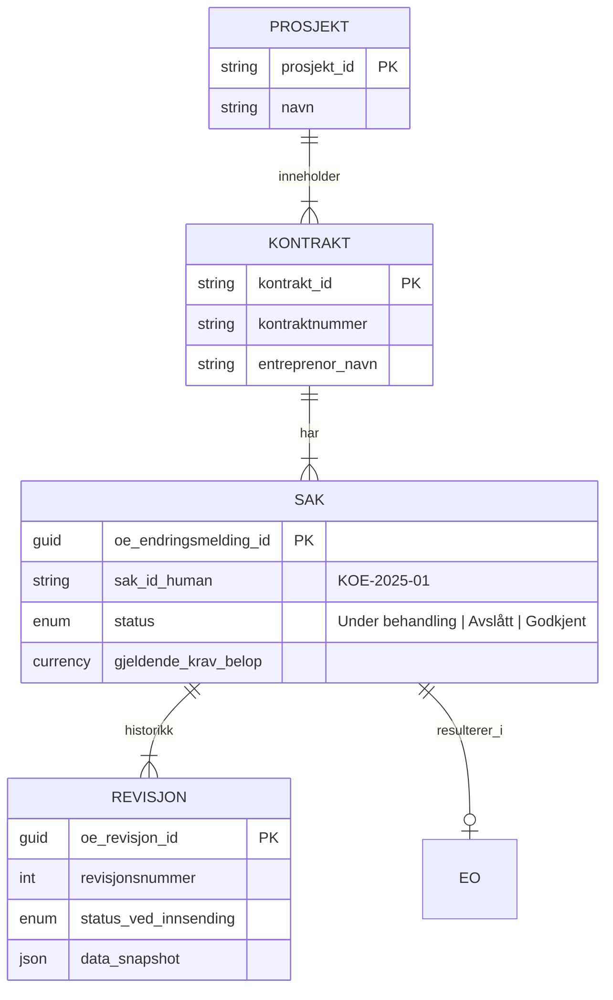

# Overordnet Design (HLD)
# Digital Samhandlingsplattform for Byggeprosjekter

**Oslobygg KF**
**Dato:** November 2025
**Versjon:** 1.0 (Utkast)

---

## Innholdsfortegnelse

1. [Arkitektur/Forretningslandskap](#1-arkitekturforretningslandskap)
2. [Scope/Prioritet](#2-scopeprioritet)
3. [Formål og begrunnelse](#3-formål-og-begrunnelse)
4. [Arkitekturdiagram](#4-arkitekturdiagram)
5. [Komponentbeskrivelse](#5-komponentbeskrivelse)
6. [Datamodell](#6-datamodell)
7. [Integrasjoner](#7-integrasjoner)
8. [Verdivurdering](#8-verdivurdering)
9. [Persondata](#9-persondata)
10. [Risikovurdering](#10-risikovurdering)
11. [Tidslinje](#11-tidslinje)
12. [Vedlegg](#12-vedlegg)

---

## 1. Arkitektur/Forretningslandskap

*[Denne seksjonen fylles ut med kontekstdiagram som viser plassering i Oslobyggs applikasjonslandskap]*

---

## 2. Scope/Prioritet

*[Denne seksjonen fylles ut med prosjektets omfang og prioritering]*

---

## 3. Formål og begrunnelse

### 3.1 Bakgrunn

Prosjektet er initiert av **Oslobygg KF** for å modernisere og digitalisere samhandlingsprosesser i byggeprosjekter. Dagens prosesser for håndtering av fravik og endringsordrer foregår via e-post og Word-maler, med PDF-vedlegg som sendes frem og tilbake mellom partene. All dokumentasjon arkiveres manuelt i Catenda (prosjektinformasjonsmodell-system).

### 3.2 Problemstilling

Dagens situasjon medfører flere utfordringer:

#### Datatap
Informasjonen blir innelåst i PDF-format, noe som betyr at dataene ikke kan søkes, sorteres eller analyseres automatisk. Når data ligger i PDF-filer kan vi ikke rapportere på tvers av prosjekter eller aggregere informasjon for å få helhetlig innsikt i organisasjonen.

#### Ineffektivitet
- Prosjektledere bruker tid på å flytte filer mellom systemer manuelt
- Behandlingstiden for en typisk søknad er 5-7 dager
- Det skjer ofte dobbeltregistrering fordi samme informasjon må skrives inn på flere steder

#### Høy terskel
Leverandører sliter med å få tilgang til portaler og faller tilbake på e-post som kommunikasjonsform, noe som skaper mer manuelt arbeid.

### 3.3 Målsetting

Prosjektet skal levere:

- **Strukturerte data** - informasjon som ligger i databaser hvor hvert datafelt har sin plass (ikke innelåst i PDF-filer)
- **Lav terskel** for eksterne brukere - enkelt å komme i gang uten kompliserte innloggingsprosesser
- **Automatisk arkivering** - dokumenter lagres riktig sted uten manuell håndtering
- **Sikker samhandling** - trygg deling av informasjon mellom parter
- **Skalerbart** til 50+ prosjekter - løsningen må fungere like godt om vi har 5 eller 50 prosjekter

### 3.4 Pilot-applikasjoner

Løsningen implementeres først med to pilot-applikasjoner:

#### 1. Fravik utslippsfri byggeplass
En leverandør søker om unntak fra miljøkrav (f.eks. bruk av dieselekskovator i stedet for elektrisk, eller arbeid som gir støy). En rådgiver vurderer søknaden faglig, og prosjektleder fatter endelig vedtak.

**Klassifisering:** Lav risiko (ingen økonomiske konsekvenser, ikke juridisk bindende)

#### 2. Krav om Endringsordre (KOE)
En prosess som starter med varsel om et forhold (f.eks. endrede tegninger), utvikler seg til et krav om endring, mottar svar fra byggherre, og ender i en kontraktsendring med økonomisk konsekvens.

**Klassifisering:** Høy risiko (store økonomiske konsekvenser, kontraktsbindende)

### 3.5 Forventede gevinster

#### Datadrevet beslutningstaking
- Strukturerte data muliggjør rapportering på tvers av prosjekter
- Mulighet for analyse av mønstre, trender og flaskehalser
- Grunnlag for kontinuerlig forbedring

#### Effektivisering
- Redusert behandlingstid fra 5-7 dager til estimert 1-2 dager
- Automatisk arkivering eliminerer manuell filhåndtering
- Ingen dobbeltregistrering av data

#### Bedre brukeropplevelse
- Lav terskel for eksterne leverandører
- Intuitiv brukerflate basert på Oslo kommunes designsystem (Punkt)
- Tilgjengelig fra mobil, nettbrett og desktop

#### Juridisk sporbarhet
- Komplett audit trail for alle handlinger
- Immutable (uforanderlig) saksgrunnlag
- Dokumentert beslutningsforløp

---

## 4. Arkitekturdiagram

### 4.1 POC-arkitektur (Prototype)

Prototypen ble utviklet for å validere konseptet og brukeropplevelsen.

```
┌─────────────────┐     Webhook      ┌─────────────────┐
│     Catenda     │ ───────────────> │  Python Backend │
│   (Prosjekt-    │                  │   (Flask:8080)  │
│    hotell)      │ <─────────────── │                 │
└─────────────────┘   API (comment,  └────────┬────────┘
                      document)               │ REST API
                                              │
                      ┌───────────────────────┼───────────────────────┐
                      │                       ▼                       │
                      │              ┌─────────────────┐              │
                      │              │   React App     │              │
                      │              │ (GitHub Pages)  │              │
                      │              └─────────────────┘              │
                      │                                               │
                      │  URL: ?sakId={guid}&modus={varsel|koe|svar}   │
                      └───────────────────────────────────────────────┘

                                              │
                                              ▼
                                    ┌──────────────────┐
                                    │   CSV/JSON       │
                                    │   (lokal disk)   │
                                    └──────────────────┘
```

**Hovedkomponenter:**
- React-applikasjon hostet på GitHub Pages
- Python Flask backend (port 8080)
- CSV-basert datalagring
- Catenda webhook og API-integrasjon

**Begrensninger:**
- Ikke skalerbart (CSV-filer)
- Ingen integrert sikkerhet
- Manuell drift og backup

### 4.2 L1D Produksjonsarkitektur

Produksjonsløsningen bygger på Azure-plattformen med fokus på skalerbarhet, sikkerhet og vedlikeholdbarhet.

```
                                    ┌──────────────────┐
                                    │    Bruker        │
                                    │  (Ekstern/       │
                                    │   Intern)        │
                                    └────────┬─────────┘
                                             │
                                             ▼
                              ┌──────────────────────────────┐
                              │  Azure Front Door + WAF      │
                              │  - DDoS Protection           │
                              │  - Rate Limiting             │
                              │  - Geo-filtering             │
                              └──────────────┬───────────────┘
                                             │
                                             ▼
┌───────────────────────────────────────────────────────────────────────┐
│                    Azure Static Web Apps                              │
│  ┌─────────────────────────────────────────────────────────────────┐  │
│  │                     React Frontend                              │  │
│  │  - React 19 + TypeScript                                        │  │
│  │  - Punkt (Oslo kommunes designsystem)                           │  │
│  │  - Client-side PDF-generering (@react-pdf)                      │  │
│  └─────────────────────────────────────────────────────────────────┘  │
└───────────────────────────────────┬───────────────────────────────────┘
                                    │ HTTPS/REST
                                    ▼
┌───────────────────────────────────────────────────────────────────────┐
│                      Azure Functions (Python 3.11)                    │
│  ┌──────────────────────────────────────────────────────────────────┐ │
│  │  Forretningslogikk og API-lag                                    │ │
│  │  - Gatekeeper (autorisasjon)                                     │ │
│  │  - Validering (input/output)                                     │ │
│  │  - Magic Link-håndtering                                         │ │
│  │  - Webhook-mottak fra Catenda                                    │ │
│  └──────────────────────────────────────────────────────────────────┘ │
└───────────────┬───────────────────────────────────┬───────────────────┘
                │                                   │
                │ Managed Identity                  │ HTTPS
                ▼                                   ▼
┌───────────────────────────┐        ┌──────────────────────────────┐
│      Dataverse            │        │         Catenda              │
│  ┌─────────────────────┐  │        │  ┌────────────────────────┐  │
│  │  - Applications     │  │        │  │  - Webhook (inn)       │  │
│  │  - Projects         │  │        │  │  - Document API v2     │  │
│  │  - AuditLog         │  │        │  │  - BCF 3.0 API         │  │
│  │  - MagicLinks       │  │        │  │  - Project Members     │  │
│  └─────────────────────┘  │        │  └────────────────────────┘  │
│  Row-Level Security       │        │  Autoritativ dokument-kilde  │
└───────────────────────────┘        └──────────────────────────────┘
                │
                │ Native Connector
                ▼
┌───────────────────────────┐
│      Power BI             │
│  - Rapporter              │
│  - Dashboards             │
│  - Analyse                │
└───────────────────────────┘

        ┌──────────────────────────────────────┐
        │  Microsoft 365 Økosystem             │
        │  ┌────────────────────────────────┐  │
        │  │  Entra ID (SSO, MFA)           │  │
        │  │  SharePoint (vedlegg)          │  │
        │  │  Microsoft Graph API           │  │
        │  └────────────────────────────────┘  │
        └──────────────────────────────────────┘
```

**Sikkerhetsflyt (5 lag):**

1. **Nettverk:** Azure Front Door med WAF, DDoS Protection, Rate Limiting
2. **Autentisering:** Catenda/Entra ID/Magic Link
3. **Autorisasjon:** Azure Functions Gatekeeper (UUID, TTL, scope)
4. **Data:** Dataverse Row-Level Security, Managed Identity
5. **Observerbarhet:** Application Insights, Azure Monitor Alerts

### 4.3 Dataflyt: Typisk brukerscenario

**Scenario: Entreprenør sender Krav om Endringsordre (KOE)**

```
1. Catenda: Prosjektleder oppretter ny sak
   │
   ├─> Catenda sender webhook til Azure Functions
   │
2. Azure Functions: Mottar webhook
   │
   ├─> Validerer signatur (HMAC)
   ├─> Sjekker idempotens (duplikatsjekk)
   ├─> Oppretter sak i Dataverse
   ├─> Genererer Magic Link (UUID v4)
   │
   └─> Poster lenke tilbake til Catenda-saken
       │
3. Entreprenør: Klikker lenke i Catenda
   │
   ├─> Azure Functions validerer UUID (gyldig? utløpt?)
   ├─> Henter forhåndsutfylt prosjektdata fra Dataverse
   │
   └─> React App: Viser skjema med prosjektinfo
       │
4. Entreprenør: Fyller ut KOE-skjema
   │
   ├─> React genererer PDF-preview i sanntid (client-side)
   ├─> Entreprenør bekrefter e-post (JIT-validering mot Catenda)
   │
   └─> Sender inn: POST /api/koe-submit
       │
5. Azure Functions: Mottar innsending
   │
   ├─> Validerer prosjekt-scope og rolle
   ├─> Lagrer strukturert data i Dataverse
   ├─> Lagrer audit log-entry
   │
   └─> Returnerer sakId til React
       │
6. React App: Sender PDF
   │
   └─> POST /api/cases/{sakId}/pdf (base64)
       │
7. Azure Functions: Mottar PDF
   │
   ├─> Laster opp til Catenda Document Library (v2 API)
   ├─> Konverterer compact GUID til UUID-36
   ├─> Oppretter BCF document reference
   ├─> Poster kommentar til Catenda: "KOE mottatt - PDF vedlagt"
   │
   └─> Returnerer suksess til bruker
       │
8. Prosjektleder: Logger inn via Entra ID (SSO)
   │
   ├─> Åpner saksbehandlingsmodus
   ├─> Ser søknad (Fane 1 - read-only)
   ├─> Fyller ut behandling (Fane 2 - editable)
   │
   └─> Sender svar → ny PDF → Catenda
```

---

## 5. Komponentbeskrivelse

### 5.1 Frontend (React App)

#### Teknologier

| Teknologi | Versjon | Formål |
|-----------|---------|--------|
| **React** | 19 | UI-rammeverk for komponentbasert utvikling |
| **TypeScript** | 5.x | Typesikkerhet og bedre utvikleropplevelse |
| **Vite** | Latest | Byggverktøy og development server |
| **Punkt** | Latest | Oslo kommunes designsystem (komponenter, farger, typografi) |
| **Tailwind CSS** | 3.x | Utility-first CSS for rask styling |
| **@react-pdf/renderer** | Latest | Client-side PDF-generering |
| **React Router** | 6.x | Navigasjon og URL-håndtering |

#### Ansvarsområder

**Brukergrensesnitt og Tilgangsstyring:**
- **Rollebasert visning:** Grensesnittet tilpasser seg automatisk basert på innlogget rolle (TE/BH) fra Entra ID eller Magic Link-token
- **Sikkerhet:** Frontend-visning er kun for brukervennlighet. All tilgangskontroll og validering av operasjoner (f.eks. "kan signere svar") håndheves av Gatekeeper i Azure Functions
- Responsivt design som fungerer på mobil, nettbrett og desktop
- WCAG 2.1 AA-kompatibel (universell utforming)
- Konsistent med Oslo kommunes visuelle profil

**Skjemahåndtering:**
- Dynamiske skjema med valideringer
- Real-time PDF-preview mens brukeren fyller ut
- Autosave av utkast (draft mode)

**PDF-generering (Client-side):**
- Client-side rendering (@react-pdf) for umiddelbar forhåndsvisning og reduserte serverkostnader
- **Sikkerhetsmerknad:** PDF-en anses som et "visuelt vedlegg". Dataverse (databasen) er den autoritative kilden for strukturerte data (beløp, datoer)
- **Integritet:** Ved innsending sendes både strukturerte data og PDF-blob. Backend logger innsendingstidspunkt og avsender for å sikre sporbarhet ved eventuelle avvik
- Bruk av Oslo Sans font (kommunal profil) og låst layout

**API-kommunikasjon:**
- REST API-kall til Azure Functions
- Error handling og retry-logikk
- Loading states og brukerrespons

#### Deployment

**POC:**
- Hostet på GitHub Pages
- Manuell deploy ved git push

**L1D (Produksjon):**
- Azure Static Web Apps
- CI/CD via GitHub Actions
- Automatisk deployment ved merge til main branch

---

### 5.2 Backend (Azure Functions)

#### Teknologier

| Teknologi | Formål |
|-----------|--------|
| **Python 3.11** | Programmeringsspråk |
| **Azure Functions** | Serverless compute platform |
| **Consumption Plan** | Betal-per-bruk, automatisk skalering |
| **Dataverse SDK** | Integrasjon mot Dataverse |
| **Requests** | HTTP-klient for Catenda API-kall |
| **PyJWT** | JWT-håndtering for autentisering |
| **Pydantic** | Datavalidering og serialisering |

#### Ansvarsområder

**Sikkerhet (Gatekeeper-pattern):**
```python
# Pseudokode: Gatekeeper-funksjon
def gatekeeper(request, required_role=None):
    """
    Validerer alle innkommende forespørsler før de når forretningslogikk.
    """
    # 1. Hent token fra request (URL parameter eller header)
    token = extract_token(request)

    # 2. Valider UUID format
    if not is_valid_uuid(token):
        return 400, "Invalid token format"

    # 3. Hent Magic Link fra database
    magic_link = dataverse.get_magic_link(token)

    if not magic_link:
        return 403, "Token not found"

    # 4. Sjekk TTL (Time To Live)
    if magic_link.expires_at < datetime.now():
        return 403, "Token expired"

    # 5. Sjekk one-time token
    if magic_link.used:
        log_suspicious_activity(token, request.ip)
        return 403, "Token already used"

    # 6. Sjekk prosjekt-scope
    if magic_link.project_id != request.data.get("project_id"):
        return 403, "Project mismatch"

    # 7. Valider rolle (hvis påkrevd)
    if required_role and magic_link.role != required_role:
        return 403, f"Role {required_role} required"

    # 8. Marker token som brukt (for one-time tokens)
    if magic_link.single_use:
        dataverse.mark_used(token)

    # 9. Logg hendelse til audit log
    audit_log(token, "access_granted", request.ip)

    return magic_link  # Godkjent, returner kontekst
```

**API-endepunkter:**

| Endepunkt | Metode | Beskrivelse | Autentisering |
|-----------|--------|-------------|---------------|
| `/api/health` | GET | Health check | Ingen |
| `/api/cases/{sakId}` | GET | Hent sak | Magic Link eller Entra ID |
| `/api/varsel-submit` | POST | Send varsel | Magic Link |
| `/api/koe-submit` | POST | Send KOE | Magic Link + e-postvalidering |
| `/api/svar-submit` | POST | Send BH-svar | Entra ID (kun PL) |
| `/api/cases/{sakId}/revidering` | POST | Send revisjon | Magic Link |
| `/api/cases/{sakId}/pdf` | POST | Last opp PDF | Magic Link eller Entra ID |
| `/api/cases/{sakId}/draft` | PUT | Lagre utkast | Magic Link eller Entra ID |
| `/api/link-generator` | POST | Generer Magic Link | Entra ID (kun PL) |
| `/webhook/catenda` | POST | Catenda webhook | HMAC-signatur |

**Dataverse-operasjoner:**
- CRUD (Create, Read, Update, Delete) for Applications, Projects, AuditLog
- Managed Identity for sikker tilkobling (ingen lagrede credentials)
- Retry-logikk med exponential backoff ved throttling

**Catenda-integrasjon:**
- Webhook-mottak med signaturvalidering
- Document upload via v2 API
- BCF 3.0 document references
- Kommentar-posting til topics
- JIT-validering av Project Members

**Observerbarhet:**
- Strukturert logging til Application Insights
- Custom metrics for business events
- Alert-triggere ved mistenkelig aktivitet

---

### 5.3 Database (Dataverse)

#### Hvorfor Dataverse?

**Fordeler over SharePoint:**
- Ingen 5000-grense på listevisninger
- Native row-level security for interne brukere
- Bedre ytelse ved høyt datavolum
- Native Power BI connector
- Cloud-native skalerbarhet

**Fordeler over SQL Database:**
- Innebygd sikkerhet og auditlogging
- Ingen infrastruktur å administrere
- Integrasjon med Power Platform
- Forhåndsdefinerte datatyper og relasjoner

#### Datamodell (foreløpig)

**Applications (Søknader/Krav):**
- `application_id` (Primary Key, GUID)
- `project_id` (Foreign Key → Projects)
- `case_type` (fravik | koe)
- `status` (draft | submitted | under_review | approved | rejected | closed)
- `form_data` (JSON - strukturert skjemadata)
- `created_by` (tekst - navn eller Entra ID)
- `created_at` (DateTime)
- `submitted_at` (DateTime)
- `reviewed_by` (Entra ID)
- `reviewed_at` (DateTime)
- `catenda_topic_guid` (tekst)
- `catenda_document_guid` (tekst)

**Projects (Prosjekter):**
- `project_id` (Primary Key, GUID)
- `project_name` (tekst)
- `catenda_project_id` (tekst)
- `project_leader` (Entra ID)
- `start_date` (DateTime)
- `end_date` (DateTime)
- `status` (active | completed | archived)

**MagicLinks (Token-håndtering):**
- `token` (Primary Key, UUID v4)
- `application_id` (Foreign Key → Applications)
- `project_id` (Foreign Key → Projects)
- `recipient_email` (tekst)
- `role` (TE | BH | Advisor | PL)
- `created_at` (DateTime)
- `expires_at` (DateTime)
- `used` (Boolean)
- `used_at` (DateTime)
- `used_by_ip` (tekst)
- `single_use` (Boolean)
- `revoked` (Boolean)
- `revoked_reason` (tekst)

**AuditLog (Revisjonslogg):**
- `audit_id` (Primary Key, GUID)
- `timestamp` (DateTime)
- `event_type` (login | link_use | submit | sign | jit_role | webhook_received, ...)
- `user_id` (Entra ID eller selvdeklarert)
- `application_id` (Foreign Key, nullable)
- `project_id` (Foreign Key, nullable)
- `ip_address` (tekst)
- `user_agent` (tekst)
- `details` (JSON - event-spesifikk metadata)
- `result` (success | failure | suspicious)

#### Sikkerhet

**Row-Level Security (RLS) for interne brukere:**
- Prosjektledere ser kun søknader for sine egne prosjekter
- Administratorer ser alle søknader
- Implementeres via Dataverse Security Roles

**Server-side filtering for eksterne (Magic Link):**
- RLS gjelder kun Entra ID-brukere
- Eksterne (Magic Link) får tilgang via API-lag
- Azure Functions håndhever prosjekt-scope og felttilgang

```python
# Pseudokode: Server-side autorisasjon
def get_application(app_id, scope_project, role):
    app = dataverse.get(app_id)

    # Prosjekt-scope
    if app.project_id != scope_project:
        return 403, "Project mismatch"

    # Rolle-basert felttilgang
    if role == "TE":
        # Entreprenør ser kun TE-felt og sak-info
        return filter_fields(app, allowed=["case_info", "te_fields"])

    elif role == "BH":
        # Byggherre ser alt, kan skrive BH-felt
        return filter_fields(app, allowed=["case_info", "te_fields", "bh_fields"])

    elif role == "PL":
        # Prosjektleder ser alt
        return app

    return 403, "Unauthorized"
```

---

### 5.4 Eksterne systemer

#### Catenda (PIM-system)

**Rolle:** Autoritativ kilde for prosjektdokumenter og samarbeidsdata.

**Integrasjoner:**

1. **Webhook (innkommende):**
   - Event: `topic.created`
   - Trigger: Ny sak opprettes i Catenda
   - Action: Azure Functions genererer Magic Link og poster tilbake

2. **Document API v2 (utgående):**
   - Opplasting av PDF-filer til Document Library
   - Returnerer compact GUID (32 tegn)

3. **BCF 3.0 API (utgående):**
   - Opprette document references på topics
   - Krever UUID format (36 tegn) - konvertering nødvendig
   - Poste kommentarer til topics

4. **Project Members API (utgående):**
   - Hente liste over prosjektdeltakere
   - JIT-validering av entreprenør e-post ved KOE-innsending
   - Brukes i Link Generator for å populere mottakerliste

**Webhook-sikkerhet:**
- HMAC-signaturvalidering (`x-catenda-signature`)
- Delt hemmelighet lagres i Azure Key Vault
- Idempotens: Samme event behandles ikke to ganger

#### Microsoft 365

**Entra ID (Azure AD):**
- Single Sign-On for interne brukere
- Multi-Factor Authentication (MFA)
- Conditional Access policies
- Managed Identity for service-to-service auth

**SharePoint:**
- Vedleggslagring via Microsoft Graph API
- Resumable upload for store filer (< 250 MB)
- Prosjektspesifikke dokumentbiblioteker

**Power BI:**
- Native Dataverse connector
- Rapporter og dashboards
- Analyse på tvers av prosjekter

---

### 5.5 Teknologivalg og begrunnelser

#### L1D over L4 (Power Pages)

**Vurderte alternativer:**
- **L4:** Power Pages med React SPA
- **L1D:** Custom React + Dataverse + Azure Functions

**Valgt løsning:** L1D

**Begrunnelse:**

| Kriterium | L4 (Power Pages) | L1D (Custom React) | Vinner |
|-----------|------------------|---------------------|--------|
| **Sikkerhet** | GUI-konfigurasjon (implisitt, risiko for feil) | Code-first (eksplisitt, versjonert) | **L1D** |
| **Fleksibilitet** | Begrenset av Power Pages-rammeverket | Full kontroll over UX og logikk | **L1D** |
| **Testbarhet** | Manuell testing, vanskelig å automatisere | Unit tests, integration tests, E2E | **L1D** |
| **Kostnad** | Lisenskostnad per ekstern bruker | Serverless (betal-per-bruk) | **L1D** |
| **Vedlikeholdbarhet** | Konfigurasjon spredt i GUI | Kode i Git, code review, CI/CD | **L1D** |
| **UX-kontroll** | Begrenset tilpasning | Fullstendig kontroll (Punkt) | **L1D** |

**Konklusjon:** L1D gir bedre kontroll over sikkerhet, brukeropplevelse og vedlikeholdbarhet, til tross for høyere initiale utviklingskostnader.

---

## 6. Datamodell

Datamodellen implementeres i **Microsoft Dataverse** for å sikre relasjonell integritet, sikkerhet på feltnivå og native integrasjon med Power Platform.

Modellen er designet med en **Master/Detail-struktur** for å håndtere forhandlingsprosesser der et krav kan gjennomgå flere revisjoner før enighet oppnås.

### 6.1 ER-Diagram (Konseptuelt)



### 6.2 Tabellstruktur (Dataverse Entities)

#### Tabell 1: Endringsmelding (oe_endringsmelding) - "Saken"

Dette er hovedtabellen som representerer selve saken. Den inneholder alltid gjeldende status og nøkkeltall fra siste aktive revisjon. Det er denne tabellen som brukes til rapportering (pipeline, total eksponering).

| Logisk Navn | Dataverse Type | Beskrivelse |
|---|---|---|
| oe_endring_id | Primary Key (GUID) | Unik system-ID |
| oe_sak_id | String (Autonumber) | Lesbar ID, f.eks. "KOE-2025-0042" |
| oe_tittel | String | Sakens tittel |
| oe_type | Choice | KOE (Krav), EO (Endringsordre) |
| oe_kontrakt_id | Lookup (oe_kontrakt) | Kobling til kontrakt/prosjekt |
| oe_gjeldende_revisjon | Integer | Peker til siste revisjonsnummer (f.eks. 3) |
| oe_status | Status Reason | Utkast, Sendt, Avslått, Godkjent |
| oe_gjeldende_krav_belop | Currency | Beløpet fra siste revisjon (for rapportering) |
| oe_bh_godkjent_belop | Currency | Beløpet Byggherre har godkjent (hvis avgjort) |

#### Tabell 2: Endring Revisjon (oe_endring_revisjon) - "Historikken"

Hver gang Entreprenør sender inn et krav (første gang eller etter avslag), opprettes en låst rad her. Dette sikrer komplett revisjonshistorikk og muliggjør analyse av forhandlingsprosessen.

| Logisk Navn | Dataverse Type | Beskrivelse |
|---|---|---|
| oe_revisjon_id | Primary Key | System-ID for revisjonen |
| oe_sak_id | Lookup (oe_endringsmelding) | Hvilken sak denne revisjonen tilhører |
| oe_revisjonsnummer | Integer | 0, 1, 2... |
| oe_innsendt_dato | DateTime | Tidspunkt for innsending |
| oe_innsendt_av | String | Navn/E-post på avsender (TE) |
| oe_krav_belop | Currency | Beløpet som ble krevd i denne revisjonen |
| oe_krav_frist_dager | Integer | Dager fristforlengelse i denne revisjonen |
| oe_json_payload | File (JSON) | Komplett kopi av skjemadata (FormDataModel) for denne versjonen |

**Hensikt med oe_json_payload:**
Sikrer at vi kan vise nøyaktig hva som ble sendt i hver revisjon, selv om skjemaet endres senere. Dette oppfyller krav om sporbarhet og dokumentasjon av forhandlingsforløpet.

#### Tabell 3: Kontrakt (oe_kontrakt)

Stamdata for å unngå manuell inntasting av prosjektinfo.

| Felt | Type | Beskrivelse |
|---|---|---|
| oe_kontrakt_id | Primary Key | System-ID |
| oe_kontraktnummer | String | F.eks. "K-10234" |
| oe_prosjekt_id | Lookup (oe_prosjekt) | Prosjekttilhørighet |
| oe_entreprenor_navn | String | Navn på firma |

### 6.3 Dataprosess (Krav til Endringsordre)

**1. Nytt krav:** Entreprenør oppretter sak
   - → Ny rad i `oe_endringsmelding` (Status: Sendt)
   - → Ny rad i `oe_endring_revisjon` (Rev 0)

**2. Avslag/Dialog:** Byggherre avviser Rev 0
   - → `oe_endringsmelding` oppdateres til Status: Avslått

**3. Revidering:** Entreprenør sender inn justert krav
   - → Ny rad i `oe_endring_revisjon` (Rev 1) med nytt beløp
   - → `oe_endringsmelding` oppdateres med tall fra Rev 1 og Status: Sendt

**4. Enighet (EO):** Byggherre godkjenner Rev 1
   - → `oe_endringsmelding` får Status: Godkjent
   - → Systemet kan generere en formell EO (enten som statusendring eller nytt EO-objekt)

### 6.4 Mapping mot Frontend

Frontend (types.ts) benytter en rik JSON-struktur (FormDataModel).

**Strategi:**
- **Nøkkeltall for rapportering** (Beløp, Frist, Datoer) lagres i kolonner i `oe_endring_revisjon`
- **Kompletthet:** Resten av skjemaet (tekstlige begrunnelser, lister) lagres som JSON i `oe_json_payload`

Dette sikrer at frontend alltid kan gjenskape visningen av en historisk revisjon 100% korrekt.

### 6.5 Integritet og Sporbarhet

**Master Data Principle:**
- Strukturerte data i Dataverse er autoritativ kilde
- Ved motstrid mellom database og PDF har databasen forrang
- PDF anses som "visuelt vedlegg" for lesbarhet

**Audit Trail:**
- Alle revisjoner lagres immutable (kan ikke endres etter innsending)
- Hver innsending logges med tidsstempel, avsender og IP-adresse i AuditLog
- Hash av både dataset og PDF logges for å oppdage manipulering

---

## 7. Integrasjoner

### 7.1 Oversikt

Løsningen integrerer med både interne (Microsoft 365) og eksterne (Catenda) systemer.

```
┌──────────────────────────────────────────────────────────────────┐
│                   Digital Samhandlingsplattform                  │
│                  (React + Azure Functions + Dataverse)            │
└───┬──────────────────┬──────────────────┬─────────────────────┬──┘
    │                  │                  │                     │
    │                  │                  │                     │
    ▼                  ▼                  ▼                     ▼
┌─────────┐    ┌──────────────┐   ┌─────────────┐    ┌──────────────┐
│ Catenda │    │  Entra ID    │   │ SharePoint  │    │  Power BI    │
│  (PIM)  │    │   (SSO)      │   │  (Vedlegg)  │    │ (Rapporter)  │
└─────────┘    └──────────────┘   └─────────────┘    └──────────────┘
 Ekstern           Intern             Intern              Intern
```

---

### 7.2 Catenda (Ekstern integrasjon)

#### Beskrivelse
Catenda er et invitation-only PIM-system (Prosjektinformasjonsmodell) som fungerer som samarbeidsplattform for byggeprosjekter. Catenda er **autoritativ kilde (master)** for alle prosjektdokumenter.

#### Type integrasjon
- **Webhook** (push fra Catenda til oss)
- **REST API** (pull/push fra oss til Catenda)

#### API-endepunkter brukt

| Endepunkt | Metode | Formål | Frekvens |
|-----------|--------|--------|----------|
| `POST /webhook/receiver` | POST | Mottar webhooks fra Catenda | Event-drevet |
| `GET /projects/{id}/members` | GET | Henter prosjektdeltakere (JIT-validering) | Per innsending |
| `POST /v2/projects/{id}/items` | POST | Laster opp PDF til Document Library | Per godkjenning |
| `POST /opencde/bcf/3.0/projects/{id}/topics/{topic_guid}/document_references` | POST | Kobler dokument til BCF-topic | Etter upload |
| `POST /opencde/bcf/3.0/projects/{id}/topics/{topic_guid}/comments` | POST | Poster kommentar til topic | Per statusendring |
| `GET /opencde/bcf/3.0/projects/{id}/topics/{topic_guid}` | GET | Henter topic-info (valgfritt) | Ved behov |

#### Datakontroll
- **Catenda kontrollerer:** PDF-dokumenter, prosjektstruktur, brukermedlemskap
- **Vi kontrollerer:** Strukturert skjemadata, audit trail, Magic Links

#### Sikkerhet

**Webhook-validering (HMAC):**
```python
# Pseudokode: Webhook-signaturvalidering
def validate_webhook(request):
    """
    Validerer at webhook faktisk kommer fra Catenda.
    """
    # 1. Hent signatur fra header
    signature = request.headers.get("x-catenda-signature")

    # 2. Hent delt hemmelighet fra Azure Key Vault
    secret = azure_key_vault.get_secret("CatendaWebhookSecret")

    # 3. Beregn forventet signatur
    body = request.get_body()  # bytes
    expected_signature = hmac.new(
        key=secret.encode(),
        msg=body,
        digestmod=hashlib.sha256
    ).hexdigest()

    # 4. Sammenlign signaturer (constant-time comparison)
    if not hmac.compare_digest(signature, expected_signature):
        log_security_event("webhook_invalid_signature", request.ip)
        return 401, "Invalid signature"

    # 5. Sjekk idempotens
    event_data = json.loads(body)
    event_id = f"{event_data['event']}:{event_data['data']['caseId']}"

    if already_processed(event_id):
        # Samme event mottatt tidligere, returner 202 uten sideeffekter
        return 202, "Already processed"

    # 6. Marker som behandlet
    mark_processed(event_id, timestamp=datetime.now())

    return event_data  # Godkjent
```

**API-autentisering (OAuth 2.0):**
- Client Credentials Flow
- Access token lagres i Azure Key Vault
- Automatisk refresh ved utløp

**GUID-konvertering (kritisk):**

Catenda v2 API returnerer **compact GUID (32 tegn)** ved document upload, men BCF 3.0 API krever **UUID format (36 tegn)** ved document reference.

```python
def catenda_compact_to_uuid(compact: str) -> str:
    """
    Konverterer Catenda compact GUID til UUID-36 format.

    Input:  "a1b2c3d4e5f6g7h8i9j0k1l2m3n4o5p6" (32 tegn)
    Output: "a1b2c3d4-e5f6-g7h8-i9j0-k1l2m3n4o5p6" (36 tegn)
    """
    c = compact.replace('-', '').lower()  # Fjern eventuelle bindestreker
    return f"{c[:8]}-{c[8:12]}-{c[12:16]}-{c[16:20]}-{c[20:32]}"
```

**Retry-logikk:**
- Exponential backoff ved 429 (Too Many Requests) eller 5xx-feil
- Maksimalt 4 retry-forsøk: 2s → 4s → 8s → 16s
- Logging av alle feilete forsøk til AuditLog

#### Feilhåndtering

| Feiltype | HTTP-kode | Handling |
|----------|-----------|----------|
| Catenda utilgjengelig | 503 | Fallback: Lagre data i Dataverse, retry senere |
| Ugyldig webhook | 401 | Logg sikkerhetshendelse, avvis forespørsel |
| Dokument allerede eksisterer | 409 | Bruk eksisterende document_guid |
| Rate limit | 429 | Exponential backoff, retry |
| Timeout | 504 | Retry med lengre timeout |

---

### 7.3 Microsoft 365 (Intern integrasjon)

#### 7.3.1 Entra ID (Azure Active Directory)

**Formål:** Single Sign-On (SSO) og identitetsstyring for interne brukere.

**Implementasjon:**
- MSAL (Microsoft Authentication Library) i React
- OAuth 2.0 Authorization Code Flow with PKCE
- Managed Identity for Azure Functions → Dataverse

**Scopes:**
```javascript
// React App: MSAL-konfigurasjon
const msalConfig = {
  auth: {
    clientId: "app-client-id",
    authority: "https://login.microsoftonline.com/{tenant-id}",
    redirectUri: "https://app.oslobygg.no"
  }
};

const loginRequest = {
  scopes: ["User.Read", "openid", "profile", "email"]
};
```

**Claims brukt:**
- `oid` (Object ID) - unik bruker-ID
- `name` - visningsnavn
- `email` - e-postadresse
- `roles` - applikasjonsroller (PL, Admin)

**Conditional Access:**
- MFA påkrevd for PL-rolle
- Tillatte lokasjoner: Norge + godkjente VPN
- Blokkert fra ukjente enheter

---

#### 7.3.2 SharePoint (via Microsoft Graph API)

**Formål:** Lagring av vedlegg (bilder, tegninger, dokumenter).

**API-endepunkt:**
```
POST https://graph.microsoft.com/v1.0/sites/{site-id}/drives/{drive-id}/items/{parent-id}:/filename:/content
```

**Resumable Upload (store filer > 4 MB):**

```python
# Pseudokode: Resumable upload til SharePoint
def upload_large_file(file_path, destination_url):
    """
    Laster opp store filer til SharePoint i chunks.
    """
    file_size = os.path.getsize(file_path)
    chunk_size = 10 * 1024 * 1024  # 10 MB chunks

    # 1. Opprett upload-sesjon
    session = graph_api.create_upload_session(destination_url, file_size)
    upload_url = session["uploadUrl"]

    # 2. Last opp chunks
    with open(file_path, 'rb') as f:
        offset = 0
        while offset < file_size:
            chunk = f.read(chunk_size)
            chunk_end = offset + len(chunk) - 1

            headers = {
                "Content-Length": str(len(chunk)),
                "Content-Range": f"bytes {offset}-{chunk_end}/{file_size}"
            }

            response = requests.put(upload_url, headers=headers, data=chunk)

            if response.status_code in [200, 201, 202]:
                offset += len(chunk)
            else:
                # Retry chunk
                time.sleep(2)

    # 3. Returner item metadata
    return response.json()
```

**Mappestruktur:**
```
/Prosjekter
  /{project_name}
    /Fravik
      /{case_id}
        - vedlegg_1.pdf
        - bilde_1.jpg
    /KOE
      /{case_id}
        - tegning_rev0.pdf
        - kalkyle.xlsx
```

**Sikkerhet:**
- Inherited permissions fra prosjektmappe
- Prosjektleder = Owner
- Eksterne har ikke tilgang (kun via API)

---

#### 7.3.3 Power BI

**Formål:** Rapportering og analyse på tvers av prosjekter.

**Integrasjon:**
- Native Dataverse connector (DirectQuery eller Import)
- Automatisk oppdatering via scheduled refresh

**Eksempelrapporter:**
1. **Behandlingstid per prosjekt**
   - Gjennomsnittlig tid fra submitted → approved
   - Flaskehalser og forsinkelser

2. **Økonomisk oversikt (KOE)**
   - Total sum krav per prosjekt
   - Godkjent vs. avslått
   - Budsjettoverskridelser

3. **Fravik-trender**
   - Hyppigst søkte fravik
   - Godkjenningsprosent per kategori

**Datakilde:**
```
Dataverse (DirectQuery)
  └─ Applications (filtrert på project_id)
  └─ Projects
  └─ AuditLog (for tidsanalyse)
```

---

### 7.4 Integrasjonsmatrise

| System | Type | Retning | Protokoll | Autentisering | Eier av data |
|--------|------|---------|-----------|---------------|--------------|
| **Catenda** | Ekstern | Begge | REST + Webhook | OAuth 2.0 + HMAC | Catenda (dokumenter) |
| **Dataverse** | Intern | Begge | Dataverse SDK | Managed Identity | Vi (strukturert data) |
| **Entra ID** | Intern | Inn | OAuth 2.0 | MSAL | Microsoft (identiteter) |
| **SharePoint** | Intern | Ut | Microsoft Graph | Managed Identity | Vi (vedlegg) |
| **Power BI** | Intern | Inn | Native connector | Service Principal | Vi (data), Microsoft (platform) |

---

## 8. Verdivurdering

### 8.1 Informasjonsklassifisering

Løsningen håndterer informasjon med **varierende sensitivitet** avhengig av prosesstype.

#### Klassifiseringskriterier

| Kriterium | Fravik (Lav risiko) | KOE (Høy risiko) |
|-----------|---------------------|------------------|
| **Økonomisk konsekvens** | < 100 000 NOK (minimal) | > 500 000 NOK (ofte > 5% av prosjektbudsjett) |
| **Juridisk binding** | Ikke bindende (internt vedtak) | Kontraktsbindende (mellom parter) |
| **Personopplysninger** | Begrenset (navn, e-post) | Utvidet (signaturdata, detaljert audit trail) |
| **Fortrolighet** | Intern/Begrenset | Konfidensiell (kontraktsforhandlinger) |
| **Tilgjengelighet** | Lav (kan vente > 24t) | Høy (tidskritisk, < 1t responstid) |

#### Verdivurdering per informasjonstype

| Informasjonstype | Konfidensialitet | Integritet | Tilgjengelighet | Totalverdi |
|------------------|------------------|------------|-----------------|------------|
| **Prosjektdata** (navn, adresse, deltakere) | Lav | Høy | Middels | **Middels** |
| **Fravikssøknad** (miljø, støy, praktisk info) | Lav | Middels | Lav | **Lav** |
| **KOE-data** (kostnader, tidsfrister, kontraktsendringer) | Høy | Høy | Høy | **Høy** |
| **Behandling/Vedtak** (vurdering, begrunnelse) | Middels | Høy | Middels | **Høy** |
| **Audit Log** (hvem gjorde hva når) | Middels | Høy | Lav | **Høy** |
| **Magic Links** (UUID-tokens) | Høy | Høy | Middels | **Høy** |

### 8.2 Konsekvensanalyse ved brudd

#### Scenario 1: Uautorisert tilgang til fravikssøknad (Lav verdi)

**Konsekvens:**
- Begrenset informasjon eksponert (navn, praktiske detaljer)
- Ingen økonomisk tap
- Ingen juridisk konsekvens

**Sannsynlighet:** Lav (UUID-sikkerhet, TTL, one-time token)

**Risikonivå:** Lav ✅

---

#### Scenario 2: Uautorisert tilgang til KOE (Høy verdi)

**Konsekvens:**
- Konkurransesensitiv informasjon eksponert (priser, strategier)
- Potensielt økonomisk tap for Oslobygg
- Tillitsbrudd med leverandører
- Juridiske konsekvenser ved kontraktsbrudd

**Sannsynlighet:** Svært lav (UUID + TTL + one-time + OTP step-up)

**Risikonivå:** Middels ⚠️

**Reduserende tiltak:**
- OTP-bekreftelse ved signering av endringer
- E-postverifisering (6-sifret kode)
- Vurder step-up til Entra ID for kritiske operasjoner
- BankID signering for ekstreme tilfeller (> 1 MNOK)

---

#### Scenario 3: Manipulering av audit log

**Konsekvens:**
- Tap av sporbarhet
- Juridisk bevis kompromittert
- Kan ikke dokumentere ansvarsforhold

**Sannsynlighet:** Svært lav (Dataverse immutability, append-only log)

**Risikonivå:** Middels ⚠️

**Reduserende tiltak:**
- Append-only audit log (kan ikke slettes/endres)
- Dataverse security: Kun system har skrivetilgang
- Periodisk eksport til arkivsystem (WORM storage)

---

### 8.3 Beslutningsmatrise for sikkerhetstiltak

| Risikonivå | Tiltak |
|------------|--------|
| **Lav** (Fravik) | Magic Link (UUID + TTL ≤ 72t + one-time) |
| **Moderat** | + E-postverifisering (selvdeklarert) |
| **Høy** (KOE) | + OTP step-up ved signering |
| **Kritisk** (KOE > 1 MNOK) | + BankID / Posten signering (fremtidig) |

---

## 9. Persondata

### 9.1 Behandlede personopplysninger

#### POC (Prototype)
- Navn (selvdeklarert)
- E-postadresse (selvdeklarert)
- IP-adresse (automatisk logging)
- User-agent (nettleser/enhet)

#### L1D (Produksjon)
- Navn (Entra ID eller selvdeklarert)
- E-postadresse (Entra ID eller selvdeklarert)
- Telefonnummer (valgfritt)
- Entra ID Object ID (for interne brukere)
- Catenda bruker-ID (ved JIT-validering)
- IP-adresse (audit log)
- Tidsstempler (alle handlinger)
- Signaturdata (hvis OTP eller BankID brukes)

**NB:** Hvis BankID-signering implementeres, vil **fødselsnummer** også behandles. Dette klassifiseres som **GDPR Article 9 spesielle kategorier** og krever ekstra sikkerhetstiltak.

---

### 9.2 GDPR-vurdering

#### Behandlingsgrunnlag

**Artikkel 6.1(e) - Oppgave i allmennhetens interesse:**

Oslobygg KF er et kommunalt foretak som utfører offentlig myndighetsutøvelse knyttet til byggeprosjekter. Behandling av persondata er nødvendig for å gjennomføre samhandling mellom byggherre og entreprenører i henhold til standardkontrakter (NS 8405, NS 8407) og byggesaksforskriften.

**Supplerende grunnlag (ved behov):**
- Artikkel 6.1(b) - Kontraktsoppfyllelse (for KOE-prosessen)
- Artikkel 6.1(c) - Rettslig forpliktelse (arkivloven, bokføringsloven)

#### Behandlingsansvarlig
**Oslobygg KF** (org.nr. 924599545)

#### Databehandler
**Microsoft** (via Azure-plattformen og Dataverse)

**Databehandleravtale:** Dekket av Microsofts standard DPA (Data Processing Agreement) for Azure-tjenester.

---

### 9.3 Personvernprinsipper

#### 1. Formålsbegrensning
- Data samles inn kun for å håndtere fravik- og KOE-prosesser
- Data brukes ikke til andre formål uten nytt samtykke

#### 2. Dataminimering
- Vi samler kun nødvendige opplysninger
- Frivillige felt markeres tydelig
- Selvdeklarert identitet for lave risikonivå (unngår unødvendig ID-sjekk)

#### 3. Lagringsperiode

| Datatype | Lagringstid | Hjemmel |
|----------|-------------|---------|
| **Aktive søknader** | Til saken er avsluttet + 1 år | Kontraktsoppfølging |
| **Avsluttede søknader** | 10 år etter prosjektslutt | Arkivloven § 6 (byggesaker) |
| **Audit log** | 10 år | Bokføringsloven § 13 (økonomiske transaksjoner > 500k) |
| **Magic Links (brukt)** | Slettes etter 90 dager | Ingen arkivplikt for tokens |
| **Magic Links (ubrukt)** | Slettes ved utløp (72t) | Dataminimering |

#### 4. Rettigheter

| Rettighet | Implementering |
|-----------|----------------|
| **Innsyn** | Self-service via "Min Side" (fremtidig) eller skriftlig henvendelse til PL |
| **Retting** | Kun før innsending; etter innsending må endringer logges (immutability) |
| **Sletting** | Begrenset pga. arkivplikt; kan anonymiseres etter 10 år |
| **Dataportabilitet** | JSON-eksport av egne data (fremtidig funksjon) |
| **Protestere** | Begrenset pga. oppgave i allmennhetens interesse (Art. 21.1 unntak) |

---

### 9.4 Sikkerhetstiltak (personvern)

#### Tekniske tiltak
- **Kryptering i transit:** TLS 1.3 (HTTPS)
- **Kryptering at rest:** Azure Storage encryption (AES-256)
- **Pseudonymisering:** Entra ID Object ID brukes i stedet for navn i interne logger
- **Tilgangskontroll:** Row-level security (RLS) i Dataverse
- **Logging:** Alle tilganger til persondata logges i audit trail

#### Organisatoriske tiltak
- **Opplæring:** Alle medarbeidere får GDPR-opplæring
- **Tilgangsstyring:** Kun prosjektleder har tilgang til søknader i sine prosjekter
- **Databehandleravtaler:** Inngått med Microsoft (Azure) og Catenda

---

### 9.5 Personvernkonsekvenser (DPIA)

**Må det gjennomføres DPIA (Data Protection Impact Assessment)?**

**Vurdering:**

GDPR Art. 35 krever DPIA hvis behandlingen vil medføre "høy risiko" for personvernet.

| Kriterium | Fravik | KOE |
|-----------|--------|-----|
| Storskala behandling | ❌ Nei (< 100 brukere per prosjekt) | ❌ Nei |
| Spesielle kategorier (Art. 9) | ❌ Nei | ⚠️ Kun hvis BankID implementeres |
| Systematisk overvåking | ❌ Nei | ❌ Nei |
| Automatiserte avgjørelser (Art. 22) | ❌ Nei | ❌ Nei |
| Profilering | ❌ Nei | ❌ Nei |

**Konklusjon:**
- **Fravik:** DPIA ikke påkrevd
- **KOE (uten BankID):** DPIA ikke påkrevd
- **KOE (med BankID):** DPIA **påkrevd** (pga. fødselsnummer = spesiell kategori)

**Anbefaling:** Gjennomfør forenklet DPIA som del av ROS-analysen før produksjonssetting.

---

### 9.6 Henvisning til ROS-analyse

Personvernaspektene er integrert i **ROS-analyse** (se seksjon 10). Spesielt relevante trusler:

- **T-05:** Uautorisert tilgang til persondata (Magic Link kompromittert)
- **T-08:** Dataeksponering ved feilkonfigurasjon (Dataverse RLS)
- **T-12:** Manglende sletting av utløpte tokens

---

## 10. Risikovurdering

### 10.1 ROS-analyse (Risiko og Sårbarhet)

#### Metodikk

**Sannsynlighet:**
- **1 - Svært lav:** < 1% sjanse over 12 måneder
- **2 - Lav:** 1-10% sjanse
- **3 - Middels:** 10-30% sjanse
- **4 - Høy:** 30-60% sjanse
- **5 - Svært høy:** > 60% sjanse

**Konsekvens:**
- **1 - Ubetydelig:** Ingen merkbar påvirkning
- **2 - Lav:** Mindre forstyrrelse, løses raskt
- **3 - Middels:** Betydelig forstyrrelse, datatap, økonomisk tap < 100k
- **4 - Høy:** Alvorlig forstyrrelse, datatap, økonomisk tap 100k-1M
- **5 - Kritisk:** Katastrofal påvirkning, økonomisk tap > 1M, omdømmetap

**Risikomatrise:**

| Sannsynlighet ↓ / Konsekvens → | 1 (Ubetydelig) | 2 (Lav) | 3 (Middels) | 4 (Høy) | 5 (Kritisk) |
|-------------------------------|----------------|---------|-------------|---------|-------------|
| **5 (Svært høy)** | 🟨 Middels | 🟧 Høy | 🟥 Kritisk | 🟥 Kritisk | 🟥 Kritisk |
| **4 (Høy)** | 🟩 Lav | 🟨 Middels | 🟧 Høy | 🟥 Kritisk | 🟥 Kritisk |
| **3 (Middels)** | 🟩 Lav | 🟨 Middels | 🟨 Middels | 🟧 Høy | 🟥 Kritisk |
| **2 (Lav)** | 🟩 Lav | 🟩 Lav | 🟨 Middels | 🟨 Middels | 🟧 Høy |
| **1 (Svært lav)** | 🟩 Lav | 🟩 Lav | 🟩 Lav | 🟨 Middels | 🟨 Middels |

---

### 10.2 Identifiserte trusler og tiltak

#### T-01: Gjetting av UUID (Magic Link)

**Beskrivelse:** En angriper prøver systematisk å gjette gyldige UUID-tokens for å få tilgang til søknader.

| Attributt | Verdi |
|-----------|-------|
| **Sannsynlighet** | 1 (Svært lav) |
| **Konsekvens** | 4 (Høy) for KOE, 2 (Lav) for Fravik |
| **Risiko (før tiltak)** | 🟨 Middels (KOE), 🟩 Lav (Fravik) |

**Eksisterende tiltak:**
- UUID v4 (122-bit entropy = 5.3×10³⁶ kombinasjoner)
- Azure WAF med rate limiting (100 req/min per IP)
- Brute-force detection (Application Insights alert)
- TTL ≤ 72t (begrenset angrepsvindu)

**Residual risiko:** 🟩 Lav

---

#### T-02: Videresendt Magic Link (deling til uautorisert person)

**Beskrivelse:** En autorisert bruker sender Magic Link til en uautorisert person (f.eks. via e-post eller chat).

| Attributt | Verdi |
|-----------|-------|
| **Sannsynlighet** | 3 (Middels) |
| **Konsekvens** | 2 (Lav) for Fravik, 4 (Høy) for KOE |
| **Risiko (før tiltak)** | 🟨 Middels (Fravik), 🟧 Høy (KOE) |

**Eksisterende tiltak:**
- **JIT-validering mot Catenda:** Backend verifiserer i sanntid at e-postadressen som signerer faktisk er aktiv prosjektdeltaker i Catenda før innsending godtas
- **Fravik:** Akseptert residual risiko (lav konsekvens)
- **KOE:** OTP step-up ved signering (e-postverifisering med 6-sifret kode)
- One-time token (kan kun brukes én gang)
- IP-logging (audit trail)

**Fremtidig forbedring:**
- Vurder step-up til Entra ID for KOE > 500k NOK
- BankID signering for KOE > 1 MNOK

**Residual risiko:** 🟩 Lav (Fravik), 🟨 Middels (KOE)

---

#### T-03: Dataverse throttling (6000 req / 5 min)

**Beskrivelse:** Høy trafikk fører til at Dataverse throttler requests, noe som gjør systemet utilgjengelig.

| Attributt | Verdi |
|-----------|-------|
| **Sannsynlighet** | 2 (Lav) ved normal drift, 4 (Høy) ved trafikktopp |
| **Konsekvens** | 3 (Middels) - bruker får feilmelding, kan prøve igjen |
| **Risiko (før tiltak)** | 🟨 Middels |

**Eksisterende tiltak:**
- Exponential backoff ved 429-respons (1s → 2s → 4s → 8s)
- Retry-logikk (maks 4 forsøk)
- Circuit breaker (stopper requests midlertidig ved vedvarende feil)
- Asynkron kø for ikke-kritiske operasjoner (f.eks. audit log-skriving)

**Fremtidig forbedring:**
- Caching av Project-data (reduserer Dataverse-kall)
- Redis cache for ofte brukte queries

**Residual risiko:** 🟩 Lav

---

#### T-04: Catenda API utilgjengelig

**Beskrivelse:** Catenda sine API-er er nede, noe som blokkerer PDF-opplasting og JIT-validering.

| Attributt | Verdi |
|-----------|-------|
| **Sannsynlighet** | 2 (Lav) |
| **Konsekvens** | 3 (Middels) - PDF kan ikke arkiveres umiddelbart |
| **Risiko (før tiltak)** | 🟨 Middels |

**Eksisterende tiltak:**
- **Fallback:** Lagre data i Dataverse selv om Catenda er nede
- **Retry med backoff** (4 forsøk over 30 sekunder)
- **Asynkron kø:** PDF-upload forsøkes igjen automatisk senere
- **Manual override:** PL kan laste opp manuelt via Catenda hvis nødvendig

**JIT-validering (hvis Catenda nede):**
- **Fallback:** Avvis innsending med beskjed om å prøve igjen senere
- **Alternativ:** Read-only modus (kan se data, men ikke sende inn)

**Residual risiko:** 🟩 Lav

---

#### T-05: Uautorisert tilgang til persondata (GDPR-brudd)

**Beskrivelse:** En angriper får tilgang til Dataverse og eksfiltrerer persondata (navn, e-post, audit log).

| Attributt | Verdi |
|-----------|-------|
| **Sannsynlighet** | 1 (Svært lav) |
| **Konsekvens** | 5 (Kritisk) - GDPR-brudd, bøter, omdømmetap |
| **Risiko (før tiltak)** | 🟨 Middels |

**Eksisterende tiltak:**
- **Managed Identity:** Ingen lagrede credentials i kode
- **Row-Level Security (RLS):** Interne brukere ser kun egne prosjekter
- **Server-side filtering:** Eksterne (Magic Link) får kun tilgang via API-lag
- **Kryptering:** TLS 1.3 (transit), AES-256 (rest)
- **Audit logging:** Alle tilganger logges med IP, timestamp, user-agent
- **Azure Monitor Alerts:** Alarm ved unormal aktivitet (f.eks. mange 403-feil)

**Residual risiko:** 🟩 Lav

---

#### T-06: Webhook spoofing (falsk event fra "Catenda")

**Beskrivelse:** En angriper sender falske webhooks til vår backend for å opprette fiktive saker eller manipulere data.

| Attributt | Verdi |
|-----------|-------|
| **Sannsynlighet** | 1 (Svært lav) |
| **Konsekvens** | 4 (Høy) - falske saker, forvirring, ressurssløsing |
| **Risiko (før tiltak)** | 🟨 Middels |

**Eksisterende tiltak:**
- **HMAC-signaturvalidering:** Hver webhook må ha gyldig `x-catenda-signature`
- **Delt hemmelighet i Key Vault:** Kun Catenda og Azure Functions kjenner secret
- **Idempotens:** Samme event behandles ikke to ganger (event_id tracking)
- **Logging:** Alle ugyldige webhooks logges med IP-adresse
- **Rate limiting:** Maksimalt 100 webhook-forespørsler per minutt

**Residual risiko:** 🟩 Lav

---

#### T-07: CSRF (Cross-Site Request Forgery) på innsending

**Beskrivelse:** En angriper lurer en autentisert bruker til å sende inn et skjema uten å vite det (f.eks. via ondsinnet lenke).

| Attributt | Verdi |
|-----------|-------|
| **Sannsynlighet** | 2 (Lav) |
| **Konsekvens** | 3 (Middels) - uønsket innsending, forvirring |
| **Risiko (før tiltak)** | 🟨 Middels |

**Eksisterende tiltak:**
- **CSRF-token:** Double-submit cookie eller signed token
- **SameSite=Strict cookies:** Nettleser sender ikke cookies på cross-site requests
- **Nonce/State:** Hver operasjon har unik, kortlevd nonce
- **Reject hvis brukt tidligere:** Backend sjekker nonce-database

**Residual risiko:** 🟩 Lav

---

#### T-08: Manglende sletting av utløpte Magic Links

**Beskrivelse:** Utløpte Magic Links slettes ikke automatisk, noe som øker angrepsflaten (selv om de er utløpt).

| Attributt | Verdi |
|-----------|-------|
| **Sannsynlighet** | 5 (Svært høy) - vil skje hvis ikke implementert |
| **Konsekvens** | 2 (Lav) - kun teoretisk risiko (tokens er ugyldige) |
| **Risiko (før tiltak)** | 🟨 Middels |

**Tiltak:**
- **Automatisk sletting:** Azure Function (timer trigger) kjører daglig
  ```python
  # Pseudokode: Cleanup-job
  def cleanup_expired_links():
      threshold = datetime.now() - timedelta(days=90)
      dataverse.delete_where(
          table="MagicLinks",
          condition=f"expires_at < {threshold} OR (used = true AND used_at < {threshold})"
      )
  ```
- **Soft delete først:** Marker som `deleted=true` i 30 dager (recovery window)
- **Hard delete etter 30 dager:** Permanent sletting

**Residual risiko:** 🟩 Lav

---

#### T-09: Manipulering av Client-side PDF (Integritetsbrudd)

**Beskrivelse:** En teknisk kyndig bruker manipulerer PDF-genereringen i nettleseren før innsending, slik at PDF-dokumentet viser andre beløp/vilkår enn det som lagres i databasen (Dataverse).

| Attributt | Verdi |
|-----------|-------|
| **Sannsynlighet** | 2 (Lav) - Krever teknisk innsikt |
| **Konsekvens** | 3 (Middels) - Tvist om hva som faktisk er avtalt |
| **Risiko (før tiltak)** | 🟨 Middels |

**Tiltak:**
- **Master Data Principle:** Kontrakten spesifiserer at strukturerte data i systemet (Dataverse) har forrang ved motstrid mellom database og generert PDF
- **Audit Trail:** Innsending logges med hash av både dataset og PDF
- **Visuell verifisering:** Byggherre godkjenner basert på dataene presentert i sitt dashboard, som hentes fra databasen, ikke kun ved å lese PDF-vedlegget

**Residual risiko:** 🟩 Lav

---

### 10.3 Oppsummering av risikoer

| ID | Trussel | Før tiltak | Etter tiltak | Status |
|----|---------|------------|--------------|--------|
| T-01 | UUID-gjetting | 🟨 Middels (KOE) | 🟩 Lav | ✅ Akseptabel |
| T-02 | Videresendt Magic Link | 🟧 Høy (KOE) | 🟨 Middels (KOE) | ⚠️ Vurder step-up |
| T-03 | Dataverse throttling | 🟨 Middels | 🟩 Lav | ✅ Akseptabel |
| T-04 | Catenda utilgjengelig | 🟨 Middels | 🟩 Lav | ✅ Akseptabel |
| T-05 | Uautorisert tilgang persondata | 🟨 Middels | 🟩 Lav | ✅ Akseptabel |
| T-06 | Webhook spoofing | 🟨 Middels | 🟩 Lav | ✅ Akseptabel |
| T-07 | CSRF-angrep | 🟨 Middels | 🟩 Lav | ✅ Akseptabel |
| T-08 | Utløpte tokens ikke slettet | 🟨 Middels | 🟩 Lav | ✅ Akseptabel |
| T-09 | Client-side PDF-manipulering | 🟨 Middels | 🟩 Lav | ✅ Akseptabel |

**Konklusjon:** Alle identifiserte risikoer er redusert til akseptabelt nivå. T-02 (videresendt KOE-lenke) bør vurderes for ytterligere tiltak i Fase 2 (step-up Entra ID eller BankID).

---

### 10.4 Sikkerhetslag (Defense in Depth)

Løsningen implementerer **5 lag med forsvar** for å sikre at ett enkelt feilpunkt ikke kompromitterer hele systemet.

```
┌────────────────────────────────────────────────────────────┐
│  Lag 5: Observerbarhet                                     │
│  - Application Insights (structured logging)               │
│  - Azure Monitor Alerts (mistenkelig aktivitet)            │
│  - KQL-queries for sikkerhetshendelser                     │
└────────────────────────────────────────────────────────────┘
         ▲
         │ Logg alle hendelser
         │
┌────────────────────────────────────────────────────────────┐
│  Lag 4: Data                                               │
│  - Dataverse Row-Level Security (RLS)                      │
│  - Managed Identity (ingen credentials i kode)             │
│  - Encryption at rest (AES-256)                            │
└────────────────────────────────────────────────────────────┘
         ▲
         │ Sikker tilgang
         │
┌────────────────────────────────────────────────────────────┐
│  Lag 3: Autorisasjon                                       │
│  - Gatekeeper (Azure Functions)                            │
│  - UUID-validering (format, eksistens)                     │
│  - TTL-kontroll (utløpt?)                                  │
│  - Prosjekt-scope (riktig prosjekt?)                       │
│  - Rolle-basert felttilgang (TE vs BH)                     │
│  - Tilstandskontroll (riktig status?)                      │
└────────────────────────────────────────────────────────────┘
         ▲
         │ Validert forespørsel
         │
┌────────────────────────────────────────────────────────────┐
│  Lag 2: Autentisering                                      │
│  - Magic Link (UUID v4)                                    │
│  - Entra ID (SSO + MFA for interne)                        │
│  - Catenda (invitation-only for eksterne)                  │
│  - OTP step-up (for KOE-signering)                         │
└────────────────────────────────────────────────────────────┘
         ▲
         │ Autentisert bruker
         │
┌────────────────────────────────────────────────────────────┐
│  Lag 1: Nettverk                                           │
│  - Azure Front Door + WAF                                  │
│  - DDoS Protection                                         │
│  - Rate Limiting (100 req/min per IP)                      │
│  - TLS 1.3 (encrypted transport)                           │
└────────────────────────────────────────────────────────────┘
         ▲
         │ Filtrert trafikk
         │
    [Internet]
```

---

### 10.5 Compliance og standarder

| Standard/Regelverk | Relevans | Status |
|--------------------|----------|--------|
| **GDPR** (Personvernforordningen) | Høy | ✅ Ivaretatt (se seksjon 9) |
| **WCAG 2.1 AA** (Universell utforming) | Høy | ✅ Ivaretatt (Punkt-designsystem) |
| **eForvaltningsforskriften** | Middels | ✅ Ivaretatt (autentisering, logging) |
| **Arkivloven** | Høy | ⚠️ Må sikres ved produksjonssetting |
| **Bokføringsloven** (for KOE > 500k) | Middels | ✅ Ivaretatt (10 års audit log) |
| **NS 8405/8407** (Standard byggekontrakter) | Lav | ℹ️ Informativt (prosessflyt) |

---

### 10.6 Overvåkning og hendelseshåndtering

#### Sikkerhetshendelser som trigger alarm

```kql
// Azure Monitor KQL: Mistenkelig aktivitet
// 1. Mange 403 Forbidden fra samme IP
requests
| where resultCode == "403"
| summarize count() by client_IP, bin(timestamp, 5m)
| where count_ > 20
| project timestamp, client_IP, attempts=count_

// 2. Bruk av utløpt eller brukt token
customEvents
| where name == "link_use"
| where tostring(customDimensions["token_status"]) in ("expired", "used")
| summarize count() by user_Id, bin(timestamp, 15m)
| where count_ > 3

// 3. Brute-force forsøk (mange ulike tokens fra samme IP)
customEvents
| where name == "link_validation_failed"
| summarize distinct_tokens=dcount(tostring(customDimensions["token"])) by client_IP, bin(timestamp, 10m)
| where distinct_tokens > 50
```

#### Respons ved alarm

| Alarmtype | Automatisk tiltak | Manuelt tiltak |
|-----------|-------------------|----------------|
| **Brute-force (> 50 tokens/10 min)** | Blokker IP i WAF (24t) | Vurder permanent blokkering |
| **Brukt token (> 3 forsøk/15 min)** | Revoker token, flagg sak | Varsle PL, undersøk audit log |
| **403-storm (> 20/5 min)** | Circuit breaker, logg IP | Identifiser årsak, vurder DDoS |
| **Webhook invalid signature** | Avvis, logg IP | Kontakt Catenda support |

---

