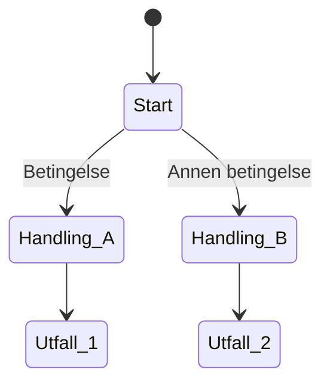

# NS 8407 Varslingsregler - Scenariodiagrammer

**Formål:** Avdekke mangler, uavklarte spørsmål og logiske brister gjennom systematisk scenarioanalyse.

*Opprettet: 2026-01-24*

> **Dokumentrelasjon:** Disse diagrammene bygger på den verifiserte kontraktsteksten i [NS8407_VARSLINGSREGLER_KARTLEGGING.md](../NS8407_VARSLINGSREGLER_KARTLEGGING.md). Diagrammene er ment å avdekke hull i forståelsen, ikke å erstatte kontraktsteksten.

---

## Innhold

| Fil | Spor | Innhold |
|-----|------|---------|
| [scenario-frist.md](./scenario-frist.md) | Frist (§33) | Alle scenarier for fristforlengelse |
| [scenario-vederlag.md](./scenario-vederlag.md) | Vederlag (§34) | Alle scenarier for vederlagsjustering |
| [scenario-grunnlag.md](./scenario-grunnlag.md) | Grunnlag (§25, §32) | Alle scenarier for grunnlagsvarsel |
| [uavklarte-situasjoner.md](./uavklarte-situasjoner.md) | Alle | Samling av hull/mangler oppdaget |

---

## Metodikk

### 1. Scenariobasert analyse

For hvert spor kartlegges ALLE mulige hendelsesforløp:

```
TRIGGER → TE handling → BH handling → TE respons → ... → UTFALL
```

### 2. Spørsmål ved hver node

- Hva skjer hvis parten IKKE handler?
- Hva skjer hvis parten handler FOR SENT?
- Hva skjer hvis parten handler, men motparten ikke påberoper §5?
- Hva skjer ved KOMBINASJONER av handlinger/passivitet?

### 3. Diagramformat

Vi bruker **Mermaid** syntax som rendrer i GitHub/VSCode:



### 4. Koding av utfall

| Kode | Betydning | Alvorlighet |
|------|-----------|-------------|
| `PREKLUSJON` | Krav tapes helt | Kritisk |
| `REDUKSJON` | Krav reduseres til "måtte forstå" | Alvorlig |
| `PASSIVITET` | Motpartens standpunkt godtas | Moderat |
| `HELBREDELSE` | Sen varsling anses i tide | Positiv |
| `UAVKLART` | Kontrakten gir ikke svar | Må avklares |

---

## Prioritet

1. **Fristsporet** (§33) - Mest kompleks, mange aktører og steg
2. **Vederlagssporet** (§34) - Kritisk asymmetri ENDRING vs SVIKT
3. **Grunnlagssporet** (§25, §32) - Viktig for kategorisering

---

## Funn

Alle uavklarte situasjoner samles i [uavklarte-situasjoner.md](./uavklarte-situasjoner.md) med:

- Beskrivelse av situasjonen
- Hvilke paragrafer som er involvert
- Mulige tolkninger
- Anbefaling for applikasjonen
