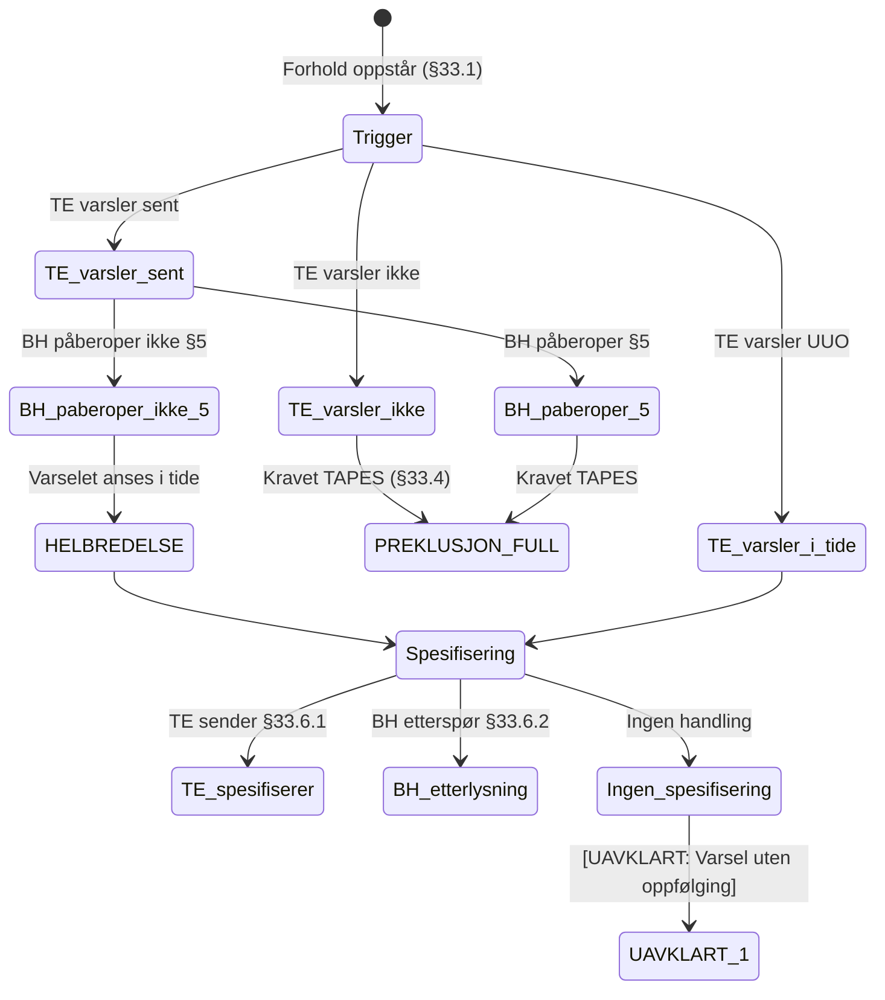
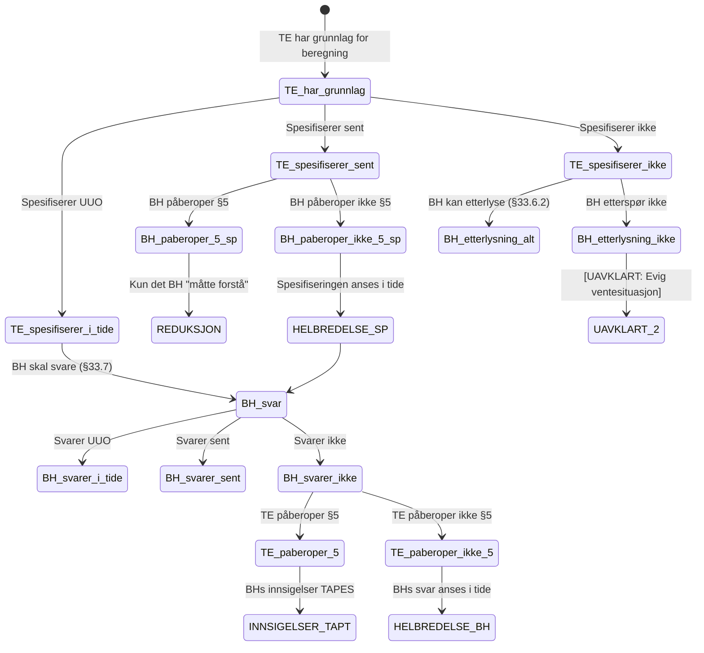
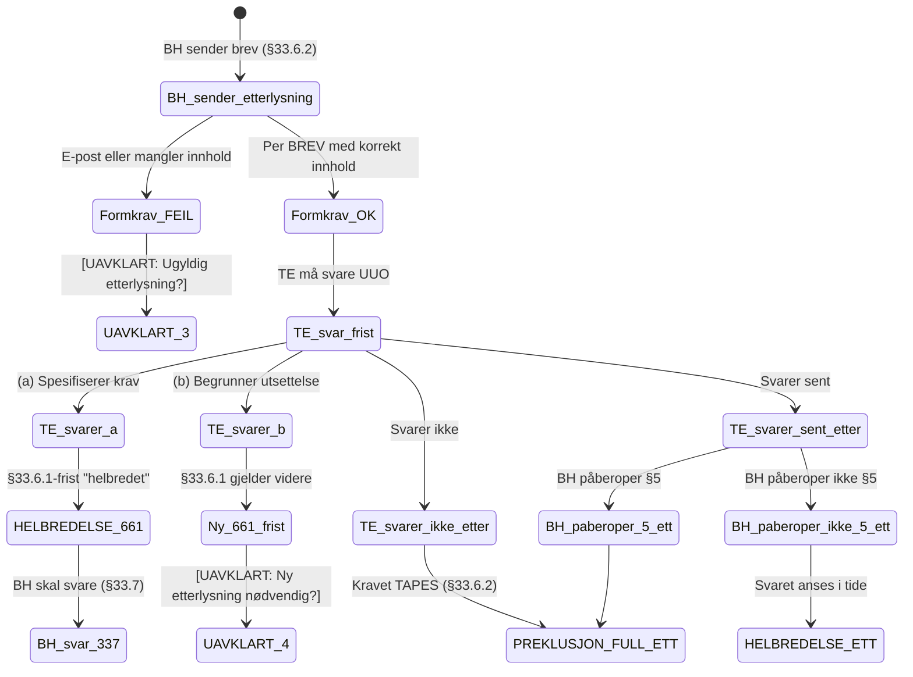
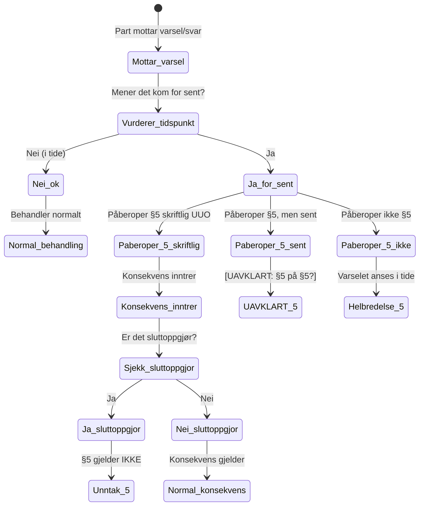
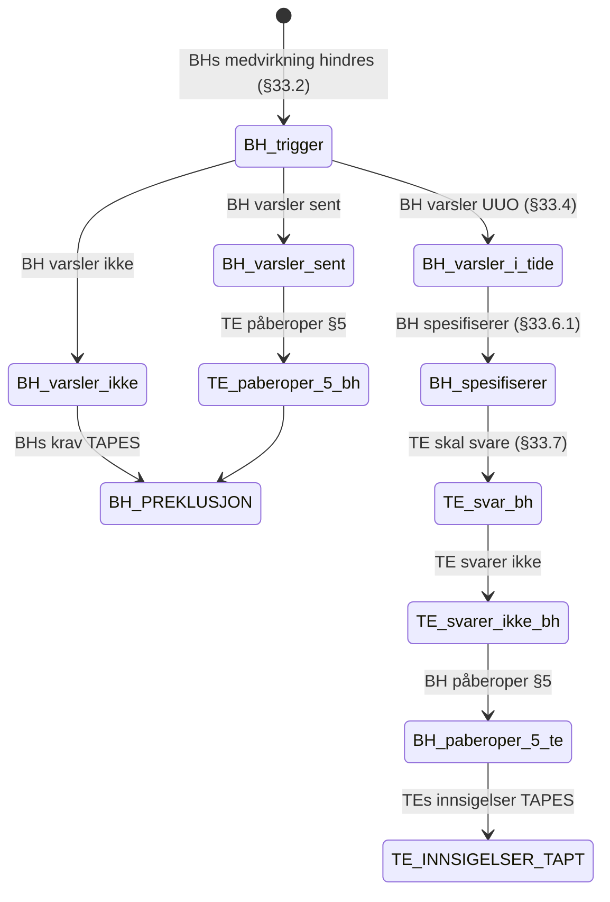
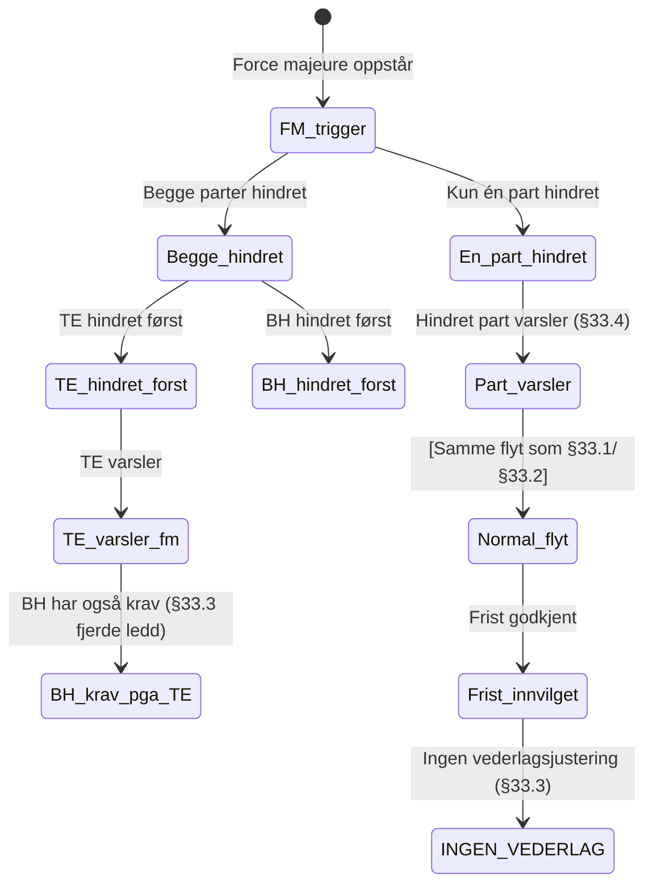
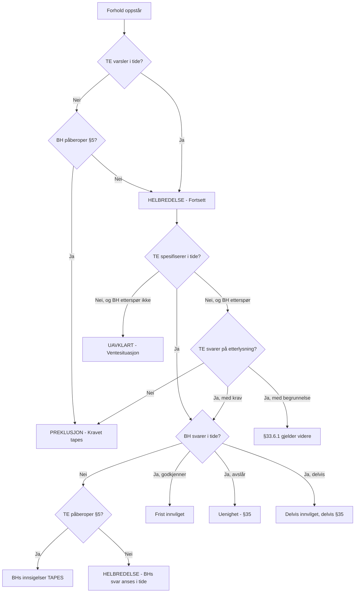
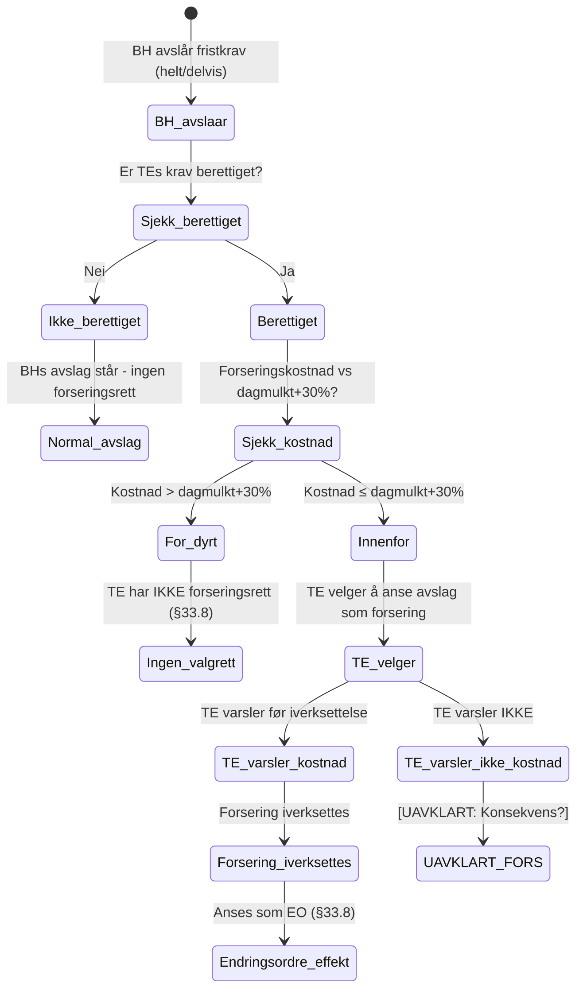

# Fristsporet (§33) - Scenarioanalyse

**Formål:** Kartlegge alle mulige hendelsesforløp for fristforlengelse og identifisere uavklarte situasjoner.

*Opprettet: 2026-01-24*

---

## Oversikt

Fristsporet har følgende hovedsteg:

```
1. TRIGGER oppstår (§33.1/§33.2/§33.3)
2. Nøytralt varsel (§33.4)
3. Spesifisert krav (§33.6.1) ELLER Etterlysning (§33.6.2)
4. Svar på krav (§33.7)
5. §5-mekanismen (ved sen varsling/svar)
```

---

## 1. Hovedflyt - TEs fristkrav



**UAVKLART 1:** Hva skjer hvis TE varsler nøytralt (§33.4) men aldri spesifiserer, og BH aldri etterspør? Kravet er "plassert" men ikke tallfestet.

---

## 2. Spesifisering via §33.6.1



**UAVKLART 2:** Hva skjer hvis TE aldri spesifiserer og BH aldri etterspør? Kan kravet bli "foreldet" etter alminnelige regler?

---

## 3. Etterlysning via §33.6.2



**UAVKLART 3:** Hva er konsekvensen av ugyldig etterlysning (e-post i stedet for brev, mangler advarsel)?

**UAVKLART 4:** Når TE begrunner utsettelse (b), kan BH sende ny etterlysning umiddelbart? Eller må BH vente til grunnlag objektivt foreligger?

---

## 4. §5-mekanismen i fristsporet



**UAVKLART 5:** Hva skjer hvis part A påberoper §5 for sent - kan part B påberope §5 på part As §5-påberopelse? (Meta-§5)

---

## 5. BHs fristforlengelse (§33.2)



---

## 6. Force majeure (§33.3)



---

## 7. Komplett beslutningstre



---

## 8. Forsering ved uberettiget avslag (§33.8)



**Innholdskrav i varselet:** Skal angi hva forseringen antas å ville koste.

**Viktig:** §33.8 har INGEN eksplisitt konsekvens for manglende varsel. Mulige tolkninger:
1. TE mister retten til å anse avslaget som forseringspålegg
2. BH kan bestride forseringskostnadene
3. Kun lojalitetsbrudd

---

## 9. Identifiserte situasjoner og avklaringer

| # | Situasjon | Paragrafer | Status | Konklusjon |
|---|-----------|------------|--------|------------|
| 1 | Nøytralt varsel uten oppfølging | §33.4, §33.6.1 | **AVKLART** | Ikke et reelt problem - uten spesifisering er det aldri fremsatt et konkret krav |
| 2 | Ingen spesifisering, ingen etterlysning | §33.6.1, §33.6.2 | **AVKLART** | Samme som over - ingen spesifisering = ingen krav |
| 3 | Formkrav for etterlysning | §33.6.2 | **NOTERT** | Standard sier "brev", men i praksis aksepteres Word/PDF |
| 4 | Begrunnelse for utsettelse - ny etterlysning | §33.6.2 | **AVKLART** | Ingen regel i kontrakten = BH kan sende ny etterlysning når som helst |
| 5 | §5 på §5 (meta-spørsmål) | §5 | **AVKLART** | Logisk mulig, men praktisk irrelevant (se forklaring under) |
| 6 | Sluttoppgjør og fristkrav | §5, §33 | **UAVKLART** | Når er kravet "fremsatt" - ved §33.4 eller først ved §33.6.1? |
| 7 | Manglende varsel før forsering | §33.8 | **UAVKLART** | Ingen eksplisitt konsekvens i kontrakten |

### Forklaring: §5 på §5 (punkt 5)

Eksempel på hvordan dette fungerer:
1. TE varsler for sent
2. BH påberoper §5, men selv for sent
3. Hva skjer?

**Svar:** Domstolen vil si: Ja, TE varslet for sent, men BH påberopte ikke "uten ugrunnet opphold". Konsekvens per §5: "skal varselet eller svaret anses for å være gitt i tide."

**Konklusjon:** TE varslet i prinsippet for sent, men varselet anses å være gitt i tide da BH ikke påberopte i tide. Dette er "helbredelse" i praksis.

### Forklaring: Sluttoppgjør og fristkrav (punkt 6) - UAVKLART

§5 gjelder ikke for krav fremsatt i sluttoppgjør. Men når er et fristkrav "fremsatt"?

- **Alternativ A:** Kravet er "fremsatt" ved nøytralt varsel (§33.4)
- **Alternativ B:** Kravet er først "fremsatt" ved spesifisert krav (§33.6.1)

Svaret har betydning for om §5-unntaket gjelder. Dette bør avklares juridisk.

---

## 10. Implikasjoner for applikasjonen

### Må håndteres

1. **Helbredelse via §5** - Applikasjonen må spore om motpart har påberopt sen varsling
2. **Formkrav §33.6.2** - Applikasjonen bør advare om at etterlysning krever BREV
3. **Symmetri §33.7** - Begge parter har svarplikt, ikke bare BH
4. **Forsering §33.8** - Applikasjonen må støtte forseringsprosessen med kostnadsvarsel

### Bør flagges som UAVKLART

1. Nøytralt varsel uten oppfølging - vis advarsel til bruker
2. Lang tid mellom §33.4 og §33.6.1 - vis advarsel
3. Etterlysning per e-post - vis advarsel om formkrav

---

> **Neste steg:** Overføre uavklarte situasjoner til [uavklarte-situasjoner.md](./uavklarte-situasjoner.md)
